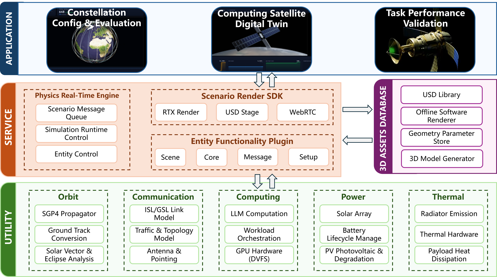

# 系统架构文档 · Architecture

> **在轨算力数据中心数字孪生**。本文按 **系统组成（计算层 / 服务层 / 应用层分层架构）→ 工作流程 → 模型集成标准 → 软件界面** 四个部分描述系统：仿真模型集中在哪里、软件引擎各自扮演什么角色、时间步进如何推动、交互沿什么管线穿过系统。物理公式细节见 [docs/physics.md](space-compute-demo/docs/physics.md)，快速上手见 [README.md](README.md)。

---

## 概述 · 平台软件概述

在轨算力卫星集群仿真平台的总体架构如图 1 所示。平台分为**计算层**、**服务层**与**应用层**三层，并与之正交地挂接一个**三维资产库**，为渲染服务供给三维内容。



**图 1** 在轨算力卫星集群仿真平台软件的总体架构

**计算层**为仿真提供所需的基础科学计算与领域模型，集中在 `backend/`，其唯一职责是产生业务数值（位置、瓦特、℃、SOC、tokens/s）。图中按 Orbit / Communication / Computing / Power / Thermal 五列组织：轨道预报（SGP4 真实传播 + WGS-84 星下点 + 解析太阳历/圆锥本影半影地影，支持 Walker 星座）、太阳能（`η·A·S₀/d²·入射率·蚀分数·展开度`，入射率随卫星姿态几何投影）、功率/电池（EPS 每卡预算 + Wh 积分，可配电池化学与包尺寸）、热控（集总热质 + 斯特藩-玻尔兹曼辐射 + 太阳/反照/地球红外环境热流，涂层 α/ε）、AI 作业目录与 LLM 推理（DVFS + decode 访存下限 + 热节流耦合，V100 实测校准）；通信/链路（ISL/GSL、拓扑、天线指向）列为规划与图示能力。三个验证器守护物理正确性；轨道/电/热三模块经本机 STK 11.6（含 SEET）数值对标（`tools/stk_benchmark/`，51/51 判据通过）。模型清单、公式与热-算力反馈闭环见 §3。

**服务层**以云服务架构构建，在计算层之上整合出运行时机制，又可细分为若干服务。核心是**仿真引擎服务**——即图中**物理实时引擎**（`StateEngine`）：它既是积分器又是调度器，也是**业务状态的单一权威源**；每个物理 tick（1Hz）按固定顺序调用计算层全部模型一遍，再 broadcast 态势，应用层与渲染服务从不各自积分、永不漂移。**场景渲染 SDK**（Omniverse Kit）提供 RTX 渲染、USD Stage 与 WebRTC 720p 推流；**实体功能插件**（Scene / Core / Message / Setup）在渲染宿主内承担场景编排与消息通道。**数据收发服务**为系统提供统一的数据汇集与传输——WS 统一信封 `{type, ts, payload, request_id?}` 加 REST（1Hz 广播 / 5Hz 轮询）。**仿真控管服务**（Simulation Runtime Control / Entity Control）提供运行时控管与实体控制，并由三维资产库供给几何参数等主题数据。此外，**对比仿真服务**以 lockstep 同步步进实现并行 / 实时 What-if 对比；**仿真评估**落在任务性能验证、设计校验与对比评估上；**动态实体生成**对应 Walker 星座 / 实体的按需合成。上层全部服务化、部署可上云，客户端以 Web 形式登陆操作（浏览器经 WebRTC 观看 Kit 渲染视口）。各服务的进程形态与运行时约定见 §1。

**应用层**在服务层功能基础之上构建、依赖其数据支持，只把状态投影成界面与控件、不做物理推导，代码在 `web/`。图中三张应用磁贴——星座配置与评估、算力卫星数字孪生、任务性能验证——对应两个导航页：**态势总览** Overview 与**卫星孪生体** Satellite Twin。与三层正交的**资产域**（图右 **3D ASSETS DATABASE**）是可由脚本完全重生的三维内容：USD 库、离线软件渲染器（免 GL、生成缩略图）、几何参数存储（`twin_params.json`）与三维模型生成器（几何指令 → subprocess 再生 `.usda`），经参数化 USD 管线为渲染服务供料。界面能力详见 §4，目录与技术栈见 §5。

### 工作流程

平台的完整运行流程对应图 1 中自上而下的数据通路（详细展开见 §2）：

1. **想定编辑**——用户在应用层的设计工作台 / 配置器 / 设计库 / 负载面板编辑“想定”（轨道六要素 + Walker 星座、硬件 GPU/材料、整星设计、几何、作业档案、地面站与通信波段、姿态）；
2. **指令下行**——编辑经 REST/WS 命令进入数据收发服务，落到仿真引擎的指令响应方法；几何 / 设计类指令额外触发资产域的 USD 参数化再生，落盘成功后才 `version+1`，Kit 5Hz 轮询发现版本变化后 Reload 换新模型；
3. **初始化与仿真准备**——引擎完成全部模型初始化（启动时从磁盘恢复几何，物理 = 磁盘上的模型）；
4. **实时步进推演**——用户开始仿真后，引擎按 1Hz 步进，每 tick 顺序调用计算层全部领域模型并积分 SOC / 温度 / 累计产出；
5. **态势双路分发**——态势数据 `StatePacket` 一路经 WS 1Hz 广播给 Web 图表，一路被 Kit 以 HTTP 5Hz 拉取、逐帧投影到 USD 并经 RTX+WebRTC 流回浏览器视口；
6. **松耦合集成 / What-if 旁路**——态势同时供分布式数据管理与第三方松耦合集成；对比仿真服务把 2–4 个离线变体引擎与在线 tick 同步步进，变体采样随态势广播流出、在遥测折线图上实时生长分叉，全程不触碰在线状态与 USD。

---

## 1. 系统组成（总体架构）

平台采用**三层架构**：**计算层**提供仿真所需的基础科学计算与领域模型（轨道动力学、能源热控、算力性能）；**服务层**在其上整合出仿真引擎、仿真控管、数据收发、对比仿真与三维渲染等服务；**应用层**依赖服务层的数据支持构建全部人机界面。与分层正交的还有一个**资产域**（参数化 USD 模型管线），为渲染服务供给三维内容。

> 平台总体架构总图见上文 **图 1**（概述 · 平台软件概述）。

各层职责判据与所在目录：

| 层 | 判据 | 位置 | 内容 |
| --- | --- | --- | --- |
| **计算层** | 产生业务数值（位置、瓦特、℃、SOC、tokens/s） | `backend/`（模型文件） | SGP4 轨道、太阳能/电池/热、DVFS+decode LLM 引擎、作业目录、设计预设 |
| **服务层** | 提供运行时机制与服务整合 | `backend/app.py` + `state_engine.py`、`ov_app/` | 引擎步进、控管、收发、对比仿真、RTX 渲染与推流 |
| **应用层** | 把状态投影成界面与控件，不做物理推导 | `web/` | 六个页面与全部面板 |
| **资产域** | 可由脚本完全重生的三维内容 | `usd/` + `tools/` | 参数化 USD、软件光栅器、验证器 |

### 1.1 运行时与部署形态

三层落在**三个进程**上：Web 开发服务器(:5173)、FastAPI 后端(:8001)、Omniverse Kit(:49100，720p WebRTC)。一键启动 `start_all_windowed.bat`（当前仓库唯一的启动器，Kit 带本地窗口——**勿最小化**，否则 Windows 挂起渲染循环、WebRTC 编码器饿死；`launch_kit.ps1` 传 `-Headless` 才加 `--no-window`）。

**最重要的一条架构约定——单一权威源**：服务层的 `StateEngine` 是业务状态唯一真理。应用层只显示（不做物理推导），渲染服务只投影（不做业务计算），三端从不各自积分，因此永远不会漂移。Kit 走 HTTP 轮询而非 WebSocket（其 stdlib 无 WS 客户端），且必须访问 `127.0.0.1`（`localhost` 在 Windows 上走 IPv6 回退，每请求 +0.2s）。

### 1.2 渲染服务的宿主-插件结构

**Kit 是宿主应用，extension 是插件**。宿主由 `.kit` 配置定义（RTX、tickRate=30、livestream 层），对插件提供四种引擎服务：**帧事件流（~30fps）、USD Stage/Context、RTX 渲染器、WebRTC 推流层**。业务全部写在 8 个 `space.demo.*` 扩展里，扩展在 `on_startup` 时向宿主注册：

| 扩展 | 状态 | 职责 |
| --- | --- | --- |
| `scene` | ✅ 在役 | **事实上的编排中枢**：5Hz 轮询后端、四舞台整体切换、逐帧驱动地球/太阳/灯光/三轴姿态/卷展翼、星座点云、任务编排、几何热重载 |
| `core` | ✅ | 启动时打开初始舞台（`SPACE_DEMO_USD_ROOT`/overview.usda） |
| `selection` | ✅ | 订阅 USD 拾取事件 → `POST /selection` 上报后端 |
| `messaging` | ✅ | NVIDIA 模板的浏览器↔Kit 数据通道（开舞台/选 prim 等控制消息） |
| `setup` | ✅ | 模板布局/启动 |
| `camera` / `timeline` / `task_maritime` | 🚧 桩 | 只打日志；`timeline` 本该镜像仿真钟，职责实际被 `scene` 的锚点逻辑接管 |

两条渲染铁律：(a) **逐帧动画只写 USD Session 层**——磁盘 `.usda` 永远干净，`Ctrl+S` 烘不进某一帧的轨道姿态，几何热重载（`Reload(force=True)`）与逐帧写永不冲突；(b) 重资产（太阳板/散热板/服务器）走 class 原型 + instanceable 引用，Kit 只组合一次。

---

## 2. 工作流程

系统的完整运行流程（对应总体架构图中自上而下的数据通路）：

1. **想定编辑**——用户在应用层的配置器/设计库/负载面板编辑"想定"（硬件、几何、整星设计、作业档案）；
2. **指令下行**——编辑经 REST/WS 命令进入数据收发服务，落到仿真引擎的指令响应方法上；几何/设计类指令额外触发资产域的 USD 参数化再生；
3. **实时步进推演**——仿真引擎按 1Hz 步进，每 tick 按固定顺序调用计算层全部领域模型；
4. **态势双路分发**——态势数据（`StatePacket`）一路经 WS 1Hz 广播给 Web 图表，一路被 Kit 以 HTTP 5Hz 拉取、逐帧投影到 USD 并经 RTX+WebRTC 流回浏览器视口；
5. **What-if 旁路**——对比仿真服务把 2–4 个离线变体引擎与在线 tick **同步步进**，变体采样随态势广播流出、在遥测折线图上实时生长分叉，不触碰在线状态。

### 2.1 启动与初始化

`start_all_windowed.bat` → ① 后端：`_restore_geometry_from_disk()` 从 `twin_params.json` 恢复几何（**不**递增版本——物理=磁盘上的模型），`engine.start()` 拉起 1Hz 步进协程；② Kit：`launch_kit.ps1` robocopy 同步扩展进模板（`C:\Workspace\kit-usd-viewer-template`）并启动，`core` 打开 `overview.usda`，`scene` 起 5Hz 轮询；③ 浏览器打开 :5173，`StreamMount` 连 :49100，流就绪前 Three.js 回退场景先顶上。

### 2.2 实时步进推演（引擎主循环）

`StateEngine` 是**积分器 + 调度器**：持有全部状态实体，每 tick 按固定顺序调用计算层模型一遍：

```
async _run():                          # 1Hz 心跳
    sleep(1.0); sim_time += 1
    _update_placeholder_physics(dt=1):
        _tick_fleet(t)                 # ① 轨道:传播星座,返回被跟踪星位置
        _set_tracked_kinematics(...)   # ② 位置→lat/lon/日照/太阳角
        solar → workload → job_detail  # ③④ 太阳能、作业表→LLM 工作点
        battery ← net_w                # ⑤ 电池 Wh 积分 (×60 加速)
        thermal ← Q_in − Q_out         # ⑥ 热积分 (×60 加速)
        design checks + alarms         # ⑦ 稳态裕量校验、8 类告警
    broadcast(snapshot())              # 推给所有 WebSocket 客户端
```

tick 体裹 `try/except`——一次瞬时 sgp4 失败只跳一拍，不会拖死协程冻结 `/state`。

### 2.3 时间步进级联

**系统只有一个权威时钟**：后端 tick 里的 `sim_time_s += 1`。其余全部"时间"都是对它的降频采样或升频平滑，构成五级级联——每级抹平上一级的台阶：

| 级 | 谁 | 频率 | 机制 |
| --- | --- | --- | --- |
| ① 物理 tick | 后端 `StateEngine._run` | 1Hz | 唯一推进 `sim_time_s` 并积分 SOC/温度/累计产出 |
| ② 读时刷新 | 后端 `snapshot()` | 每次被读 | 用"sim 时间 + 墙钟分数"重算**仅几何与瞬时功率**（积分态不碰），5Hz 轮询看到亚秒运动 |
| ③ 轮询协程 | Kit `scene` **自建**时钟（`asyncio.ensure_future`，sleep 0.2s） | 5Hz | 拉 `/state`，更新锚点与缓动目标 |
| ④ 帧回调 | Kit `scene` **订阅宿主帧事件流** | ~30fps | 特写舞台指数缓动 τ=0.35s 逼近目标（跳变>20°lat/40°lon 直接吸附防甩镜）；总览舞台锚点外插重算星座相位；地球自转纯墙钟 |
| ⑤ 平滑钟 | 前端 `useSmoothSimTime` | 显示刷新率 | rAF 外插消除 1Hz WS 台阶（HUD/回退场景） |

**Kit 与扩展在时间上的分工**：宿主只提供"每帧叫你一次"的事件流；是 `scene` 扩展同时注册两个时钟源（自建 5Hz 轮询协程 + 宿主帧回调）把后端时间与渲染时间缝合。Kit 从不推进 `sim_time_s`，它只消费。

**时间尺度刻意不对称且倍率对齐**：主时钟/作业表/累计产出 ×1（tokens 按诚实 sim 时间累计）；轨道（`TIME_SCALE=60`，一圈 LEO ≈ 90s）与电池/热（`PHYS_TIME_SCALE=60`）同为 ×60——一次地影恰好积分掉整段真实放电，"进影→掉电→告警"时间自洽。

### 2.4 交互管线

十一条管线覆盖全部交互，共同模式：**命令进入唯一权威源 → 状态改变 → 广播/轮询送回三端**，UI 从不自己预测结果。

| # | 交互 | 管线 |
| --- | --- | --- |
| 1 | 改硬件(GPU/材料) | 配置器 → WS `set_config` → 引擎换表 → 下 tick 生效 → 广播回显；Kit 映射材质 variant |
| 2 | 改几何 | 步进器 → `POST /twin_geometry` → 写 `twin_params.json`（加锁）→ subprocess 再生 `.usda` → **落盘成功后才 `version+1`** → Kit 5Hz 轮询发现版本变化 → `Reload(force=True)` 换新模型（顺序保证 Kit 永远重载不到半成品） |
| 3 | 应用整星设计 | 设计库 → `POST /designs/{id}/apply` → 配置+几何+作业表+平台常数原子切换 → 同管线 2 |
| 4 | 切工作负载 | `POST /workload_profile` → 作业表替换、产出清零 |
| 5 | 点击构件 | **闭环**：Kit 拾取 → `POST /selection` → 广播 `selection_changed` → Web 按 prim 路径弹面板；Web 主动选择走 WS 汇入同一广播，两侧选中态始终一致 |
| 6 | 展开/姿态 | `POST /solar_deploy` / `/attitude_spin` / `/attitude_mode` → 引擎改目标 → 物理(产能×展开度)与 Kit 动画(Session 层拉伸/动量轮逐帧积分/指向模式缓动到目标)各自跟随；模式与动量轮互斥 |
| 7 | 任务 | `POST /mission/start` → 相位机走墙钟 → `scene_ready` 加载门防抢跑 |
| 8 | **实时 What-if 对比** | `POST /compare/start` → **在事件循环上冻结 `LiveSnapshot`**（1Hz tick 同循环，同步读不可能与 tick 交错——公平性关键）→ ×N 离线变体引擎从同一快照播种，之后**每个物理 tick 后同步步进一步**（lockstep，暂停即同停）→ 变体当前采样随 `StatePacket.compare_live` 广播，前端累积进遥测折线图滚动窗、虚线叠加实时生长分叉；`POST /compare/stop` 结束（**全程不触碰在线状态与 USD**） |
| 9 | **轨道/星座设计** | 设计器编辑轨道六要素 + Walker 参数 → `POST /orbit_design` → 后端按开普勒关系合成参考 TLE、注册为 `custom_design` 预设并激活 → 引擎 tick、Kit 星座环、前端舰队传播器、覆盖地图在下一拍全部重新传播（设计所见即所得）；`GET /orbit_design` 随时读出当前星座六要素 |
| 10 | **地面站配置 + 分析** | `POST /ground_target` 标红新加坡并配置仰角掩模/通信波段/太阳分档 → 舰队 tick 顺带算逐星仰角+太阳强度（`_consts.ground_analytics`），结果随 `StatePacket.ground_target` 广播：可见星数、聚合带宽(可见×波段速率)、仰角 CDF、太阳直方图 → 覆盖地图红标+接触环、Coverage 折线图(前端 `useCoverageHistory` 滚动累积)、Solar 直方图、Bands 波段对比曲线；`GET /comms_bands` 波段目录、`GET /ground_visibility` worker 线程离线采样一整轨过境 |
| 11 | **卫星选型/搭建** | 向导四步（平台→结构→逐槽位载荷→作业档案）**全程只改前端草稿**；每次编辑防抖调 `POST /satellite_build/preview` —— 后端**另起一个 detached `StateEngine` 把草稿装配出来**再问它 `workload_adaptation`，返回与在线面板同源的派生指标与逐档案适配判定（**Run 前看到的设计校验就是 Run 后的结果**，且试算全程不触碰在线状态/USD）；Run 一次 `POST /satellite_build` **原子落地**（平台构型 + 硬件配置 + 逐槽位载荷 + 作业档案一起写）→ 接管线 2 再生 USD、bump version、Kit 重载 |

---

## 3. 集成标准（模型体系）

仿真模型体系分三层：**计算模型模块**提供动力学与性能学基础；**模型标准接口**定义统一生命周期；其上构建**仿真实体模型与载荷组件模型**。载荷组件挂载在卫星实体上、由引擎在每 tick 统一调用递推
### 3.1 计算模型模块

全部"算数"代码集中在 `backend/`，按模型分文件、可独立测试与替换：

| 模型 | 文件 | 输入 → 输出 | 方法 |
| --- | --- | --- | --- |
| 轨道预报 | `services/orbit_catalog.py` `services/constellations.py` `services/geodyn.py` `services/elements.py` | TLE、sim 时间 → ECI 位置、WGS-84 lat/lon/alt、蚀分数、**密切六根数**、Walker 舰队、地面站仰角 | SGP4 真实传播 + IAU-82 GMST/WGS-84 星下点 + 解析太阳历 + 圆锥本影/半影 + ECEF/ENU 仰角（STK 11 对标 ≤10⁻⁷°/≤5 s/≤1 s）+ OE↔RV 层（NTU CV-001/002 约定，逐 tick 广播） |
| 太阳能 | `state_engine.py` | 面积、材料 η+温度系数、蚀分数、**姿态**、结构温度、展开度 → `solar_input_w`、`solar_incidence` | `η·A·(S₀/d²)·入射率·蚀分数·η_T(T)·展开度`，η_T=1+k(T−25°C) 逐材料数据手册降额；入射率随姿态：对日=1、free SADA=0.95、nadir/velocity/inertial=`max(0, 板面法向·太阳)` 几何投影（STK 对标 24h 能量差 ≤0.4%） |
| 功率/电池 | `state_engine.py` | 作业 util、TDP、太阳输入、**电池化学/包尺寸** → `payload_power_w`、SOC | EPS 每卡预算 + Wh 积分；容量=包质量×化学能量密度，往返效率只计充电一侧 |
| 热控 | `state_engine.py` | 耗散功率、面积、涂层 **α/ε**、轨道位置/蚀分数 → 温度、辐射功率 | 集总热质 + 斯特藩-玻尔兹曼 + 太阳吸收/地球反照/地球红外环境热流（球-地视因子；STK SEET 对标分段均温差 ≤0.4 K） |
| AI 作业 | `ai_workloads.py` | 作业类型、GPU、功率上限、结构温度 → MFU/吞吐/实际功耗 | 数据手册算力表 + 类型化作业目录；**混插舱按卡型分组**，每组自成理想 TP 组、整星按组求和（`state_engine._bay_job_detail`，同构舱严格退化为单组算术） |
| LLM 推理 | `llm_perf.py` | 模型/批量/上下文、功率热约束 → 频率、tok/s、结温 | DVFS 聚合 + decode 访存下限 + 热节流耦合（V100 实测校准） |

六个验证器 + 一条 STK 对标管线守住物理正确性：`validate_physics.py`（整轨 6 预设×9 项）、`validate_llm_perf.py`（理论 52 项）、`validate_llm_engine.py`（闭环 32 项）、`validate_attitude_solar.py`（姿态-发电 16 项）、`validate_compare.py`（锁步+第一性定律 14 项）、`validate_elements.py`（根数层 27 项）、`tools/stk_benchmark/`（对 STK 11.6 真值 51 项）。

### 3.2 模型标准接口

引擎侧的统一生命周期与 SimInit / SimAdvance / SimCtrlResponse 类标准模板同构：

- **初始化**——`StateEngine.__init__` + 启动时 `_restore_geometry_from_disk()`（物理=磁盘模型，不递增版本）；
- **仿真推进**——`_update_placeholder_physics(dt)`，固定顺序调用 §3.1 全部模型（见 §2.2 伪代码）；
- **指令响应**——全部 mutator（`set_config` / `set_twin_geometry` / `apply_design` / `set_workload_profile` / `set_solar_deploy` / `set_attitude_spin` / `start_mission`…）都是同步方法，只在事件循环线程调用；
- **态势输出**——`snapshot()` 产出 `StatePacket`，叠加读时运动学刷新（§2.3 级②）。

**模型复用标准（对比仿真是范例）**：`compare_sim._OfflineTwin` **继承** `StateEngine`，唯一重写 `_tick_fleet`（整队传播 → 私有单星 Satrec；Walker 成员 0 就是 base TLE，轨道逐位一致）——零物理复制，改一处公式所有路径同步生效。`LiveCompareSession` 持有 2–4 个变体引擎，由在线引擎在每个物理 tick 后调用 `step()` **同步步进**（lockstep：暂停仿真、对比同停），变体当前采样挂在 `StatePacket.compare_live` 上随广播流出。

### 3.3 实体与载荷组件：热-算力反馈闭环

载荷组件（GPU/LLM 算力载荷、太阳翼、散热板）挂载在卫星实体上，但模型间不是单向流水线，而是**真实反馈回路**——本平台最独特的物理：

> 轨道(位置·日照) → 太阳翼载荷 → 功率·电池 → **GPU/LLM 载荷** —实际功耗=产热→ **散热板载荷** —结构温度=GPU 冷板、收缩功率预算→ **GPU/LLM 载荷**（回路闭合）

卫星结构就是 GPU 的冷板（`T_die = T_struct + P·R_th`）：散热板变差 → 结构升温 → DVFS 预算收缩 → 频率/功耗/tokens/s 一起下降 → 产热减少 → 回路在深度节流处收敛（`gpu_thermal_throttle` / `gpu_thermal_runaway` 告警）。**改一块散热板，直接损失可计算的推理吞吐。** 设计校验（平均供需、+60°C 辐射上限、地影 DoD）与逐 tick 模型**同源同公式**，"绿灯通过"的设计在运行仿真里真能闭合。

### 3.4 数据实体契约

广播链路上的跨进程数据都是 `backend/models.py` 定义的 Pydantic 实体（前端在 `types/messages.ts` 镜像同名 TypeScript 类型）；两处例外：`DesignPreset` 在 `design_presets.py`、`SatelliteAsset` 在 `satellite_assets.py`，`/compare/run` 返回体由 `compare_sim` 构造为 wire dict、仅在前端定型为 `CompareResult`。**广播顶层实体是 `StatePacket`**——三端看到的"世界"就是它：

| 实体 | 关键字段 | 谁写 | 谁读 | 链路 |
| --- | --- | --- | --- | --- |
| `StatePacket` | sim_time_s · running · camera_preset · design_id · workload_profile + 下列全部 | 引擎每 tick | Web(WS 1Hz)、Kit(HTTP 5Hz) | 广播 / 轮询 |
| `SatelliteState` | lat/lon/alt · sunlit · sun_cos · 功率三元组 · SOC · 温度 · 告警 · 展开度 · 姿态角速度 | 引擎每 tick | 全部遥测面板、Kit 轨道/灯光驱动 | 随 StatePacket |
| `SatelliteConfig` | gpu · solar/radiator 材料与尺寸 · **gpu_slots(逐槽位载荷)** | Web 配置器/搭建向导 | 引擎(物理)、Kit(材质 variant) | WS `set_config` / REST |
| `TwinGeometry` | architecture · 板簇数 · 散热板尺寸比例 · **version(Kit 重载触发器)** | Web 几何控件、设计应用 | 引擎(面积)、生成器、Kit | REST → USD 再生管线 |
| `GpuJobDetail` | 作业/模型 · engine=analytic\|mfu · 实际功耗 · 频率 · 结温 · 节流标志 · **mix(混插分组明细)** | LLM 引擎每 tick | GPU/Workload 面板 | 随 SatelliteState |
| `FleetSnapshot` / `MissionState` | 星座聚合 / 任务相位 | 引擎 | 总览页 / 任务页 | 随 StatePacket |
| `DesignPreset` | 配置+几何+作业表+平台常数 | 静态定义 | 设计库 UI、apply 管线 | `GET/POST /designs` |
| `SatelliteAsset` | 厂商平台：构型 · 槽位数与分组 · 出厂配置 | 静态定义(`satellite_assets.py`) | 搭建向导、preview/build 管线 | `GET /satellite_assets` |
| `CompareResult` | variants[]·每变体 series+summary | `compare_sim` 一次性 | Compare 面板 | `POST /compare/run`（不进广播——What-if 不是世界状态） |

统一信封：所有 WS 消息共用 `{type, ts, payload, request_id?}`，一处分发。

---

## 4. 软件界面

应用层聚焦为两个导航页面（`web/src/pages/`，全部英文 UI；早先的 Mission/Task/Control 占位页已移除）：

| 页面 | 路由 | 能力 |
| --- | --- | --- |
| **态势总览** Overview | `/` | 地球+星座三维态势、14 参数遥测卡、星座预设切换、**四页签设计工作台**：轨道/星座设计器（六要素 + Walker）、新加坡地面站配置（仰角掩模/通信波段/太阳分档）、Coverage(可见星+带宽折线)、Solar(光照分档收集直方图)、Bands(波段吞吐-仰角对比曲线)、事件流 |
| **卫星孪生体** Satellite Twin | `/satellite` | 进入即 **卫星搭建向导**（见下）；Run 后是主界面：Omniverse 特写视口（真实轨道运动/地影/构件拾取弹窗）+ 配置器（Compute+Workload/材料/几何/展开/**电池化学·包尺寸**/**姿态控制**）+ **设计库**（6 套整星、软件渲染缩略图）+ **实时 What-if 对比**（8 配置维度含电池化学·包尺寸 ×2-4 变体，与物理 tick 同步步进、虚线叠加在遥测折线图上随时间生长分叉，面板含逐变体实时数值表）+ 120s 遥测带 |

**卫星搭建向导**（`web/src/components/twin/builder/`）：四步把一颗星从零配出来——① **选型**四种厂商平台（SpaceX 桁架 12 槽 / Redwire 扁平舱 7 模块 / Sophia Space TILE 6 槽 / Ada Space 计算节点 8 槽，各自映射到一种真实 hull 构型，出厂即带该构型下已审计设计预设的配置）；② **结构设计**电(电池片/翼段数/化学/电池包)、热(涂层/散热板跨度与长宽比)、轨道指向——**板面尺寸按真实量纲手输**（翼段数 1–8、散热板跨度 0.54–5.4 m、长宽比 1.2–6，越界钳位、非法回退），面积随手实时推导；③ **载荷设计**逐槽位选卡（"画笔"式点选，可留空、可混插）；④ **作业档案**。**按 Run 之前只改前端草稿**，每次编辑走试算端点在独立引擎实例上装配草稿再问设计校验（管线 11），Run 一次原子落地。没有厂商几何的两家平台（Sophia/Ada）在选型卡上按其公开 reference design 手绘等轴测图，而不是渲染我们的替身 hull。

**姿态控制**：四种指向模式（对日 sun / 对地 nadir / 沿速度 velocity / 惯性 inertial）与 X/Y/Z 动量轮互斥——选模式清零动量轮、Kit 特写把机体缓动到目标姿态；碰动量轮则退回 `free` 自由翻滚（`POST /attitude_mode` · `/attitude_spin`，display-only）。姿态**真实驱动太阳能收集**：板面法向随模式变化，入射率 = `max(0, 法向·太阳)`，对日恒满发、体固定姿态随几何在 0…1 间摆动（配置器"Solar collection"读数实时显示，见物理模型 §太阳能）。

三维视口三态：WebRTC 流就绪时显示 Kit 渲染；连接中显示提示；离线时 Three.js 回退场景（真轨道追踪）兜底。视频元素全局单例（随路由卸载会杀掉 MediaStream、Kit 重连需 13s），仅流 `ready` 时覆盖到当前页占位槽。

---

## 5. 目录与技术栈

| 目录 | 层 | 技术栈 |
| --- | --- | --- |
| `backend/` | 计算层 + 服务层 | FastAPI · asyncio · Pydantic · sgp4 · numpy |
| `ov_app/` | 服务层(渲染) | Omniverse Kit · USD · RTX · livestream |
| `web/` | 应用层 | React 19 · TypeScript · Zustand · @react-three/fiber · WebRTC |
| `usd/` `tools/` | 资产域 | pxr · 参数化生成器 · 免 GL 软件光栅器 · 验证器 |

一句话总结：**计算层的模型集中一处并闭环耦合（结构温度↔GPU 节流）；服务层各司其职（asyncio 跑 1Hz 步进、Kit 跑 RTX 渲染与推流）；应用层只投影不推导；时间由权威 tick 逐级平滑到 30fps；所有交互穿过同一权威源再广播回来——包括 What-if 对比，它用同一套物理在离线孪生上回答"如果当初选另一种材料会怎样"。**
