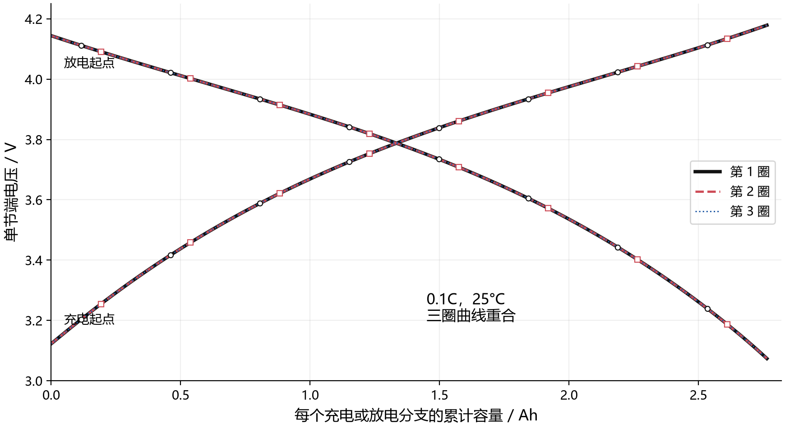
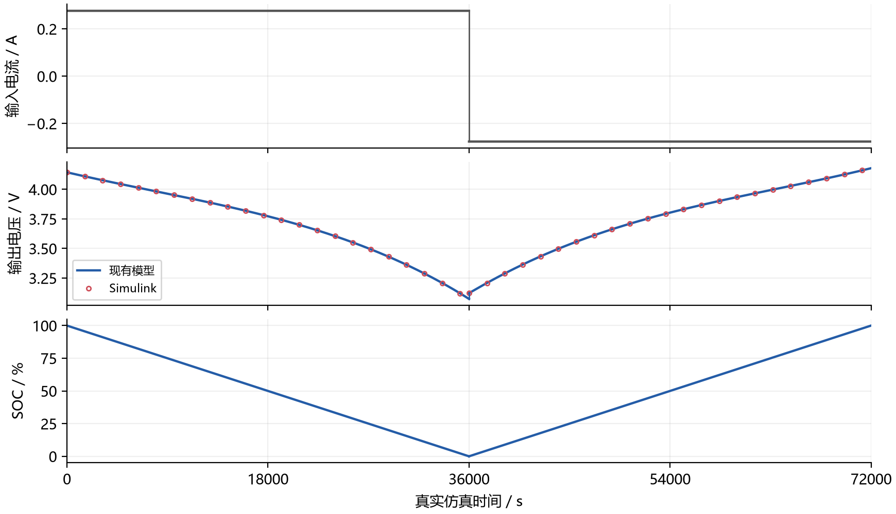
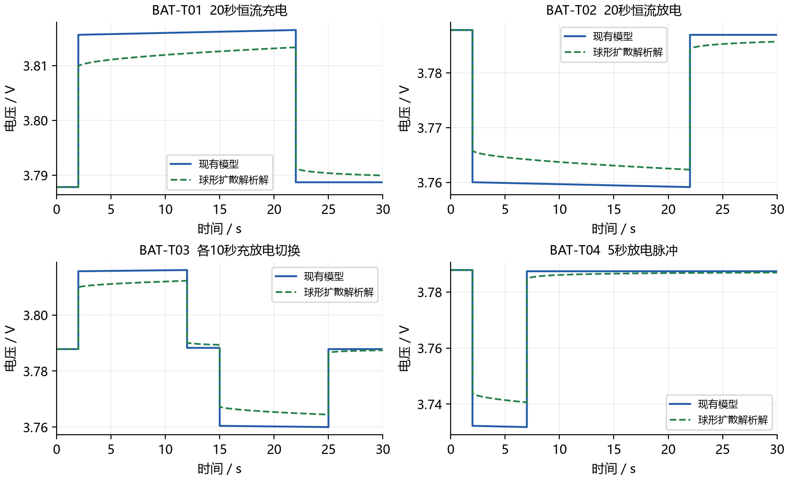
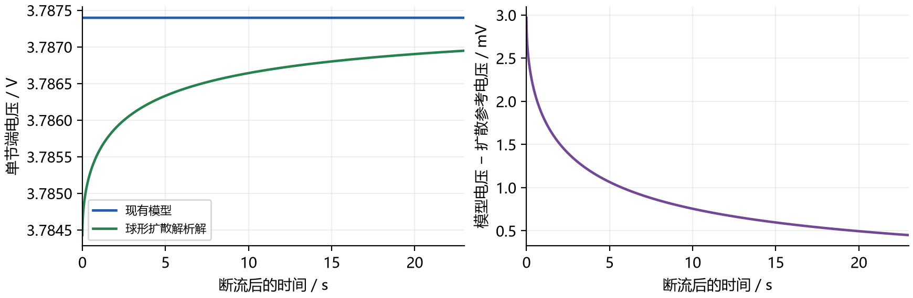

# 电池完整充放电与秒级瞬态测试

本目录保留旧 SPM 模型的诊断证据。当前电池采用一阶 ECM、只读参数表与 EKF，
请阅读 [v19.1 测试与复现说明](../tests_v19_1/README.md) 及
[当前测试报告](../SDTwin_Power_Model_Test_Report_CN_v19.1.pdf)。下列结果不代表新模型。

旧预览 PDF 和排版检查文件已于 2026年10月9日清理。原始计算结果保留供追溯。

主测试按用户参考图组织为电压与容量的完整恒流曲线。使用仓库现有参数查问题，没有拟合实验图或人为添加首圈损失。完整循环以最大 1 s 步长推进，同时补充最大 0.01 s 步长的四个 30 s 瞬态案例。原模型和原报告未修改；旧分钟级结果仅留在 minute_scale_archive 中。

## 完整循环输入与输出

单节电池，一串联一并联，温度恒定 25°C。可用容量 2.76484749523 Ah，0.1C 外加电流幅值 0.276484749523 A，正号放电，负号充电。初始 SOC 100%，负极平均锂占比 0.9，正极 0.27。
从满电先放电至 SOC 0%，再充电至 SOC 100%，连续三圈。电压附加边界为 3.0 V 和 4.2 V，先到边界即停止。本参数下六个分支均先到 SOC 边界，持续约 36000 s。外部测试驱动负责边界切换，不验证原 PDU 满充保护。
最大步长 1 s，每 1 s 输出，rtol = 1e-9，atol = 1e-11。Python RK45 和 Simulink ode45 分别积分平均锂占比、端口电能和热量。物理状态连续接续，只重置画图用的分支容量原点。容量为 abs(积分电流)/3600，单位 Ah。横轴同一容量通常不代表相同 SOC。活性材料质量未知，不换成 mAh/g。输出包括端电压、SOC、电功率、发热和能量积分。

Python 用 SOC 和电压事件定位终点。Simulink 针对这组恒流参数在理论 SOC 终点 36000 s 分段，电压边界按完整输出离线核对；本组轨迹始终位于 3.0 至 4.2 V 内。该 Simulink 模型不是通用电压截止控制器。



| 案例 | 输入 | 实际结果 |
|---|---|---|
| FC-01 恒流放电 | SOC 100%，+0.276485 A | 4.144107 至 3.073552 V，放出 2.764847495 Ah |
| FC-02 恒流充电 | 接续 SOC 0%，−0.276485 A | 3.122570 至 4.178817 V，充入 2.764847495 Ah |
| FC-03 连续三圈 | 两个分支连续执行三遍 | 三圈重合，差异仅为数值舍入，没有首圈损失或老化模型 |

黑色第一圈，红色第二圈，蓝色第三圈，以线型和稀疏空心标记区分重合，没有人为偏移。上升曲线为充电，下降曲线为放电。



图中电流、电压和 SOC 都以秒为时间轴。36000 s 时电流切换，电压允许跳变，SOC 和平均浓度连续。0.1C 一个完整分支约 36000 s，秒级分辨率不能把物理充放电压缩为 30 s。

## 秒级输入与结果

四项独立从 SOC 50%、25°C 和均匀浓度分布开始。外部指定电流，理想恒温边界维持温度；热量为输出，不更新温度。最大步长和输出间隔均为 0.01 s；切换保留同一时刻的左右两行，状态接续。

| 案例 | 输入电流时序 | 最终 SOC |
|---|---|---|
| BAT-T01 | 0 至 2 s 静置；2 至 22 s 为 −0.5 A；22 至 30 s 静置 | 50.100468% |
| BAT-T02 | 0 至 2 s 静置；2 至 22 s 为 +0.5 A；22 至 30 s 静置 | 49.899532% |
| BAT-T03 | 0 至 2 s 静置；2 至 12 s 为 −0.5 A；12 至 15 s 静置；15 至 25 s 为 +0.5 A；25 至 30 s 静置 | 50.000000% |
| BAT-T04 | 0 至 2 s 静置；2 至 7 s 为 +1 A；7 至 30 s 静置 | 49.949766% |



每个子图横轴为秒，纵轴为单节端电压。蓝线为现有模型，绿线为独立固相扩散参考。充放电方向和电量通过核对；短时接入和断流显示代数表面浓度近似缺少扩散记忆。

## 已确认的问题

1. 模型仅保存平均浓度，表面浓度由当前电流直接计算。5 s 脉冲撤去后，模型立即平衡，随后恢复 0 mV；扩散参考在 23 s 内恢复 2.51815 mV，尚未完全平衡。
2. 完整循环回到相同平均锂占比和温度，但净输入 331.348068955 J，发热 258.668027066 J，差额 72.680041889 J。现有模型未声明其他物理储能状态，能量账没有闭合。
3. 没有副反应、活性锂损失、老化和滞回状态，所以不能生成首圈不可逆容量和逐圈演化。重合由模型结构决定，不能为模仿参考图把曲线画开。
4. OCP 使用示例三次多项式，未标定真实材料，不声称复现参考图的平台和比容量。



右侧按相同时间的蓝线减绿线计算。热量分解为 I×反应过电压 + I²R − ITbeta，可逆热允许负值。分解恒等式成立不等于完整热力学能量守恒。

## 数值核对与物理边界

独立库仑计数核对 SOC = SOC0 − 积分电流/(3600×容量)。总锂库存 Qn xn + Qp xp 应守恒。端口电能和热量沿解析平均浓度轨迹用独立自适应求积复核。完整循环 54 项数值检查通过，秒级案例 87 项通过；物理缺陷单独保留，不用通过数代表模型整体正确。
完整循环 Simulink 模型用真实连续 State-Space、Integrator 和编译 Fcn 方程块独立组成，不读入 Python 状态或电压。秒级案例用独立 MATLAB S-function，由 Simulink 积分器推进。两者检验同方程实现，不是 Simscape Battery 官方电芯。
球形扩散参考方程：∂x/∂t=(D/R²)ρ⁻²∂ρ(ρ²∂ρx)，中心零通量，表面导数 mR²/(3D)。平均变化率 m 由电流决定。解析参考用 1000 个非零特征根 tan λ=λ，t=0 使用精确极限；各阶跃按线性叠加。有限体积参考用 128 和 256 层球壳，常通量段采用矩阵指数推进。网格和解析解差异满足预设 0.1 mV 精度要求。
[MathWorks 单颗粒扩散模型定义](https://www.mathworks.com/help/simscape-battery/ref/batterysingleparticle.html)；[MathWorks 扩散与断流恢复示例](https://www.mathworks.com/help/simscape-battery/ug/examine-effect-diffusion-coefficient-and-volume-fraction-on-terminal-voltage.html)。参考求解由本项目独立实现，没有冒充官方组件运行结果。

## 参数

内阻 0.025 Ω，Tref = 298.15 K，OCP 与温度系数数组按常数项在前排列。参数、初值、全部边界与容差在两份 contract.json 中。

| 参数 | 负极 | 正极 |
|---|---|---|
| D_ref_m2_s | 3.3e-14 | 1e-14 |
| radius_m | 6e-06 | 5e-06 |
| I0_ref_A | 2.5 | 3.0 |
| active_fraction | 0.75 | 0.665 |
| electrode_area_m2 | 0.06 | 0.06 |
| thickness_m | 8.5e-05 | 7.5e-05 |
| c_max_mol_m3 | 31000.0 | 63000.0 |
| E_D_J_mol | 30300.0 | 25000.0 |
| E_I_J_mol | 35000.0 | 17500.0 |
| b_V | [0.65, -1.6, 2.0, -0.95] | [4.6, -1.3, 0.9, -0.8] |
| d_V_K | [0.00012, -0.0003, 0.00015, 0.0] | [-6e-05, 4e-05, 0.0, 0.0] |

## 复现

在仓库根目录依次执行。

```powershell
& ./Thermal/.venv/Scripts/python.exe Power/battery_validation/run_full_cycles.py
& "C:/Program Files/MATLAB/R2026b/bin/matlab.exe" -batch "addpath('C:/Workspace/SpaceDC/Power/battery_validation/matlab'); run_full_cycles_simulink"
& ./Thermal/.venv/Scripts/python.exe Power/battery_validation/analyze_full_cycles.py
& ./Thermal/.venv/Scripts/python.exe Power/battery_validation/run_battery.py
& "C:/Program Files/MATLAB/R2026b/bin/matlab.exe" -batch "addpath('C:/Workspace/SpaceDC/Power/battery_validation/matlab'); run_battery_simulink"
& ./Thermal/.venv/Scripts/python.exe Power/battery_validation/analyze.py
```

`build_current_preview.py` 从保存结果生成当前四页 PDF 和图，需要 numpy、matplotlib、reportlab。完整循环 SLX 默认演示第一段 36000 s 放电，秒级 SLX 默认演示 20 s 充电，完整协议由对应 run 脚本执行。

| 文件 | 内容 |
|---|---|
| results/full_cycles/contract.json | 三圈协议、材料、初值与容差 |
| results/full_cycles/segment_N_python.csv 与 segment_N_simulink.csv | 六个半循环原始结果 |
| results/full_cycles/segment_N_accepted_steps.csv | 实际内部积分时刻 |
| results/full_cycles/summary.json | 54 项数值检查及循环能量账 |
| results/contract.json | 四个秒级用例参数与时序 |
| results/BAT-T0x_python.csv 与 BAT-T0x_simulink.csv | 秒级完整输出与热源分量 |
| results/BAT-T0x_analytic.csv 与 diffusion_128/256.csv | 扩散参考及两种网格 |
| results/BAT-T0x_accepted_steps.csv 与 simulink_derivatives.csv | 内部积分步及导数求值记录 |
| results/summary.json | 87 项数值检查和秒级物理诊断 |
| matlab/sdtwin_battery_full_cycles.slx | 内置连续模块搭成的完整循环模型 |

原图 3 审计：BT-002 在固定平均浓度和温度下改变电流，是独立静态扫描，不能当成恒流充电随时间变化。原 DY 类案例确有积分。本次补齐完整容量曲线、明确输入和真实时间推进。
