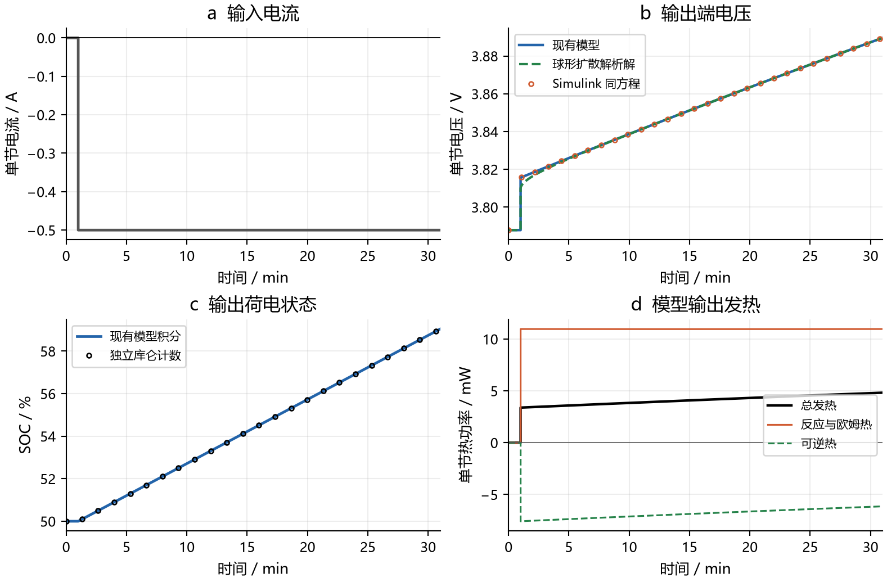
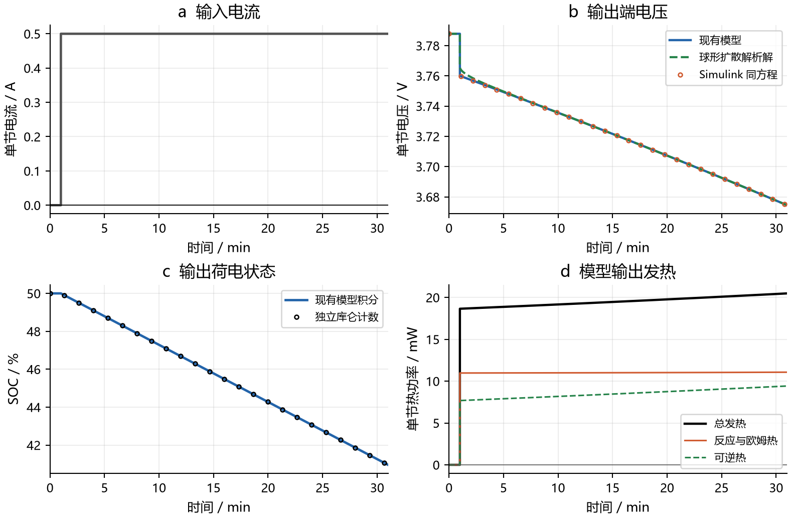
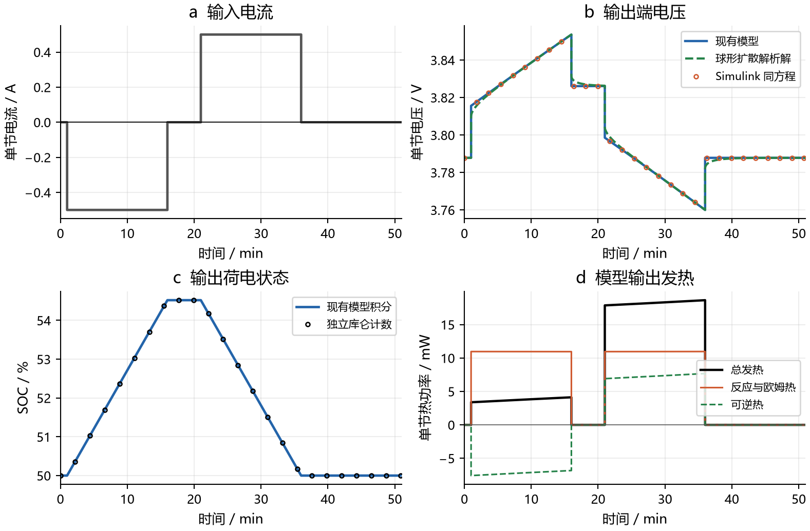
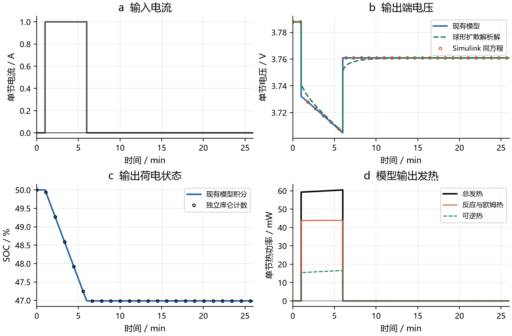
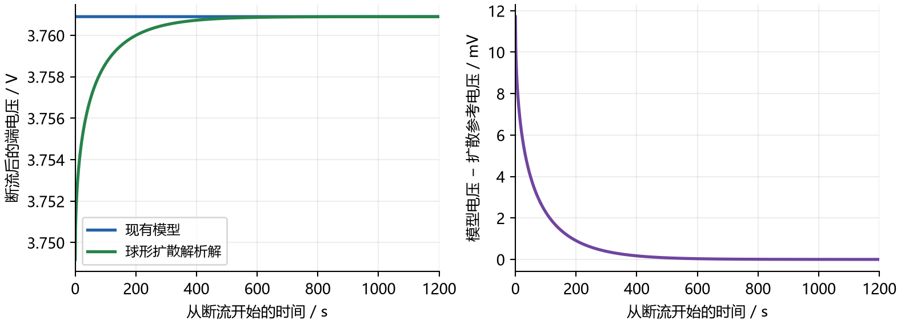

# 电池专项时域测试

本次只做四项电池案例，原模型和原报告保留。结果显示：电量积分和充放电方向符合预期，但现有模型缺少断流后的扩散恢复，而且等电量闭合循环的能量账不闭合。Python 与 Simulink 一致不能证明这些物理能力已经验证。

旧预览 PDF 已于 2026年10月9日清理。当前入口为 [v19.1 验证](../../tests_v19_1/README.md)。下列记录只对应历史试验。

## 共同设置

单节电池，一串联一并联。电池温度固定 298.15 K，即 25°C，理想恒温边界维持温度。初始 SOC 50%，负极平均锂占比 0.465，正极 0.543594701038。扩散参考以均匀浓度开始。电流正号表示放电，负号表示充电。所有场景开始先静置 60 s。
可用容量为 2.76484749523 Ah，来自 Qn × 0.87 / 3600。Qn 为 11440.7482561 C，Qp 为 18190.1384513 C，单节欧姆内阻为 0.025 Ω。材料参数沿用仓库示例，未标定到真实电芯。本测试不含充电器、太阳阵、PDU 或轨道。

输入为每段外部指定电流和持续时间。输出为单节端电压、SOC、功率、发热、端口电能和热量积分。正端口功率表示电池对外供电；正热功率表示发热，负可逆热表示吸热。恒温测试中的热量是输出，不用于推进温度。

## 三种计算的职责

1. 仓库模型：调用 `Thermal/sdtwin_sim/power_stand_in.py:battery_response`，由 SciPy DOP853 连续积分两极平均锂占比、端口能量和热量积分。
2. Simulink：真实运行 `matlab/sdtwin_battery_time_validation.slx`，ode45 连续积分同四个状态；独立 MATLAB 方程不调用 Python。它检验同方程实现的一致性，不是 Simscape Battery 官方电芯模型。
3. 扩散参考：求解球形颗粒 Fick 扩散，保留内部浓度状态。采用特征函数解析解和独立的径向有限体积方法相互核对；它沿用相同 OCP 和反应动力学参数，仅增加固相扩散记忆，不包含完整电解液模型或实物测量。

最大积分步长 2 s，rtol = 1e-9，atol = 1e-11，结果每 1 s 导出。积分器内部实际步长和导数调用单独保存，导出点不等于积分步。只在预定电流切换处分段；每段用上一段的终值继续，切换时保留时间相同但电流不同的左右两行。

## 案例和实际结果

| 案例 | 电流时序 | 最终 SOC | 主要结果 |
|---|---|---:|---|
| BAT-T01 | 0 至 60 s 为 0 A；60 至 1860 s 为 −0.5 A | 59.04209% | 充电接入后电压升至 3.81561 V，再升至 3.88959 V |
| BAT-T02 | 0 至 60 s 为 0 A；60 至 1860 s 为 +0.5 A | 40.95791% | 放电接入后电压降至 3.76002 V，再降至 3.67447 V |
| BAT-T03 | 0 至 60 s 静置；60 至 960 s 为 −0.5 A；960 至 1260 s 静置；1260 至 2160 s 为 +0.5 A；2160 至 3060 s 静置 | 50.00000% | 充放电各 0.125 Ah；能量残差 5.07527 J |
| BAT-T04 | 0 至 60 s 静置；60 至 360 s 为 +1 A；360 至 1560 s 静置 | 46.98597% | 断流后的扩散参考恢复 11.71254 mV，现有模型恢复 0 mV |

### BAT-T01 恒流充电

测试目的：确认恒流充电期间的电量增量和电压方向，直接回应原图 3 的疑问。
预期：充电电流接入时端电压升高；随后电压随 SOC 增加而上升。



图中 a 为输入电流，b 为电压输出，c 为 SOC 输出与独立库仑计数，d 为模型热源分解。蓝线为仓库模型，红色圆圈为 Simulink 同方程结果，绿虚线为球形扩散解析解。只对显示标记稀疏抽取，数值比较采用全部输出时刻。电压与热功率在切换时可跳变，平均锂占比和 SOC 连续。

实际结果：充电接入后电压由 3.78784 V 升至 3.81561 V，再连续升至 3.88959 V；SOC 升至 59.04209%。恒流充电期间没有出现电压下降。接入瞬间与扩散解析解仍相差 5.83 mV。

端口输入电能 0.96332247 Wh，输出电能 0.00000000 Wh；模型热量积分 7.41147257 J。Python 接受 940 个内部步，导数调用 14104 次；Simulink 导数调用 11198 次。

### BAT-T02 恒流放电

测试目的：确认恒流放电期间的电量消耗、端电压方向和发热符号。
预期：放电电流接入时端电压下降；随后电压随 SOC 减少而下降。



图中 a 为输入电流，b 为电压输出，c 为 SOC 输出与独立库仑计数，d 为模型热源分解。蓝线为仓库模型，红色圆圈为 Simulink 同方程结果，绿虚线为球形扩散解析解。只对显示标记稀疏抽取，数值比较采用全部输出时刻。电压与热功率在切换时可跳变，平均锂占比和 SOC 连续。

实际结果：接入放电后电压由 3.78784 V 降至 3.76002 V，再连续降至 3.67447 V；SOC 降至 40.95791%。电量、方向和代数计算核对通过。接入瞬间与扩散解析解仍相差 5.88 mV。

端口输入电能 0.00000000 Wh，输出电能 0.92956999 Wh；模型热量积分 35.16699642 J。Python 接受 940 个内部步，导数调用 14104 次；Simulink 导数调用 11198 次。

### BAT-T03 等电量充放电循环

测试目的：检验状态在充电、静置、放电和再次静置间连续传递，并核对闭合循环的电量与能量。
预期：充入和放出的电量相等，最终 SOC 回到 50%。相同物理状态和温度下，总能量账应闭合。



图中 a 为输入电流，b 为电压输出，c 为 SOC 输出与独立库仑计数，d 为模型热源分解。蓝线为仓库模型，红色圆圈为 Simulink 同方程结果，绿虚线为球形扩散解析解。只对显示标记稀疏抽取，数值比较采用全部输出时刻。电压与热功率在切换时可跳变，平均锂占比和 SOC 连续。

实际结果：充入与放出均为 0.125 Ah，SOC 回到 50%。但净输入电能 24.88591 J，总发热 19.81064 J，差额 5.07527 J。电量核对通过，按现有状态定义的闭环能量核算未闭合；静置恢复也未被描述。

端口输入电能 0.47935150 Wh，输出电能 0.47243875 Wh；模型热量积分 19.81064049 J。Python 接受 1556 个内部步，导数调用 23350 次；Simulink 导数调用 18401 次。

### BAT-T04 放电脉冲与静置恢复

测试目的：检验短时负载撤去后是否保留颗粒内浓度梯度，以及电压是否继续缓慢恢复。
预期：断流瞬间反应与欧姆压降消失；内部浓度梯度随后逐渐消退，电压继续恢复。



图中 a 为输入电流，b 为电压输出，c 为 SOC 输出与独立库仑计数，d 为模型热源分解。蓝线为仓库模型，红色圆圈为 Simulink 同方程结果，绿虚线为球形扩散解析解。只对显示标记稀疏抽取，数值比较采用全部输出时刻。电压与热功率在切换时可跳变，平均锂占比和 SOC 连续。

实际结果：放出 0.083333 Ah，SOC 降至 46.98597%。断流后扩散参考电压从 3.74919 V 缓慢恢复到 3.76090 V，恢复量 11.71254 mV；现有模型立即跳至 3.76090 V，此后恢复量为 0。静置扩散恢复能力不满足本用例目标。

端口输入电能 0.00000000 Wh，输出电能 0.30988798 Wh；模型热量积分 17.95982016 J。Python 接受 797 个内部步，导数调用 11961 次；Simulink 导数调用 9405 次。

## 物理核算

库仑计数：`SOC(t) = 0.5 − ∫I dt / (3600 × capacity_Ah)`。总锂库存 `Qn xn + Qp xp` 必须恒定。状态变化率为 `dxn/dt = −I/Qn` 和 `dxp/dt = I/Qp`。
端电压分解：`V = Up(surface) − Un(surface) − activation − I R`。热量分解：`q = I × activation + I² R − I T beta`。反应热和欧姆热均应非负，可逆热允许正负。独立自适应积分核算端口电能和热量，不把分解恒等式误称为热力学能量守恒。

等电量循环回到相同平均锂占比和温度，现有模型没有其他物理储能状态。净电输入为 24.88591096 J，报告发热为 19.81064049 J，残差 5.07527047 J。进一步分解得到 `∫I[Umean − Usurface]dt = 5.15795419 J`，`∫qrev dt = 0.08268372 J`，相减等于该残差。循环能量账没有闭合。该诊断是执行后追加的物理检查，不混入预先冻结的 85 项数值检查，也不通过改阈值将其判成通过。

脉冲断流后，现有模型将表面浓度立即设为平均浓度，失去扩散历史。参考模型保持浓度分布，因此电压有 11.71254 mV 的慢恢复。这是动态能力缺失，不能由同一方程的 Simulink 对照消除。



此图右侧是左侧现有模型电压减去扩散解析电压，同一时间轴和同一数据，不使用不同工况或不同采样点。

## 扩散参考的独立核对

球形扩散方程为 `∂x/∂t = (D/R²) ρ⁻² ∂ρ(ρ² ∂ρx)`，中心导数为零，表面导数为 `m R²/(3D)`，其中 m 为该极平均锂占比变化率。对均匀初值和单位 m 阶跃，表面增量为 `h(t) = t + 1/(15a) − 2/(3a) Σ exp(−a λk² t)/λk²`，`a = D/R²`，`tan λk = λk`。采用前 200 个非零根，t = 0 使用精确极限 0，各电流阶跃按线性叠加计算。
有限体积独立计算使用 128 和 256 层球壳，对通量和球壳体积守恒离散，分段常电流下采用矩阵指数精确时间推进。表面值由最外两层体积平均值和表面通量二次重建。网格加密的最大电压变化 0.079244 mV，256 层与解析解最大差 0.079403 mV，均满足执行前固定的 0.1 mV 精度要求。与 11.71 mV 的缺失恢复相比，该误差很小。

[MathWorks 球形单颗粒扩散模型定义](https://www.mathworks.com/help/simscape-battery/ref/batterysingleparticle.html)；[MathWorks 扩散与电压恢复示例](https://www.mathworks.com/help/simscape-battery/ug/examine-effect-diffusion-coefficient-and-volume-fraction-on-terminal-voltage.html)。解析展开和有限体积代码是本仓库的独立计算，不宣称运行了官方电芯组件。

## 材料参数

| 参数 | 负极 | 正极 |
|---|---:|---:|
| D_ref_m2_s | 3.3e-14 | 1e-14 |
| radius_m | 6e-06 | 5e-06 |
| I0_ref_A | 2.5 | 3.0 |
| active_fraction | 0.75 | 0.665 |
| electrode_area_m2 | 0.06 | 0.06 |
| thickness_m | 8.5e-05 | 7.5e-05 |
| c_max_mol_m3 | 31000.0 | 63000.0 |
| E_D_J_mol | 30300.0 | 25000.0 |
| E_I_J_mol | 35000.0 | 17500.0 |
| b_V | [0.65, -1.6, 2.0, -0.95] | [4.6, -1.3, 0.9, -0.8] |
| d_V_K | [0.00012, -0.0003, 0.00015, 0.0] | [-6e-05, 4e-05, 0.0, 0.0] |

OCP 多项式和温度系数均按常数项在前排列；本次 T = Tref，温度激活因子为 1。材料参数、运行界限、初值、全部输入和判据保存在 contract.json，测试不拟合或修改这些参数。

## 复现和数据

在仓库根目录执行：

```powershell
& ./Thermal/.venv/Scripts/python.exe Power/battery_validation/run_battery.py
& "C:/Program Files/MATLAB/R2026b/bin/matlab.exe" -batch "addpath('C:/Workspace/SpaceDC/Power/battery_validation/matlab'); run_battery_simulink"
& ./Thermal/.venv/Scripts/python.exe Power/battery_validation/analyze.py
```

图和 PDF 由 `build_preview.py` 从原始结果生成，需要 matplotlib 和 reportlab。执行环境见 python_execution.json 与 simulink_execution.json。保存的 SLX 默认展示从 50% SOC 直接施加 −0.5 A 的单段检查；完整四案例含初始静置的时序由 run_battery_simulink.m 驱动。

| 文件 | 内容 |
|---|---|
| results/contract.json | 执行前冻结的参数、输入时序和数值判据 |
| results/BAT-T0x_python.csv | 模型全部输出，含电压和热源各分量 |
| results/BAT-T0x_simulink.csv | Simulink 独立积分结果 |
| results/BAT-T0x_accepted_steps.csv | Python 实际接受的内部步时刻及积分状态 |
| results/BAT-T0x_simulink_derivatives.csv | Simulink 导数求值时刻，可重复或回退，不冒充接受步 |
| results/BAT-T0x_diffusion_128.csv 和 diffusion_256.csv | 两种网格的独立扩散求解 |
| results/BAT-T0x_analytic.csv | 精确库仑计数和球形扩散解析参考 |
| results/summary.json | 85 项数值检查、各段结果和两个物理问题 |

原图 3 数据审计：BT-002 前几项在 0°C 和固定平均锂占比下改变电流，不是时间推进。八串联电池组电压依次为 32.089386、31.700407、31.295597、30.891219 V，对应电流 −1、−0.5、0、0.5 A。原报告 DY 类用例确有积分，但该静态图不能用于证明恒流充电过程正确。
