# Power v19.1 模型与 Simulink 仿真测试报告

# 1 概述

## 1.1 标识

报告依据为用户修订的 SDTwin Power 设计报告 v19.1 和执行前确定的 10 项模型验证方案。被测核心为 Power/battery.py，模型采用一阶 ECM、SOC 与温度二维只读资产表及 EKF。运行时不做 RLS 参数辨识。

## 1.2 软件与文档概述

按设计报告 v19.1 执行 10 个模型测试项目，共 26 次独立 Simulink 仿真，对比 70,554 个时间点。全部项目满足固定判据。三个 25 °C 留出脉冲的整段电压 RMSE 为 26.70、28.65、17.27 mV。部分充电和静置阶段仍有系统偏差；通过结论不扩展为多温度实物或整星热电验证。

太阳、电池、配电和外部功率求解器组成独立试验台。物理状态为 SOC 与极化电压 u1，由外部求解器推进；估计器只读取电流、端电压和温度，估计状态不写回电池，也不参与功率分配。温度作为规定输入，本轮不积分 Thermal 温度状态。

## 1.3 术语与方向约定

| 量 | 含义与单位 |
| --- | --- |
| z 与 SOC | 剩余电量比例，无量纲。0.6 表示 60%。误差 0.02 等于 2 个百分点。 |
| u1 | RC 支路的极化电压，单位 V，表示加载与静置过程中的动态记忆。 |
| OCV | 无负载时的开路电压，由当前 SOC 和温度查表。 |
| i 与电池功率 | 单体电流单位 A。放电为正，充电为负。电池端口功率为正表示向外供电。 |
| 太阳上限与实际取电 | 上限由辐照度和方向决定；充电受限时实际取电可低于上限。 |
| RMSE 与最大误差 | 在同一时间点计算模型减参考。RMSE 为差值平方的均值再开平方；最大误差为绝对值最大值。 |

# 2 测试内容

## 2.1 十项测试与设计能力

| 编号 | 验证内容 | 设计章节与公式 | 运行数 |
| --- | --- | --- | --- |
| PV01 | 日照与朝向下的太阳发电 | 4.2，P2 | 6 |
| BT01 | 电池静态响应与整组换算 | 4.4.1 至 4.4.5，P4 至 P9 | 6 |
| BT02 | 放电脉冲与静置恢复 | 4.4.2、4.4.3，P5 至 P7 | 3 |
| BT03 | 充电脉冲与充放电反转 | 4.4.2、4.4.3，P5 至 P7 | 1 |
| BT04 | SOC 温度查表及响应 | 4.4.4，P8 | 3 |
| BT05 | 电阻发热与极化储能 | 4.4.5，P9 | 1 |
| BT06 | 完整充放电与容量曲线 | 4.4.2、4.4.3，P5、P7 | 1 |
| BT07 | 三组实测脉冲留出验证 | 4.4、9.4 | 3 |
| EK01 | 初始偏差与噪声下的 SOC 估计 | 4.4.6，P11、P12 | 1 |
| PA01 | 供需变化下的功率分配 | 4.1、4.3、4.5，P1、P3、P13 | 1 |

## 2.2 输入资产与实验环境

| 资产 | 数值与用途 |
| --- | --- |
| A 解析核算 | 人工 2 Ah 单体，25 °C，OCV=3.2+z；R0=0.05 Ω，R1=0.02 Ω，τ=10 s，C1=500 F。SOC 范围 0.1 至 0.9。 |
| B 温度插值 | 人工 2 Ah 单体，SOC 网格 0.1、0.5、0.9，温度网格 0、25、50 °C。由第 3.5 节显式函数生成，不代表真实电芯温度性能。 |
| C 实测验证 | BAK N18650CL-29，按来源示例采用 2.84 Ah，恒温设定 25 °C。R0=0.04448418743 Ω，R1=0.01120275491 Ω，τ=10.35558481 s。 |
| 默认初值 | 除 BT01、BT06、BT07、EK01 特别注明外，物理 z=0.6，u1=0 V。单体项目均为 1 串 1 并。 |
| 温度含义 | 输入接口使用 K。25 °C 输入 298.15 K；0、50 °C 分别输入 273.15、323.15 K。恒温是受控设定，不是已完成热平衡预测。 |

资产 C 复用已完成的离线标定数值，在本轮运行前冻结。训练使用脉冲 1、2、5、7、9 的放电加载段和相应静置电压；脉冲 4、6、8 留出。异常脉冲 3 不参与本轮标准验证。实测支持的 SOC 区间约 0.103 至 0.987，旧表的端点延伸不进入本轮。留出输入沿用已有的分段重采样文件，本轮重新运行模型，没有沿用旧版通过结论。

## 2.3 连续时间仿真与对照方法

Python 使用 SciPy DOP853 进行外部积分。Simulink 使用原生连续 Integrator 块保存 SOC 和 u1，并使用 ode45 求解。两侧相对容差 1×10⁻¹⁰、绝对容差 1×10⁻¹²。短时项目最大步长与保存间隔均为 0.1 s；BT02 另算 0.05、0.025 s；BT06 为 1 s。静态项目明确冻结 SOC 和 u1，只核算瞬时响应。

输入电流按零阶保持，切换时间作为求解边界。完整容量试验在 Simulink 中由 SOC 触发 Relay 反转电流；Python 侧使用常电流电量公式确定对应时刻。估计器每 0.1 s 更新，先保存校正前预测电压，再读本次测量完成校正。两侧只共享参数和输入，不调用对方实现，也不以对方输出为输入。

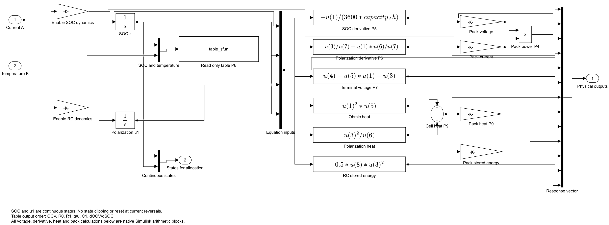

图 1 实际 Simulink 电池子系统。左侧输入单体电流和温度，中间两个连续积分器保存 SOC 与极化状态；电压、发热和串并联换算由显式方程计算。参数表仅读取，求根与 EKF 均在子系统之外。

图下残差由相应上图所用数组直接相减，不使用另一次仿真曲线。BT06 保留固定时间网格原始 CSV，同时保存事件前后及其真实时间戳；仅反转样本按同一事件侧配对。未配对时的失败摘要和原始差值也保留。所有其他时间点保持原样。

# 3 详细测试项目

## 3.1 测试项目 1 日照与朝向下的太阳发电

**目的与设计依据**：验证 P2 的方向余弦、有效面积和日照输入对最大可发功率的作用。

**前提条件**：面积 2 m²，效率 0.25，电池不带负载，温度 25 °C。

**输入与输出**：角度取 0、60、90、180 度，G=1000 W/m²。时间试验正对太阳，0 至 10 s 的 G=1000，10 至 20 s 为 500，20 至 40 s 为 0，40 至 60 s 为 1000 W/m²；再把面积改为 4 m²。
输出：最大太阳功率；输入余弦与板面有效辐照度另按公式核算。

**执行步骤**：载入冻结资产与完整输入时序。Python 外部积分器和 Simulink 分别从同一初值推进；保存所有时间点，逐点相减，并独立核算本项预期结果。

**预期结果**：角度功率依次为 500、250、0、0 W；时间序列为 500、250、0、500 W；面积加倍为 1000 W。

**判定规则**：采用第 5 章执行前固定的判据。按预期结果逐项核算，不按运行结果放宽门限。

**实际结果**：角度与时序符合预期，逐点时间序列误差为 0 W，面积加倍输出 1000 W。

**异常与适用范围**：G 已含日食遮挡，G=0 就表示本测试的全遮挡环境，不另乘第二个日食因子。没有轨道位置或温度反馈。

**结论**：通过

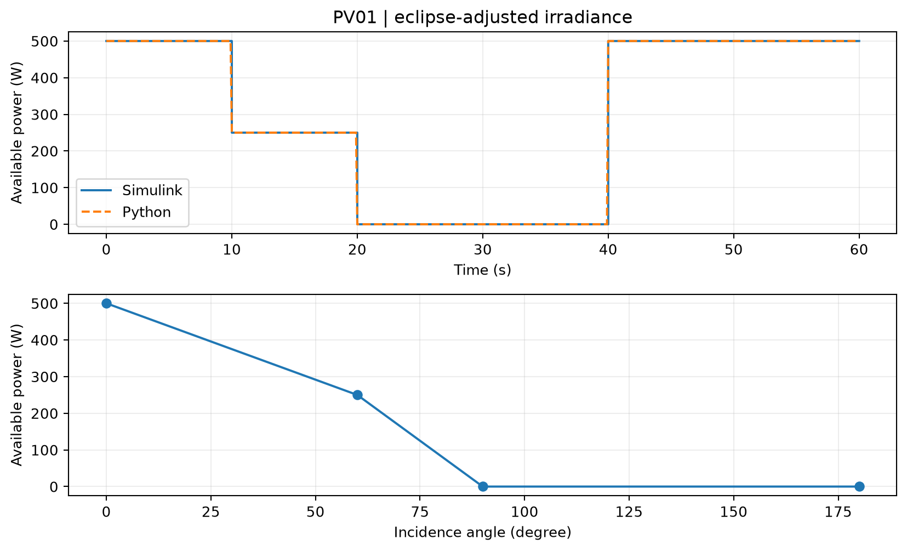

图 2 PV01 日照和朝向试验。上图横轴为秒，20 至 40 s 辐照度为零，因此最大可发功率为零；下图在固定辐照度下转动板面，90 度掠入射与 180 度背向都不发电。曲线表示太阳可发上限，不代表负载已取用这些功率。

| 入射角 度 | 输入余弦 | 有效辐照度 W/m² | Simulink W | 理论 W |
| --- | --- | --- | --- | --- |
| 0 | 1 | 1000 | 500 | 500 |
| 60 | 0.5 | 500 | 250 | 250 |
| 90 | 6.123e−17 | 6.123e−14 | 3.062e−14 | 0 |
| 180 | −1 | 0 | 0 | 0 |

## 3.2 测试项目 2 电池静态响应与整组换算

**目的与设计依据**：核算 P4 至 P9 的单体端电压、功率、导数、热源和电池组倍率。

**前提条件**：资产 A，恒温 25 °C，z=0.6，u1=0.02 V。冻结两项状态，只比较瞬时方程。

**输入与输出**：单体电流依次为 0、2、−2 A；分别配置 1 串 1 并和 4 串 2 并，共 6 组。
输出：单体及整组电压、电流、功率、热源、RC 储能、SOC 与 u1 导数。

**执行步骤**：载入冻结资产与完整输入时序。Python 外部积分器和 Simulink 分别从同一初值推进；保存所有时间点，逐点相减，并独立核算本项预期结果。

**预期结果**：2 A 单体 V=3.68 V、P=7.36 W、热源 0.22 W、储能 0.1 J；dz/dt=−2/7200，du1/dt=0.002 V/s。4 串 2 并电压乘 4、电流乘 2、功率热源储能乘 8。

**判定规则**：采用第 5 章执行前固定的判据。按预期结果逐项核算，不按运行结果放宽门限。

**实际结果**：6 组全部通过手算及跨实现判据。单体状态导数不随组数重复放大。

**异常与适用范围**：0 A 仍有 0.02 W 极化耗散，因为初始 u1 不为零。冻结状态仅用于本项瞬时公式核算，动态项目均实际积分。

**结论**：通过

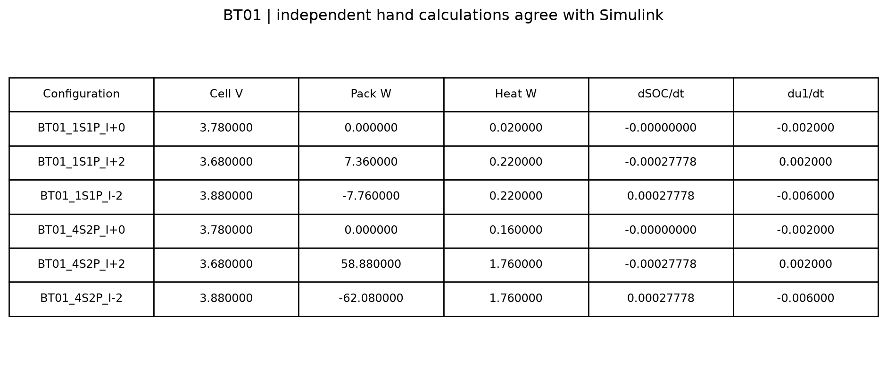

图 3 BT01 瞬时核算表。Cell V 为单体端电压，Pack W 为整组端口功率，Heat W 为整组耗散。充电功率为负而热源为正。两组拓扑的状态导数相同，证明未把串并联倍率重复计入单体电量。

## 3.3 测试项目 3 放电脉冲与静置恢复

**目的与设计依据**：验证 P5 至 P7：欧姆瞬态、极化建立、静置恢复和 SOC 电量积分。

**前提条件**：资产 A，25 °C，z=0.6，u1=0 V，1 串 1 并。

**输入与输出**：0 至 10 s 为 0 A；10 至 30 s 为 2 A；30 至 60 s 为 0 A。最大步长依次 0.1、0.05、0.025 s。
输出：电流、SOC、u1、OCV、欧姆项、端电压、解析与跨实现差值。

**执行步骤**：载入冻结资产与完整输入时序。Python 外部积分器和 Simulink 分别从同一初值推进；保存所有时间点，逐点相减，并独立核算本项预期结果。

**预期结果**：10 s 加载下降 0.1 V，30 s 撤流升高 0.1 V。20 s 放电后 SOC=0.5944444444，u1=0.03458658867 V。静置 SOC 不变而 u1 指数衰减。

**判定规则**：采用第 5 章执行前固定的判据。按预期结果逐项核算，不按运行结果放宽门限。

**实际结果**：Python 与 Simulink 最大电压差 5.773e−15 V；最细两级电压差 5.018e−14 V。解析轨迹、状态和跳变量全部达标。

**异常与适用范围**：残差在浮点舍入量级，不是物理噪声；实际测量误差由 BT07 另行评价。

**结论**：通过

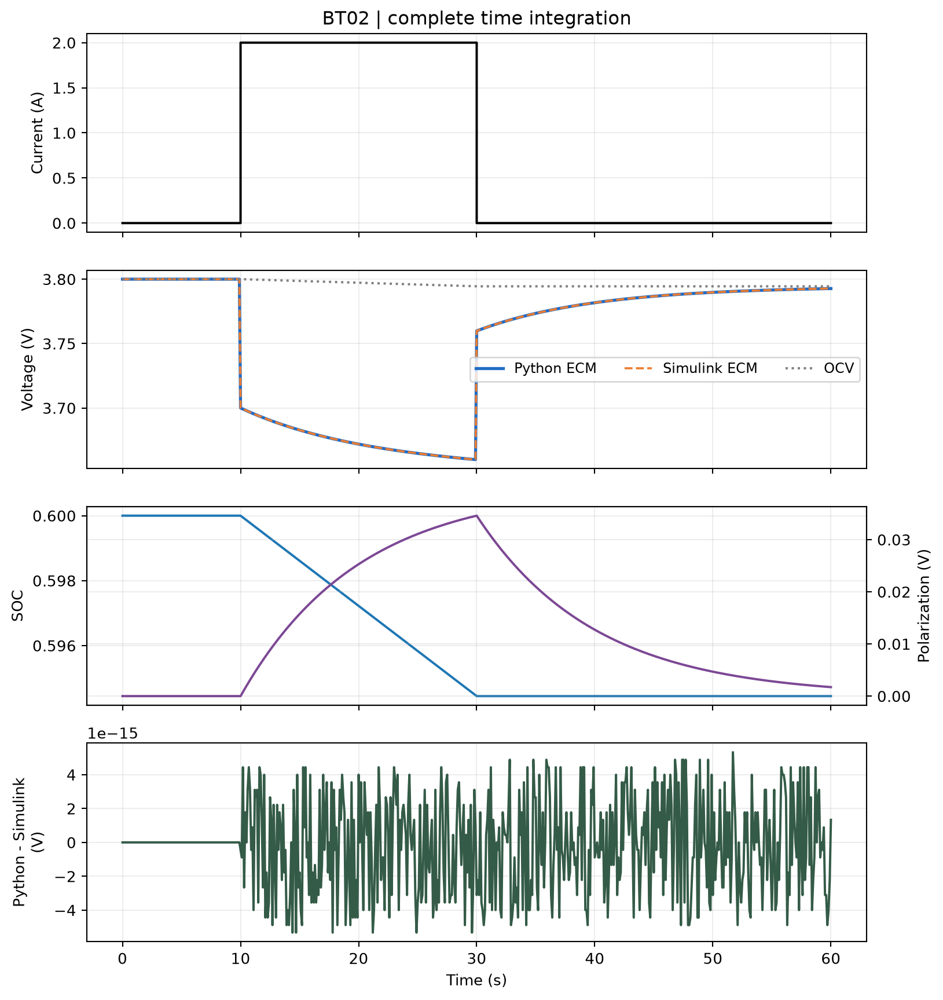

图 4 BT02 放电脉冲全过程。四行依次为实际电流、两侧端电压与 OCV、SOC 与极化电压、Python 电压减 Simulink 电压。25 °C 与初值见本项表。加载时立即损失 0.1 V，之后极化继续增加；撤流后欧姆压降消失，极化用 10 s 时间常数恢复。残差坐标的科学计数倍率必须一并读取。

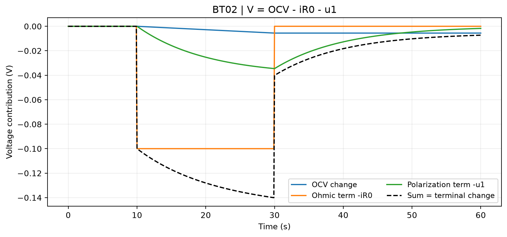

图 5 BT02 电压分解。每条彩线分别为相对初始 OCV 的变化、−iR0 与 −u1；黑虚线为三项之和，即端电压相对 3.8 V 的变化。加载瞬态来自欧姆项，后续弯曲来自极化项，OCV 的缓慢下降来自 SOC 消耗。

| 时刻 s | 电流前后 A | 电压左极限 V | 电压右极限 V | 跳变量 V |
| --- | --- | --- | --- | --- |
| 10 | 0 → 2 | 3.8 | 3.7 | −0.1 |
| 30 | 2 → 0 | 3.659857856 | 3.759857856 | 0.1 |

表中左右极限在同一已接受边界状态上分别代入切换前后电流计算，不把 29.9 s 的电压当作 30 s 左极限。完整解析解独立检查边界状态和区间轨迹。

## 3.4 测试项目 4 充电脉冲与充放电反转

**目的与设计依据**：验证 P5 至 P7 的充电方向、反向电流和极化记忆。

**前提条件**：资产 A，25 °C，z=0.6，u1=0 V。

**输入与输出**：0 至 10 s 为 0 A；10 至 30 s 为 −2 A；30 至 50 s 为 2 A；50 至 80 s 为 0 A。
输出：端电压、SOC、u1、OCV、电压三项贡献和端口功率。

**执行步骤**：载入冻结资产与完整输入时序。Python 外部积分器和 Simulink 分别从同一初值推进；保存所有时间点，逐点相减，并独立核算本项预期结果。

**预期结果**：初始充电电压升高 0.1 V，SOC 增加；30 s 反转时电压下降 0.2 V，极化不清零；充放电净电量为零，50 s 后 SOC 回到 0.6。

**判定规则**：采用第 5 章执行前固定的判据。按预期结果逐项核算，不按运行结果放宽门限。

**实际结果**：解析与跨实现判据均通过。跨实现最大电压差 5.773e−15 V；反转瞬态为 −0.2 V。

**异常与适用范围**：撤去充电电流时电压回落并不表示电量突然减少；电压由 OCV、欧姆项和保留的极化状态共同决定。

**结论**：通过

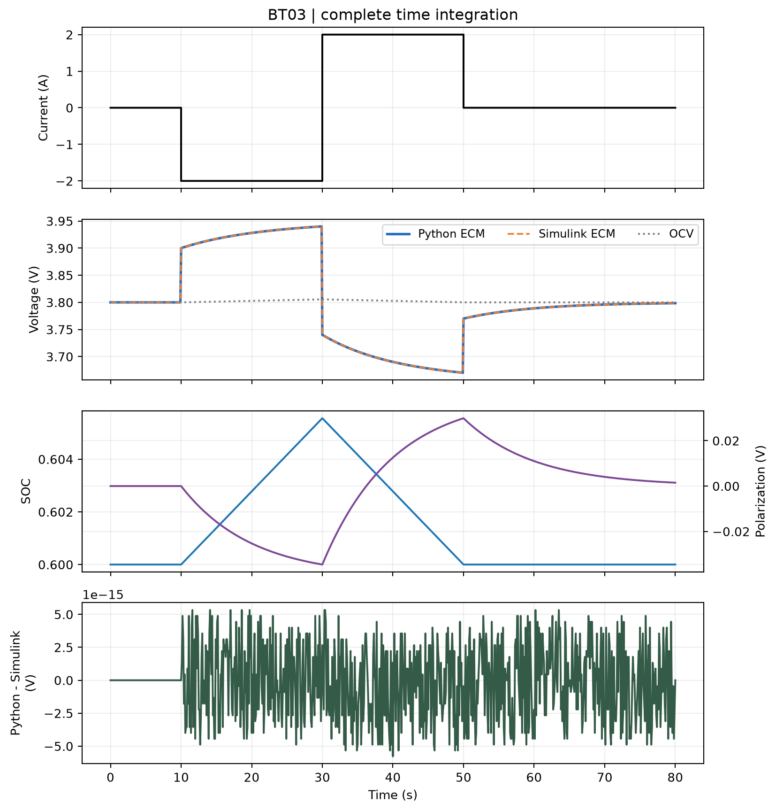

图 6 BT03 80 s 充放电与静置全过程。10 s 开始充电，端电压由 3.8 V 升至 3.9 V，随后继续上升；30 s 转为放电时立即下降 0.2 V。SOC 与极化连续，极化由负值逐渐转正。最下图直接计算两条模型电压之差。

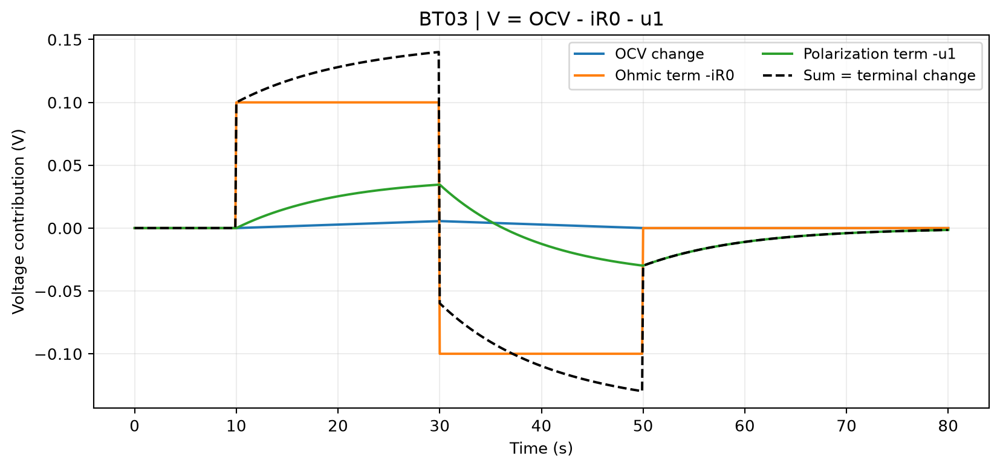

图 7 BT03 电压分解。30 s 电流反转只立即改变 −iR0，原有负极化保留并逐渐消退。此分解解释了反向初期的电压行为，而不是按充电或放电标签强行规定整条曲线形状。

| 时刻 s | 电流前后 A | 电压左极限 V | 电压右极限 V | 跳变量 V |
| --- | --- | --- | --- | --- |
| 10 | 0 → −2 | 3.8 | 3.9 | 0.1 |
| 30 | −2 → 2 | 3.940142144 | 3.740142144 | −0.2 |
| 50 | 2 → 0 | 3.670094197 | 3.770094197 | 0.1 |

## 3.5 测试项目 5 SOC 温度查表及响应

**目的与设计依据**：验证 P8 的二维双线性插值、单位换算和参数影响。

**前提条件**：人工资产 B，容量 2 Ah，初始 z=0.6、u1=0 V。各次温度保持不变。

**输入与输出**：25 个 SOC 温度查询覆盖所有节点、网格中心及边上中点。另分别在 0、25、50 °C 执行与 BT02 相同的 2 A 脉冲。
输出：OCV、R0、R1、τ、C1、端电压与极化。

**执行步骤**：载入冻结资产与完整输入时序。Python 外部积分器和 Simulink 分别从同一初值推进；保存所有时间点，逐点相减，并独立核算本项预期结果。

**预期结果**：z=0.3、T=12.5 °C 时 OCV=3.505 V、R0=0.0545 Ω、R1=0.021425 Ω、τ=10.65 s；C1=τ/R1。全部查询按显式函数独立核对。

**判定规则**：采用第 5 章执行前固定的判据。按预期结果逐项核算，不按运行结果放宽门限。

**实际结果**：25 次查询及三温度动态轨迹全部通过。三温度最大跨实现电压差 5.773e−15 V；四个紧邻支持域外的输入均被拒绝。

**异常与适用范围**：温度影响由人为函数定义。此项证明查表和动态耦合实现正确，不能说明真实 BAK 电芯在 0 或 50 °C 的精度。

**结论**：通过

生成 B 表的函数如下，T 单位为 °C，表行对应温度、列对应 SOC。OCV=3.2+z−0.001×ΔT+0.002×z×ΔT；R0=0.05+0.01×0.5−0.01×z−0.0002×ΔT；R1=0.02+0.004×0.5−0.004×z−0.00005×ΔT；τ=10+2×0.5−2×z−0.02×ΔT。其中 ΔT=T−25，C1 始终由 τ/R1 得到。

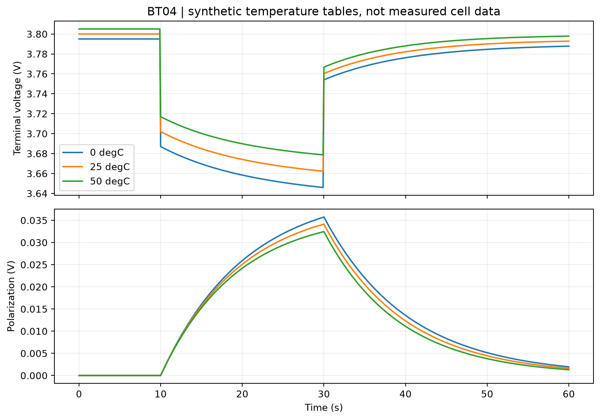

图 8 BT04 三个恒温环境的电压和极化响应。输入脉冲相同，0 °C 人工表的电阻较大，加载压降和极化较大；50 °C 相反。OCV 本身也随温度改变，因此应结合下表分辨基线与内阻效应。这里只比较人工表机制。

| 初始温度 °C | OCV V | R0 Ω | R1 Ω | τ s | C1 F |
| --- | --- | --- | --- | --- | --- |
| 0 | 3.795 | 0.054 | 0.02085 | 10.3 | 494.0048 |
| 25 | 3.8 | 0.049 | 0.0196 | 9.8 | 500 |
| 50 | 3.805 | 0.044 | 0.01835 | 9.3 | 506.812 |

## 3.6 测试项目 6 电阻发热与极化储能

**目的与设计依据**：验证 P9 的两项耗散与 RC 暂存能量，避免把内部电压损失全部计为热。

**前提条件**：常参数资产 A，25 °C，z=0.6、u1=0 V，C1=500 F。

**输入与输出**：采用 BT03 的 80 s 时序，含充电、反转和最后 30 s 静置。
输出：i²R0、u1²/R1、总热功率、0.5C1u1²、累计热量和能量收支残差。

**执行步骤**：载入冻结资产与完整输入时序。Python 外部积分器和 Simulink 分别从同一初值推进；保存所有时间点，逐点相减，并独立核算本项预期结果。

**预期结果**：常 C1 时，积分 i×OCV 与积分端口功之差，等于累计热量加 RC 储能变化；热源始终非负，停流后极化未消失时仍发热。

**判定规则**：采用第 5 章执行前固定的判据。按预期结果逐项核算，不按运行结果放宽门限。

**实际结果**：Simulink 最大能量残差 3.928e−14 J；Python 为 8.438e−15 J。两项热源及跨实现轨迹通过。

**异常与适用范围**：没有实测热量。本项为方程能量核算；常 C1 恒等式不直接应用于变参数 B，也未覆盖可逆熵热、老化或副反应热。

**结论**：通过

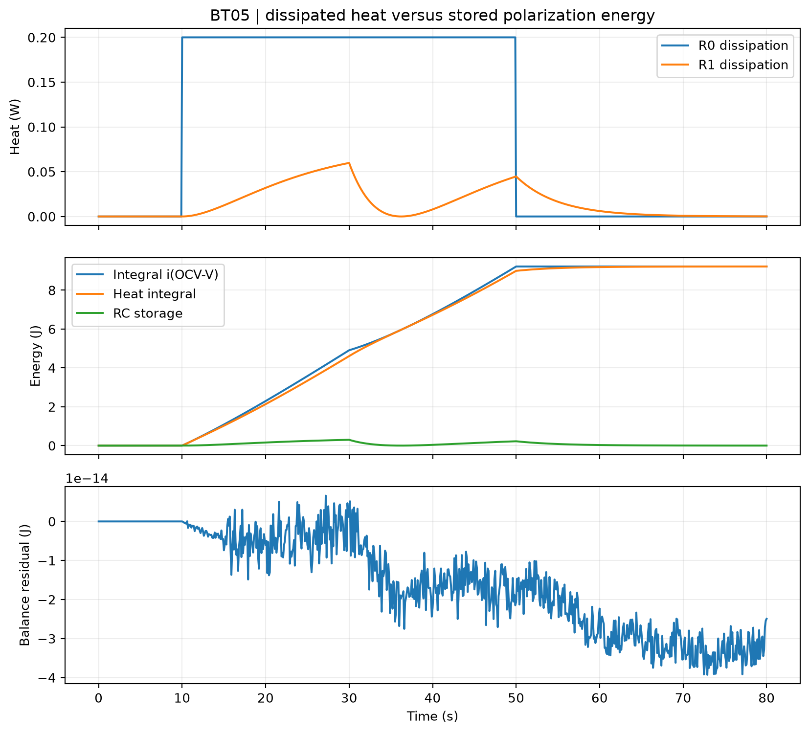

图 9 BT05 热源与储能核算。第一行区分即时欧姆耗散和极化电阻耗散；第二行比较累计内部电功差、累计热量和当前 RC 储能；第三行为第一种累计能量减去后两者。初始 RC 储能为零。50 s 停流后，欧姆耗散为零而极化耗散仍为正。

| 时刻 s | 欧姆热 W | 极化热 W | RC 储能 J | 累计热量 J |
| --- | --- | --- | --- | --- |
| 10 | 0.2 | 0 | 0 | 0 |
| 30 | 0.2 | 0.059811606 | 0.29905803 | 4.6092102 |
| 50 | 0 | 0.044717852 | 0.22358926 | 8.9948311 |
| 80 | 0 | 0.00011084447 | 0.00055422237 | 9.2178662 |

## 3.7 测试项目 7 完整充放电与容量曲线

**目的与设计依据**：验证 P5、P7 的长时电量积分、SOC 边界和容量曲线。

**前提条件**：人工资产 A，25 °C，初始 z=0.12、u1=0 V；最大步长 1 s。

**输入与输出**：以 −0.2 A 充至 SOC=0.88，再以 0.2 A 放回 0.12；即 0.1C，一次往返，反转时不重置极化。
输出：电压、SOC、累计绝对 Ah、两段电量及事件时间和事件两侧状态。

**执行步骤**：载入冻结资产与完整输入时序。Python 外部积分器和 Simulink 分别从同一初值推进；保存所有时间点，逐点相减，并独立核算本项预期结果。

**预期结果**：每个方向 1.52 Ah，每段 27360 s，总计 54720 s；电量误差不超过 10⁻⁶ Ah，反转事件时间误差不超过 10⁻⁴ s。

**判定规则**：采用第 5 章执行前固定的判据。反转样本在同一事件侧比较，原始时间戳单独保留。

**实际结果**：充入 1.520000000000 Ah，放出 1.519999999997 Ah；反转时间偏差 1.67e−08 s。同侧配对后电压最大差 1.303e−11 V，全部通过。

**异常与适用范围**：固定网格在 27360 s 原始比较出现 0.02 V 差，原因是两侧相差约 17 ns 而分别落在反转前后。保留原始失败记录，仅按既定规则配对相同事件侧。人工线性 OCV 决定了容量曲线近似直线，不能用此曲线代表真实材料平台或老化。

**结论**：通过

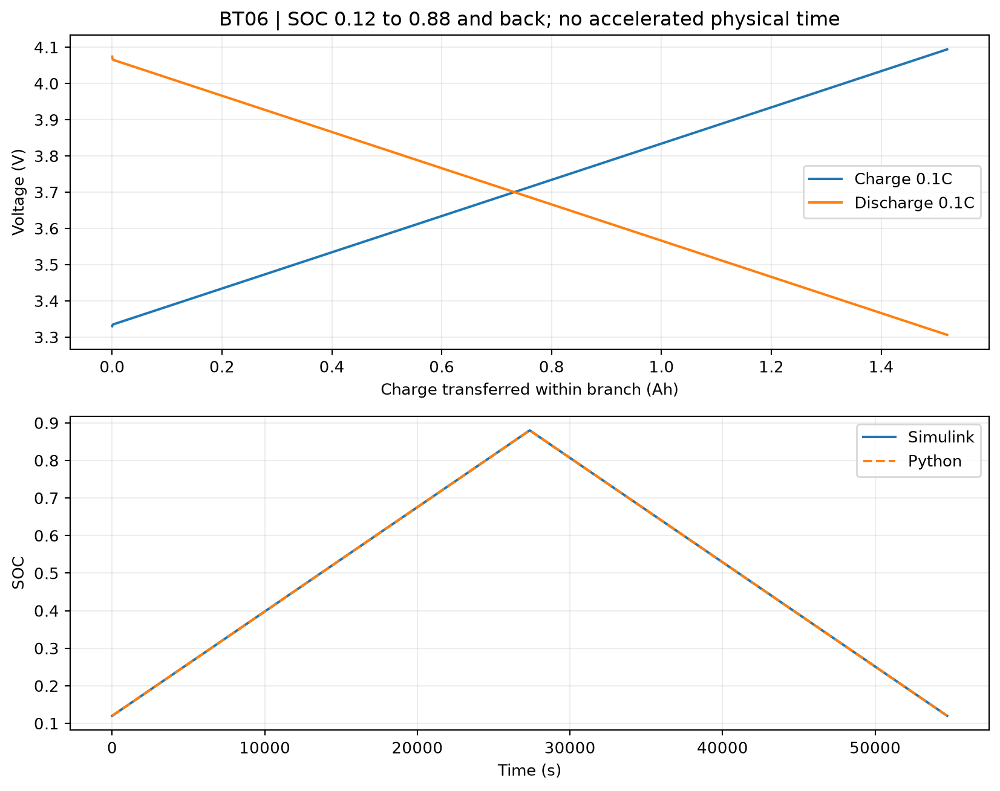

图 10 BT06 容量曲线与完整电量历程。上图横轴是各充、放电分支分别从零累计的 Ah，因此两条分支可能相交；没有活性物质量数据，不使用 mAh/g。下图给出真实物理时间，完整 0.1C 往返确需 54720 s。资产 A 的 OCV 对 SOC 为线性，因此曲线形状是核算参数的结果。

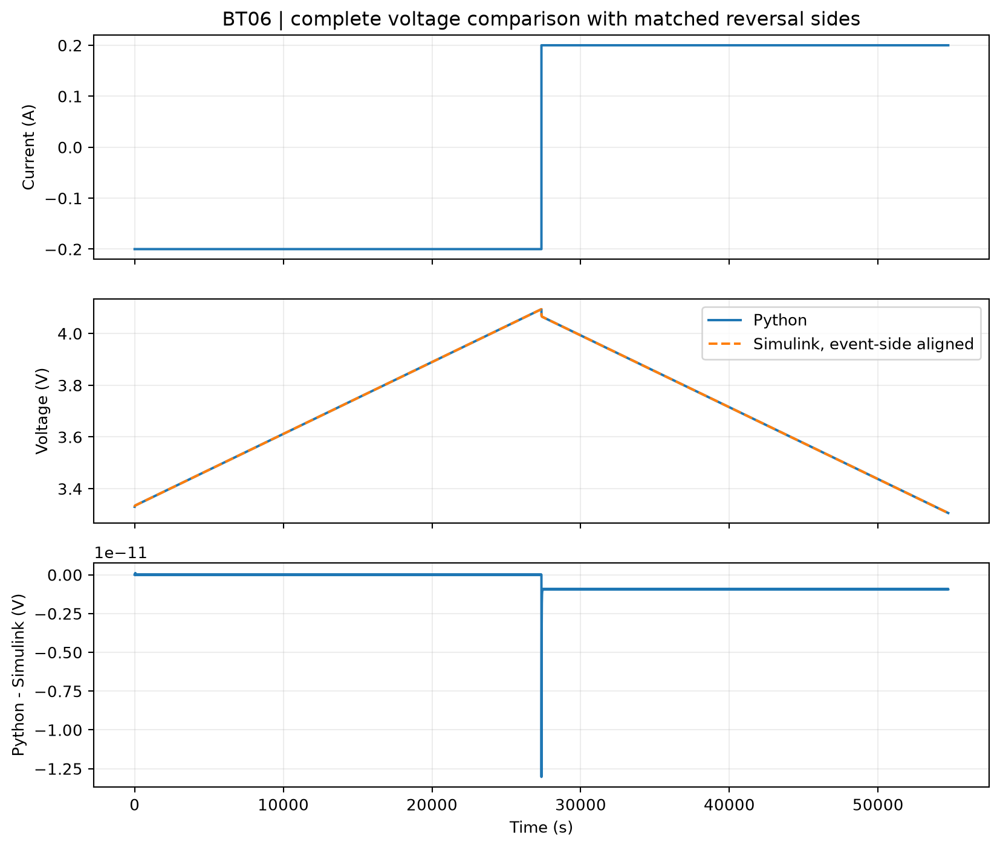

图 11 BT06 完整时域对比。上图显示电流反转，中图为两套实现的端电压，下图直接相减。反转样本使用 Simulink 的事件右侧值与 Python 右侧值配对，其真实来源时间保存在事件表中，其他样本未作调整。

| 反转侧 | Python 时间 s | Simulink 来源时间 s | SOC | u1 V | 端电压 V |
| --- | --- | --- | --- | --- | --- |
| 左侧 | 27360 | 27360.0000000165 | 0.88 | −0.004 | 4.094 |
| 右侧 | 27360 | 27360.0000000167 | 0.88 | −0.004 | 4.074 |

事件两侧电流变化 0.4 A，欧姆压降变化为 0.4×0.05=0.02 V；状态连续。仅用两个不同事件侧的电压相减会把正确的物理跳变当成数值误差。对齐审计同时保存原始时刻、原始误差、配对误差及选取规则，没有修改原始 CSV 或 MAT。

## 3.8 测试项目 8 三组实测脉冲留出验证

**目的与设计依据**：验证第 4.4、9.4 节：固定参数的一阶 ECM 对未参与标定的实际端电压是否有效。

**前提条件**：资产 C，25 °C 恒温设定。每段初始 u1=0 V，初始 SOC 由完整记录的电流积分获得；不按该段电压重新拟合初值。

**输入与输出**：留出脉冲 4、6、8，每组 0 至 119.9 s，间隔 0.1 s。原始电流反号后输入；约 30 s 放电、40 s 静置、10 s 充电、40 s 静置，实际幅值采用记录。
输出：实测与开环模型电压、直接残差、整段及分阶段 RMSE 和最大误差。

**执行步骤**：载入冻结资产与完整输入时序。Python 外部积分器和 Simulink 分别从同一初值推进；保存所有时间点，逐点相减，并独立核算本项预期结果。

**预期结果**：每组整段 RMSE≤30 mV，最大绝对误差≤100 mV；物理状态只由电流推进，不利用测量电压纠正。

**判定规则**：采用第 5 章执行前固定的判据。按预期结果逐项核算，不按运行结果放宽门限。

**实际结果**：三组整段 RMSE 为 26.70、28.65、17.27 mV；最大绝对误差为 60.25、59.47、50.51 mV，均通过。

**异常与适用范围**：部分充电和静置阶段 RMSE 约 35 至 41 mV，高于整段 30 mV 的量级。整段通过不等于每阶段都低于 30 mV。SOC 由电量推算，缺少独立真值；0.1 s 是重采样间隔，不是原传感器采样率。

**结论**：通过

| 留出脉冲 | 初始 SOC | 放电峰值 A | 充电峰值 A | 整段 RMSE mV | 最大误差 mV |
| --- | --- | --- | --- | --- | --- |
| 4 | 0.65521015 | 6.18985 | −4.643 | 26.6997 | 60.2505 |
| 6 | 0.43430811 | 6.19025 | −4.643 | 28.6459 | 59.4651 |
| 8 | 0.21339996 | 6.19005 | −4.64359 | 17.266 | 50.5055 |

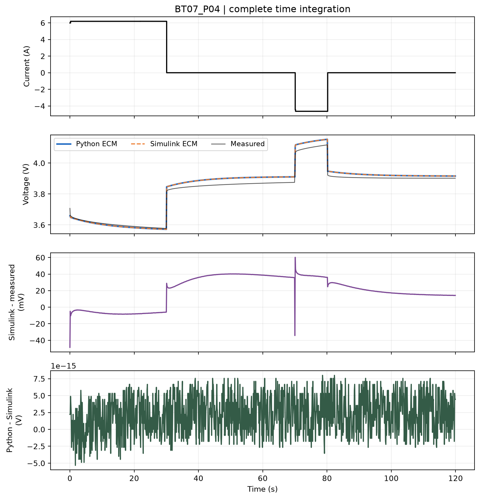

图 12 BT07 留出脉冲 4，25 °C。第一行为输入实测电流；第二行蓝色和橙色为两套开环模型，黑色为测量电压；第三行为 Simulink 电压减测量电压，单位 mV；第四行为 Python 减 Simulink，单位 V。黑色测量曲线未送入物理模型，因此第三行是真正的开环预测误差。

| 阶段 | 区间 s | RMSE mV | 最大误差 mV |
| --- | --- | --- | --- |
| 放电 | 0 至 30 | 7.5141 | 48.539 |
| 放电后静置 | 30 至 70 | 36.518 | 40.22 |
| 充电 | 70 至 80 | 38.465 | 60.25 |
| 充电后静置 | 80 至 120 | 19.819 | 36.089 |

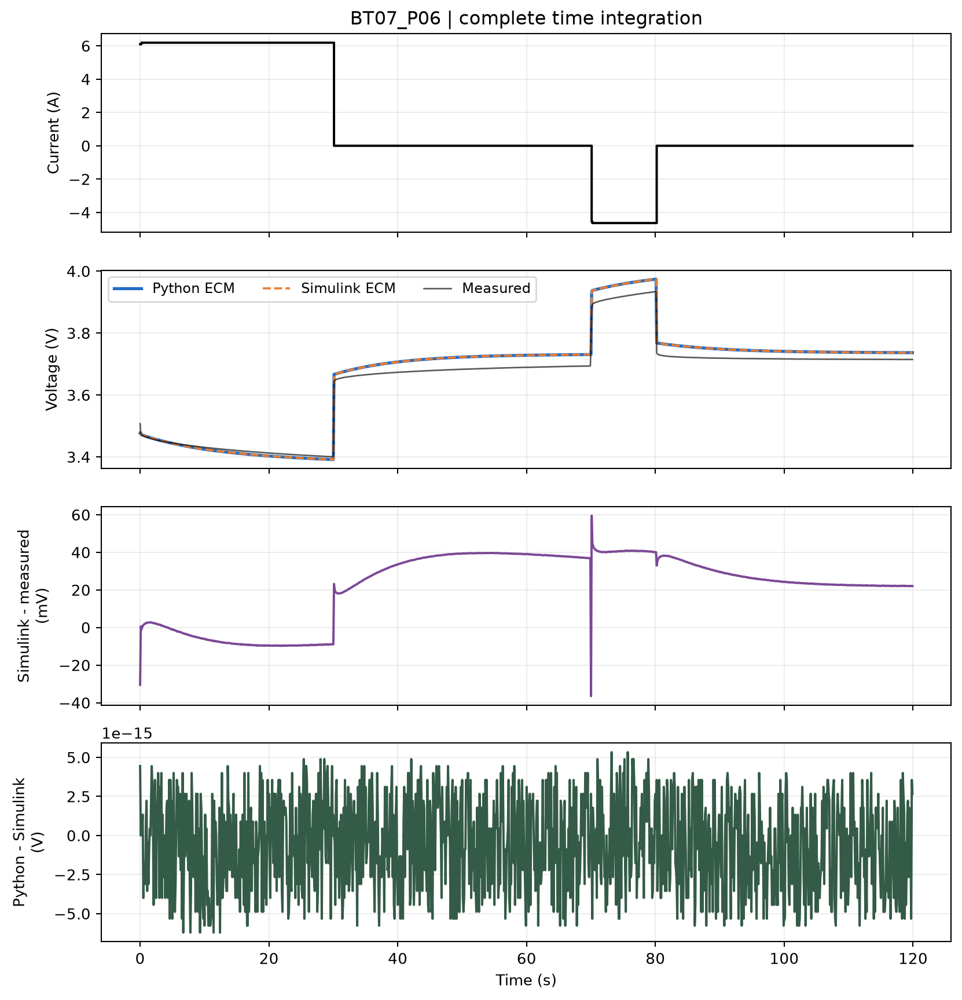

图 13 BT07 留出脉冲 6，25 °C。第一行为输入实测电流；第二行蓝色和橙色为两套开环模型，黑色为测量电压；第三行为 Simulink 电压减测量电压，单位 mV；第四行为 Python 减 Simulink，单位 V。黑色测量曲线未送入物理模型，因此第三行是真正的开环预测误差。

| 阶段 | 区间 s | RMSE mV | 最大误差 mV |
| --- | --- | --- | --- |
| 放电 | 0 至 30 | 7.7589 | 30.478 |
| 放电后静置 | 30 至 70 | 35.574 | 39.649 |
| 充电 | 70 至 80 | 40.839 | 59.465 |
| 充电后静置 | 80 至 120 | 27.095 | 40.099 |

图 14 BT07 留出脉冲 8，25 °C。第一行为输入实测电流；第二行蓝色和橙色为两套开环模型，黑色为测量电压；第三行为 Simulink 电压减测量电压，单位 mV；第四行为 Python 减 Simulink，单位 V。黑色测量曲线未送入物理模型，因此第三行是真正的开环预测误差。

| 阶段 | 区间 s | RMSE mV | 最大误差 mV |
| --- | --- | --- | --- |
| 放电 | 0 至 30 | 16.962 | 40.699 |
| 放电后静置 | 30 至 70 | 20.864 | 24.425 |
| 充电 | 70 至 80 | 21.842 | 50.505 |
| 充电后静置 | 80 至 120 | 11.135 | 22.375 |

观察到的偏差主要集中于训练中未覆盖的充电与长静置阶段。固定 RC 参数、OCV 与初始电量误差都可能造成这些偏差，但当前证据不能唯一归因。后续若改参数，必须使用训练数据重新标定并另存版本，不能用这三段留出曲线调到通过。

## 3.9 测试项目 9 初始偏差与噪声下的 SOC 估计

**目的与设计依据**：验证 P11、P12 的因果 SOC 状态估计，保留一个核心估计项目。

**前提条件**：资产 A，25 °C；物理 z=0.6、u1=0，估计初值 z=0.7、u1=0。物理与估计状态分离。

**输入与输出**：每 10 s 依次施加 0、1.5、0、−1、2、0、−1.5、0、1、−0.5 A，重复三次，共 300 s。电压噪声标准差 3 mV，种子 20261008，EKF 周期 0.1 s。
输出：SOC 真值与估计、估计极化、SOC 误差、校正前预测电压、协方差。

**执行步骤**：载入冻结资产与完整输入时序。Python 外部积分器和 Simulink 分别从同一初值推进；保存所有时间点，逐点相减，并独立核算本项预期结果。

**预期结果**：最后 30 s SOC RMSE 和最终绝对误差≤0.02；协方差有限、对称、半正定；估计轨迹与独立 MATLAB 实现一致。

**判定规则**：采用第 5 章执行前固定的判据。按预期结果逐项核算，不按运行结果放宽门限。

**实际结果**：最后 30 s SOC RMSE 为 0.0076665 个百分点，最终误差 0.00461001 个百分点。首次测量校正后即进入 2 个百分点范围，协方差检查通过。

**异常与适用范围**：人工 OCV 斜率为 1 V 每单位 SOC，初始 SOC 方差较大，因此首次电压观测即可显著纠偏。不能据此声称真实电池在任意 SOC 都立即收敛。首点先验电压仍含约 100 mV 初始偏差，未从指标中删除。

**结论**：通过

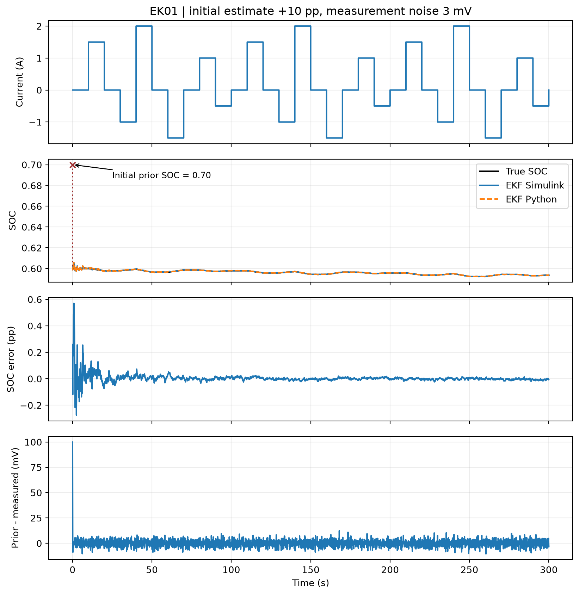

图 15 EK01 300 s 噪声试验。第二行红叉明确标出校正前初始 SOC=0.70，连续曲线为每次测量后的估计与物理真值；第三行为后验 SOC 减真值，单位为百分点；第四行为校正前电压预测减本次测量，保留首点约 100 mV 误差。不能将后验电压当作先验预测精度。

| 配置或结果 | 数值 |
| --- | --- |
| P0 对角元 | 0.01、0.0001 |
| 每步过程协方差对角元 | 1×10⁻⁹、1×10⁻⁷ |
| 电压测量方差 | 9×10⁻⁶ V² |
| 先验电压 RMSE，包含首点 | 3.59008 mV |
| 协方差最小特征值 | 3.574e−07 |
| 跨实现最大 SOC 估计差 | 8.882e−16 |

## 3.10 测试项目 10 供需变化下的功率分配

**目的与设计依据**：验证 P1、P3、P13 的供需平衡、可行电流根、限充和供电不足断开。

**前提条件**：资产 A，4 串 2 并，25 °C，z=0.6、u1=0，负载初始接通；配电效率 0.9，单体电流界限 −3 至 5 A，电压界限 2.8 至 4.3 V。

**输入与输出**：每段 20 s。太阳上限依次为 500、500、500、500、0 W；请求负载依次为 450、540、405、90、180 W，总计 100 s。
输出：太阳上限与实际输出、电池电流与功率、请求与实际负载、配电热、SOC、电压、连接状态和残差。

**执行步骤**：载入冻结资产与完整输入时序。Python 外部积分器和 Simulink 分别从同一初值推进；保存所有时间点，逐点相减，并独立核算本项预期结果。

**预期结果**：五段分别为电池零输出、补足 100 W、吸收 50 W、按 −3 A 限充并弃光、供电不足后实际负载降至 0 W。每点按实际太阳功率核算守恒。

**判定规则**：采用第 5 章执行前固定的判据。按预期结果逐项核算，不按运行结果放宽门限。

**实际结果**：五种模式及电压电流约束均通过；最大端口功率残差 3.809e−12 W。80 s 断开前最大可交付负载约 129.8762 W，确实低于 180 W。

**异常与适用范围**：断开后的零供电是本测试保护结果，不等于满足了请求负载。此项仅含一条必要模式序列，未扩展为整星启停与故障矩阵。

**结论**：通过

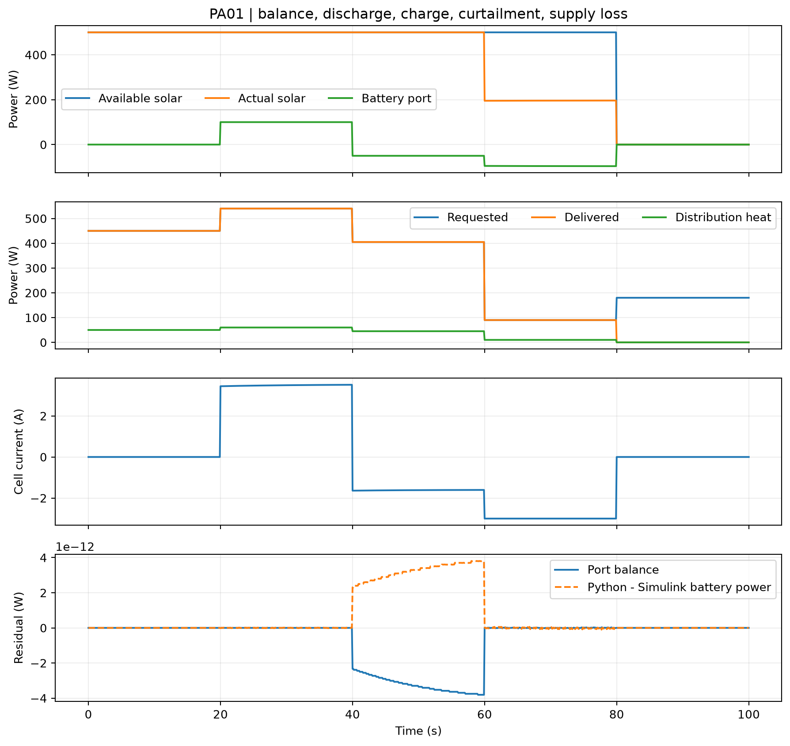

图 16 PA01 100 s 功率分配。上两行区分太阳上限、实际取电、电池端口、请求负载、交付负载与配电热。60 s 开始限充，太阳实际取电下降；80 s 无日照且电池能力不足，交付负载归零。第三行为单体电流；第四行为端口守恒残差以及两套实现的电池功率差。

| 时刻 s | 太阳实际 W | 电池 W | 交付负载 W | 配电热 W | 单体电流 A |
| --- | --- | --- | --- | --- | --- |
| 0 | 500 | 0 | 450 | 50 | 0 |
| 20 | 500 | 100 | 540 | 60 | 3.445695 |
| 40 | 500 | −50 | 405 | 45 | −1.639668 |
| 60 | 195.1475 | −95.14751 | 90 | 10 | −3 |
| 80 | 0 | 0 | 0 | 0 | 0 |

配电入口需求等于请求负载除以 0.9。例如请求 540 W 时入口需要 600 W，太阳提供 500 W，电池补 100 W，配电器耗散 60 W。电池内部热已体现在端电压与功率中，不在 P1 中重复扣除。求解器在当前真实状态下求可行根，EKF 不参与。

# 4 测试内容充分性分析

10 项覆盖太阳输入、静态电池、秒级充放电、SOC 温度查表、耗散与储能、完整容量窗口、留出实测电压、SOC 估计和基本功率分配。26 次运行属于这 10 个项目内部的参数配置及步长核算，不新增正式测试项目。

解析解、手算和能量恒等式用于发现两套实现可能共同存在的公式错误；独立 Simulink 用于检查跨实现一致性；留出实测电压用于判断 25 °C 电芯预测精度。这三类证据分别有不同作用，数值一致不能替代物理准确性。

覆盖边界明确为：多温度只验证人工表，真实温度性能未测；EKF 只验证合成已知 SOC；真实 SOC、实际发热、老化、单体不一致、可逆热和完整 Thermal 闭环未验证。接口装配、工程异常矩阵和完整轨道联调不计入本轮 10 项。

# 5 测试条件与要求

## 5.1 固定判据

| 对象 | 执行前固定的门限 |
| --- | --- |
| 静态与插值 | 绝对误差≤1×10⁻¹⁰ 加参考量绝对值的 1×10⁻¹⁰。 |
| 动态对照 | SOC≤1×10⁻⁷；u1≤1×10⁻⁶ V；单体电压≤1×10⁻⁵ V；单体电流≤1×10⁻⁵ A；功率与热源≤1×10⁻⁴ W。 |
| 步长核算 | 0.05 与 0.025 s 的差异低于上述 SOC、u1、电压门限的四分之一。 |
| 端口守恒 | 残差≤1×10⁻⁶ W 加当时最大端口绝对功率的 1×10⁻⁹。 |
| 实测电压 | 每组完整留出段 RMSE≤30 mV，最大绝对误差≤100 mV。 |
| EKF SOC | 最后 30 s 的 RMSE 和最终绝对误差均≤0.02。 |
| BT05 能量 | 残差≤1×10⁻⁵ J 加最大累计内部电功差绝对值的 1×10⁻⁶。 |
| BT06 电量与时刻 | 单方向电量误差≤1×10⁻⁶ Ah；反转时刻误差≤1×10⁻⁴ s；同事件侧比较电压。 |

## 5.2 执行环境与可复现设置

| 环境 | 配置 |
| --- | --- |
| MATLAB 与 Simulink | 26.2.0.3386108 (R2026b)；Simulink 26.2 |
| Python | Thermal/.venv，SciPy DOP853；纯电池响应不拥有积分时间。 |
| Simulink 状态 | 5 个原生连续积分器：SOC、u1、累计热量、累计内部电功差、累计绝对 Ah。后二项状态不反馈物理电池。 |
| 离散模块 | 参数查询及外部功率分配为独立 MATLAB 方程；EKF 使用独立离散状态，每次已接受观测更新一次。 |
| 可执行模型 | matlab 下每个项目对应同名 slx，另有通用模型 sdtwin_power_v191.slx。装载与启动回调自动加载相应配置。 |
| 源码范围 | Power/battery.py 为本版纯 ECM 与 EKF；外部 Python 积分和求根在 tests_v19_1/run_python.py。历史 RLS 实现独立保留。 |

这是以设计方程构建的独立 Simulink 模型，使用原生连续积分器，不是 Simscape Battery 厂商预设电芯块。模型验证的输入和参数来自本报告定义的资产。

# 6 测试数据

## 6.1 文件与重现入口

| 目录或文件 | 保存内容 |
| --- | --- |
| fixtures | 26 份时间序列及配置，A、B、C 冻结参数，BAK 数据许可，执行前方案副本。 |
| results | Python 与 Simulink CSV、原始 Simulink MAT、逐点差值、手算、能量与事件审计、summary.json。 |
| figures | 每项图表的 PNG 和 PDF；原生 Simulink 电池子系统与整体图。 |
| matlab | 10 个项目模型、通用模型、模型构建器、独立公式、运行入口。 |
| reports | 本报告 Markdown，以及报告布局与溯源记录。 |
| README.md | 完整重现命令、字段定义、结果摘要和已知适用边界。 |

从仓库根目录运行 prepare.py 冻结输入，再运行 run_python.py；MATLAB 中执行 addpath 后运行 run_suite；最后执行 analyze.py。build_report.py 只读取结果并生成报告。用户查看模型时可直接打开同名 slx 后运行，不需要 Python 回调。完整命令见本试验目录 README。

## 6.2 原始数据与版本证据

BAK 数据来自 MathWorks 的 Estimate Battery Model Parameters from HPPC Data 示例，原始记录作者为 Anandaroop Bhattacharya 与 Subhasish Basu Majumder，IIT Kharagpur。许可随导出输入保存。原始电流以放电负号记录，进入当前模型前反号。电流保持及电压同工作段内重采样的旧输入文件按哈希固定，本轮没有再拟合留出电压。

| 证据 | SHA256 前 16 位 |
| --- | --- |
| 执行前方案 | 2cf9d8dcd508b8d6 |
| 用户设计报告 v19.1 | 04f225fa8798bf0a |
| 25 °C 原始数据 | 7fba19867cf66e81 |
| 离线标定记录 | 42bf69446b287a97 |
| 保留的 Orbit 格式来源 | 9c50c61d4baa6d04 |

完整哈希在 contract.json 与 evidence_manifest.json。BT06_alignment_audit.json 记录唯一事件配对。summary_before_event_alignment.json 保存最初按固定网格比较得到的 9 项通过、1 项失败；该失败原因及后续配对规则已在第 3.7 节说明。判据和原始轨迹均未覆盖。

## 6.3 参考资料

用户修订的 SDTwin_Power_Design_Report_CN_v19.1.docx；本轮设计依据。

Power/TEST_PLAN.md 的执行前冻结版本；本轮范围与判据。

用户提供的《用 MATLAB Simulink 做锂电池建模》；脉冲、静置回稳与独立工况验证方法。

MathWorks. Estimate Battery Model Parameters from HPPC Data. https://www.mathworks.com/help/simscape-battery/ug/estimate-battery-model-parameters-from-hppc-data.html

MathWorks. Integrator. https://www.mathworks.com/help/simulink/slref/integrator.html

MathWorks. From Workspace. https://www.mathworks.com/help/simulink/slref/fromworkspace.html

# 7 测试总结

| 编号 | 测试项目 | 结论 |
| --- | --- | --- |
| PV01 | 日照与朝向下的太阳发电 | 通过 |
| BT01 | 电池静态响应与整组换算 | 通过 |
| BT02 | 放电脉冲与静置恢复 | 通过 |
| BT03 | 充电脉冲与充放电反转 | 通过 |
| BT04 | SOC 温度查表及响应 | 通过 |
| BT05 | 电阻发热与极化储能 | 通过 |
| BT06 | 完整充放电与容量曲线 | 通过 |
| BT07 | 三组实测脉冲留出验证 | 通过 |
| EK01 | 初始偏差与噪声下的 SOC 估计 | 通过 |
| PA01 | 供需变化下的功率分配 | 通过 |

本轮 10 项满足预设模型判据。所有动态项目已沿完整物理时间积分，未用少量采样点替代动态过程。三组留出实测电压整段达标，同时保留充电与静置阶段的系统偏差。

可支持的结论是：v19.1 一阶 ECM、只读参数表、EKF 与基本功率分配在本报告列出的输入域中完成数值核算和独立 Simulink 对照；BAK 25 °C 三个留出片段完成电压验证。结论不扩展到实际航天电芯、多温度实物、真实 SOC、发热实测、老化或整星热电联调。

| 项目 | 最大电压差 V | 最大 SOC 差 | 比较点数 |
| --- | --- | --- | --- |
| PV01 | 0 | 0 | 611 |
| BT01 | 4.441e−16 | 0 | 12 |
| BT02 | 5.773e−15 | 5.551e−16 | 4203 |
| BT03 | 5.773e−15 | 5.551e−16 | 801 |
| BT04 | 5.773e−15 | 4.441e−16 | 1803 |
| BT05 | 5.773e−15 | 5.551e−16 | 801 |
| BT06 | 1.303e−11 | 9.286e−13 | 54721 |
| BT07 | 7.994e−15 | 3.553e−15 | 3600 |
| EK01 | 6.217e−15 | 1.332e−15 | 3001 |
| PA01 | 1.199e−14 | 1.221e−15 | 1001 |
