# 国际空间站有限元热建模与分析报告

本报告编制于 2026 年 9 月 30 日，模型用 COMSOL Multiphysics 6.3 传热模块建立，由 Python 的 MPh 库驱动。

## 1 概述
本报告记录国际空间站有限元热模型的建立过程与轨道热分析结果。模型在 COMSOL Multiphysics 6.3 中由 Python 脚本建立，几何、材料、表面性质与热负荷依据文献 A、B、C 三份热控文献、NASA 公开三维模型、SSP 30219 坐标系规范与公开工程资料确定，每个取值都注明了文献、公开资料或模型取定依据。舱内机柜、舱外电子设备与舱外载荷简化为方块热源。机柜与舱外电子设备的热量经冷板进入冷却回路，由散热器面板向深空辐射；舱外载荷不接冷板，由方块外表面直接向空间辐射。分析覆盖设计冷工况、设计热工况与平均环境工况，每个工况由轨道正午起连续计算 16560 s，即 2.98 个轨道周期，统计取最后一个轨道周期，文中称第三圈。另建散热器排热能力子模型，求 EATCS 散热器在三个工况下的排热能力。

### 1.1 主要结论
1．在 COMSOL 中建立了国际空间站全站有限元热模型，包含 19 个加压舱段共 20 个舱体圆柱、12 个桁架段、6 个 EATCS 散热器 ORU、4 台 PVR、18 块太阳翼毯面、108 个方块热源与 6 个不发热的 EATCS 设备方块。几何、材料、表面性质与热负荷的每个取值都注明了文献、公开资料或模型取定依据；参考姿态下的关节转轴与零位与 SSP 30219 一致，在轨转动按四个刚体辐射组近似，见第 3.5 节。
2．三个工况第三圈的回路 A 收集热量平均为 22.8 至 23.0 kW，回路 B 为 25.0 至 25.2 kW；散热器分流比平均 0.06 至 0.09，最大 0.09；混合供液温度保持在 2.8 °C，散热器出口氨温度在 −78.5 °C 至 −45.2 °C 之间，分流比很小时受面板换热算法影响偏低约 2 K 至 3 K，见第 5.5 节。收集热量仍随机柜升温缓慢增加，周期稳态时两回路合计约高 1.7 kW，不改变散热器余量的结论。
3．当前热负荷下 EATCS 散热器分流比很小，流经散热器的少量氨被冷却到接近面板的辐射平衡温度。设计冷工况散热器面板最低 −77.8 °C，接近 −77 °C 的冰点；分流比很小时模型按氨进出口平均温度计算面板换热，出口端面板偏冷约 2 K，按传热单元数法逐块估算的面板最低温度约 −76 °C。模型采用理想指向规律，散热器排热又因理想化处理偏多；实际运行中散热器按 RGAC 计算的目标转角调整以防冻，文献 D16 记录的 P1 散热器在轨最低读数约为 −54 °C。按 SSP 41000 规定的 270 nmi 高度计算时，冷工况受到的地球红外与反照更少，冰点余量更小。
4．舱内机柜、MBSU、DDCU 与 IEA 等接冷板的方块，冷板面温度约等于冷却液温度加上功率除以冷板换热系数与冷板面积之积，方块温度再高出内部导热温差，由取定的冷板参数决定，三个工况的机柜温度相同，机柜最高温度 27.1 °C。模型用这些方块把热量按设定路径送入回路，方块温度不用于判断机柜是否满足文献 D13 前面板 37 °C 的限值。
5．舱外载荷不接冷板，第三圈平均温度在设计冷工况为 −26.3 °C 至 −19.4 °C，在设计热工况为 −29.3 °C 至 −6.7 °C，是受轨道环境影响最大的方块热源。ELC2 在设计热工况中比设计冷工况更冷，原因是 β 为 75° 时太阳从左舷一侧照射，ELC2 位于 AMS-02 的右舷侧，受其遮挡。载荷方块的时间常数约 5 h，第三圈平均温度每圈仍变化最多 0.9 K，达到周期稳态时还会变化约 3 K。
6．散热器排热能力子模型令全部氨流经散热器。设计热工况下单回路排热 35 kW 时，出口温度一圈内的最高值为 −22.7 °C，低于 2.8 °C 设定点，模型散热器满足单回路 35 kW 的排热要求。出口温度一圈最高值达到 2.8 °C 时，回路 A 与回路 B 分别可排出 86 kW 与 81 kW，高于公开资料的估算值。差别来自两方面：排热量增大时散热器入口温度随之升高，模型又作了理想化处理；该值应看作排热能力的上限。面板换热系数取 40 W·m⁻²·K⁻¹ 时两回路分别为 74 kW 与 70 kW。设计热工况环境比规范原意温和，吸收率取 0.36 时 35 kW 的出口温度升高约 1.8 K，结论不变；2019 年回路 B 实际只有五条散热器流路工作；散热器入口温度按 17 °C 封顶时，回路 A 与回路 B 的收集热量分别约为 68 kW 与 74 kW。
7．美国太阳翼光照段最高温度在设计冷工况为 57.3 °C，与文献 D18 寿命初期 β 为 0° 的计算值 +53 °C 相差 4.3 K；平均环境工况为 66.6 °C，高出 13.6 K，其中约 9.3 K 来自两个工况的环境差别，电池面发射率取 0.82 低于文献 D18 的 0.86，也使计算温度偏高约 4 K。出影时约 −80 °C 与文献 O14 的在轨特征一致，该项是面热容的标定项。

### 1.2 缩略语

表 1  缩略语

| 缩略语 | 英文全称 | 中文名称 |
|---|---|---|
| EATCS | External Active Thermal Control System | 舱外主动热控系统 |
| IATCS | Internal Active Thermal Control System | 舱内主动热控系统 |
| PVTCS | Photovoltaic Thermal Control System | 光伏热控系统 |
| PVR | Photovoltaic Radiator | 光伏散热器 |
| ORU | Orbital Replacement Unit | 在轨可更换单元 |
| IEA | Integrated Equipment Assembly | 综合设备组件 |
| IFHX | Interface Heat Exchanger | 界面换热器 |
| FCV | Flow Control Valve | 流量控制阀 |
| SARJ | Solar Alpha Rotary Joint | 太阳翼阿尔法旋转关节 |
| BGA | Beta Gimbal Assembly | 贝塔万向组件 |
| TRRJ | Thermal Radiator Rotary Joint | 散热器旋转关节 |
| RGAC | Radiator Goal Angle Calculation | 散热器目标转角计算 |
| MBSU | Main Bus Switching Unit | 主母线开关单元 |
| DDCU | DC-to-DC Converter Unit | 直流变换单元 |
| ATA、PM、NTA | Ammonia Tank Assembly、Pump Module、Nitrogen Tank Assembly | 氨罐组件、泵模块、氮罐组件 |
| ELC | ExPRESS Logistics Carrier | ExPRESS 后勤托架 |
| AMS-02 | Alpha Magnetic Spectrometer | 阿尔法磁谱仪 |
| JEM-EF | Japanese Experiment Module Exposed Facility | 日本实验舱暴露平台 |
| PMM、PMA、BEAM | Permanent Multipurpose Module、Pressurized Mating Adapter、Bigelow Expandable Activity Module | 永久多用途舱、加压对接适配器、可扩展活动舱 |
| +XVV | +X Velocity Vector | +X 轴沿速度矢量的对地定向姿态 |
| BDF | Backward Differentiation Formula | 后向差分公式 |

## 2 依据资料
模型参数分三个层次取得。第一层是任务提供的三份热控文献，即表 2 中的文献 A、B、C，给出主动热控系统的组成、散热器与设备尺寸、回路流量与控制设定值。第二层是公开工程资料，补全全站几何、表面光学性质、材料热物性、热负荷与空间热环境。第三层是模型取定值，用于公开资料没有覆盖的参数，model/iss_spec.py 中标为 D 的条目逐项给出取值与推算方法，主要项列于第 3.9 节。
公开资料按舱段布局、桁架与转动部件、三维模型、表面光学性质与材料、热负荷与空间环境五个方向收集。除三维模型外的四个方向另做了一轮独立核验检索，逐项对照原文复查对模型影响最大的 147 个数值；三维模型方向只做了单位、坐标轴与总长的自检。核验建议中没有被模型采用的条目列于第 3.9 节。

表 2  依据资料与用途，代号沿用 docs 目录资料文档中的编号

| 代号 | 资料 | 用途 |
|---|---|---|
| A | Active Thermal Control System ATCS Overview，Boeing | EATCS 与 PVTCS 组成、散热器与设备尺寸、流量、供液设定点、舱内水回路温度 |
| B | ICES-2019-31 P1 EATCS Ammonia Leak，NASA JSC | 散热器布置、回路与桁架段关系 |
| C | 05ICES-279 IATCS Coolant Remediation，Boeing 与 NASA | 舱内水回路控温范围的旁证 |
| G3D | NASA 3D Resources IGOAL 模型，JSC | 桁架段、散热器、PVR 纵向范围、太阳翼 BGA 转轴、舱外载荷以及 Destiny、Unity、Harmony、Zarya、Zvezda 与三个 PMA 的位置 |
| T2 | NASA 与 TopCoder ISS 官方坐标模型 | 太阳翼毯面尺寸、间隙与翼根起点，PVR 横向位置 |
| W1 | SSP 30219 Rev F 空间站坐标系规范 | 坐标系、SARJ、BGA、TRRJ 转轴与零位定义 |
| JSC 26557 | ISS On-Orbit Assembly, Modeling and Mass Properties Data Book | 舱段质心与外包络 |
| RG | Reference Guide to the ISS 2010 与 ESA、JAXA 舱段简介资料 | 舱段长度与直径 |
| D2 | NASA/TM-2001-211221 近地轨道航天器设计热环境参数选取指南 | 反照率整轨平均修正 |
| D3 | NASA TFAWS 2015 国际空间站载荷热环境课程 | SSP 41000 设计验证环境、舱外活动热数据库平均环境 |
| D4 | TD9702A International Space Station Familiarization，NASA JSC | EATCS 排热能力与设计流量 |
| D5 | NASA/SP-2000-6109 ISS Evolution Data Book Volume I | EATCS 排热能力、热负荷分配、β 角范围 |
| D13 | SSP 57000 Rev E 加压载荷接口要求 | 机柜前面板平均温度限值 |
| D15 | Wise 与 Holt，TFAWS 2001 Tranquility 节点舱再生换热器分析 | Tranquility 节点舱舱壁环境热负荷 |
| D16 | ICES-2022-145 Coolant Leak from ISS EATCS，Cowan 与 Bond | 散热器回流接头与 P1 散热器在轨温度 |
| D17 | TFAWS18-AT-01 Ammonia Vent of the EATCS Radiator，Cowan | 散热器流路在轨温度极值 |
| D18 | NASA/TM-2005-213988 美国太阳翼地影工况性能，Kerslake 与 Scheiman | 太阳翼毯面光学性质与地影温度 |
| D19 | NASA CR-2006-213693 生命保障基线值文件 | 乘员代谢热 |
| O 系列 | 热控涂层与材料文献，MIL-HDBK-5J，NIST；其中 O14、O17 为太阳翼在轨温度，O25 为 BEAM 热分析 | 表面光学性质、材料热物性与太阳翼温度 |
| V1 | Finckenor 等，MISSE 6 空间站材料分析 | 国际空间站专用批次镀铝 beta 布光学性质 |

各方向的原始记录与核验记录保存在 docs 目录。模型采用的最终取值以 model/iss_spec.py 为准，docs/ISS_SPEC.md 记录各取值的来源与理由。核验取得 SSP 30219 修订版 F，该规范图 4.0-8 规定 TRRJ 绕 X 轴转动，图 5.0-10 给出零位时三个散热器 ORU 沿 Z 叠放、面板平面法向沿 Y 轴，转过 90° 后面板平躺，为正面对地姿态；图 4.0-8 续页另有一句把零位写作散热器梁位于 x-y 平面，与图 5.0-10 矛盾，模型按图 5.0-10 取零位。

## 3 有限元模型

### 3.1 坐标系、构型与姿态
坐标系为空间站分析坐标系：原点在 S0 桁架段几何中心，+X 平行美国段舱段轴线指向飞行方向，+Y 指向右舷，+Z 指向天底。构型取 2019 年状态：永久多用途舱 PMM 位于 Tranquility 节点舱前向口，加压对接适配器 PMA-3 位于 Harmony 节点舱天顶口，Pirs 对接舱位于 Zvezda 服务舱天底口，BEAM 可扩展舱位于 Tranquility 节点舱后向口。姿态为 +XVV 对地定向，即 +X 轴沿速度矢量、+Z 轴始终指向天底，力矩平衡姿态相对该姿态的小角度偏置不计。轨道高度 400 km，倾角 51.64°，周期 5553.6 s。

### 3.2 几何模型
几何全部由 COMSOL 的基本几何体生成。加压舱为先建实体圆柱再转换得到的封闭曲面，赋壳单元；桁架段、舱外设备、IEA、舱外载荷与舱内机柜为实体方块；EATCS 散热器、PVR 与太阳翼毯面为工作平面上的矩形曲面，赋壳单元。部件之间留 5 cm 间隙，几何经自动包围盒检查无相交。

表 3  几何模型组成

| 部件类别 | 数量 | 单元类型 | 说明 |
|---|---|---|---|
| 加压舱 | 20 | 壳 | 19 个舱段，美国段 14 个，俄罗斯段 5 个；Zvezda 服务舱按小直径段与大直径段建为 2 个圆柱，均含端盖 |
| 桁架段 | 12 | 实体 | Z1、S0、S1、S3 至 S6、P1、P3 至 P6，空间站没有 S2 与 P2 段 |
| 冷板设备 | 10 | 实体 | MBSU 4 台，DDCU 6 台 |
| EATCS 不发热设备 | 6 | 实体 | 氨罐组件、泵模块、氮罐组件各 2 台，不计泵电机热量 |
| IEA 电子设备 | 4 | 实体 | P4、P6、S4、S6 各 1 台 |
| 舱外载荷 | 6 | 实体 | ELC 4 个、AMS-02、JEM-EF |
| 舱内机柜 | 88 | 实体 | Destiny 24、Harmony 8、Tranquility 16、Columbus 16、Kibo 24 |
| EATCS 散热器面板 | 48 | 壳 | 6 个 ORU，每个 8 块面板 |
| PVR 面板 | 28 | 壳 | 4 台 PVR，每台 7 块面板 |
| 太阳翼毯面 | 18 | 壳 | 美国太阳翼 16 块，服务舱太阳翼 2 块 |

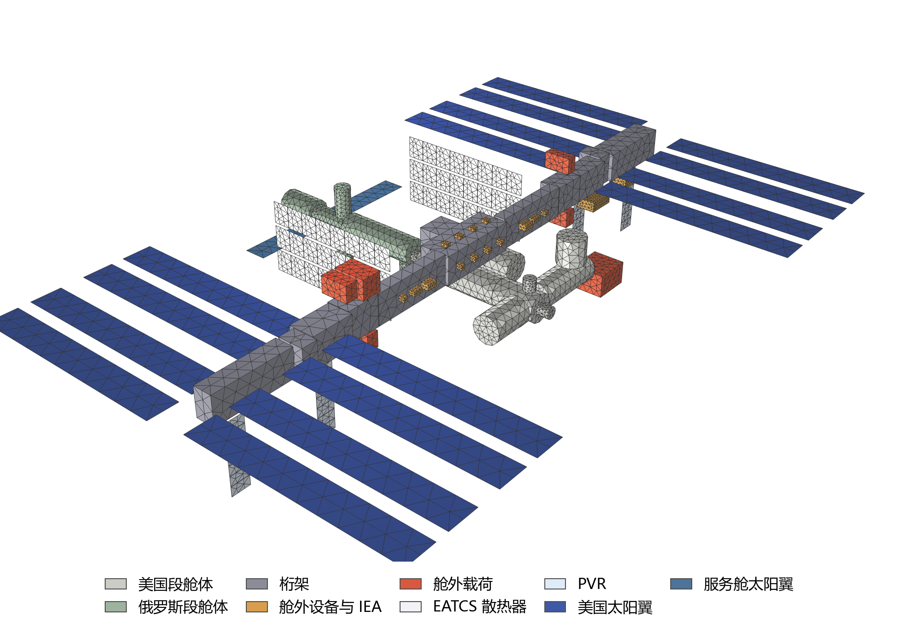

图 1  全站几何模型，按部件类别着色

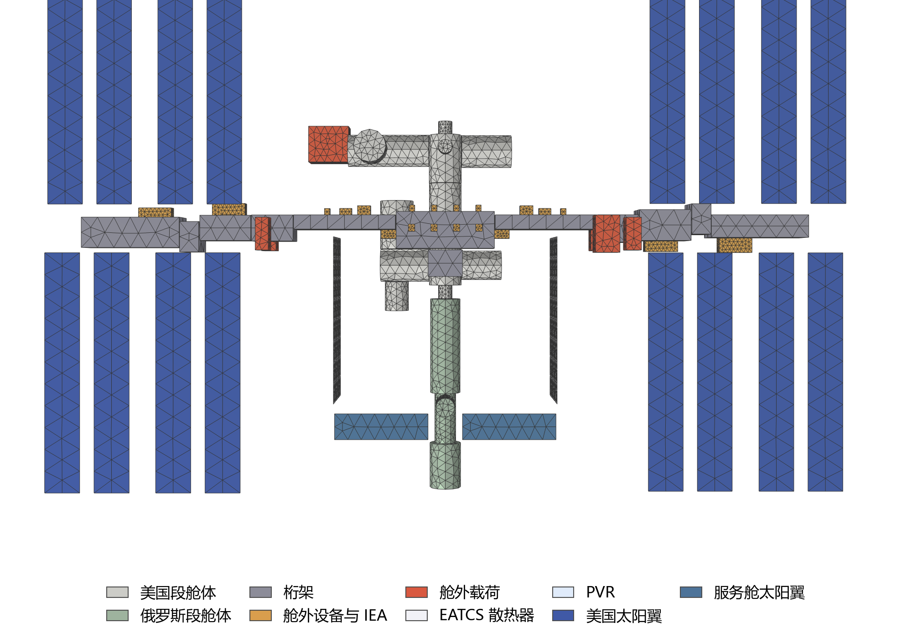

图 2  全站几何模型天顶视图，图中上方为飞行方向

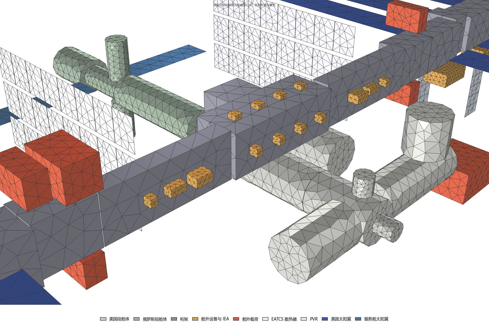

图 3  中央桁架、散热器翼与加压舱局部

### 3.3 网格
壳面用自由三角形单元，实体用自由四面体单元，最大单元尺寸按部件类别设定：美国太阳翼 3.0 m，服务舱太阳翼 2.0 m，桁架 2.2 m，舱体 1.4 m 至 1.6 m，散热器与 PVR 面板 1.2 m 至 1.4 m，舱外载荷 1.2 m，舱外设备 0.6 m，机柜 0.7 m，其余部位 2.0 m。全模型共 17748 个三角形边界单元，含壳单元与实体表面单元，另有 19907 个四面体单元。轨道温度研究步求解 82145 个自由度，含实体与壳的温度、四个辐射组的表面辐射度与 88 个回路未知量。

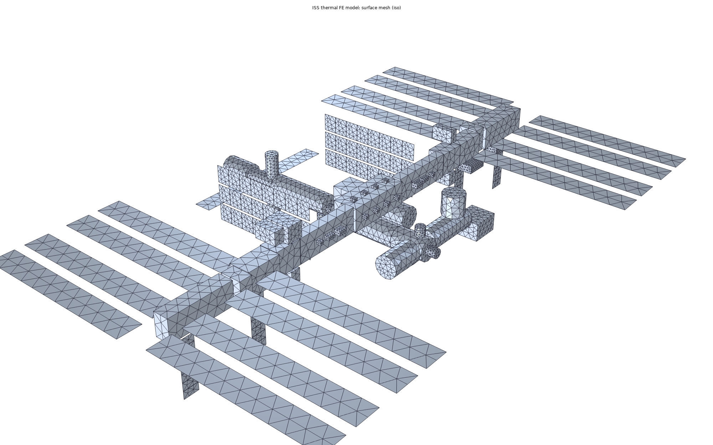

图 4  全站表面网格

### 3.4 表面光学性质与材料

表 4  表面光学性质

| 类别 | 太阳吸收率 | 红外发射率 | 依据 |
|---|---|---|---|
| EATCS 散热器与 PVR，Z-93 | 0.20 | 0.91 | 平均环境工况取名义值；冷工况取寿命初期 0.15 与 0.91，热工况取污染与紫外老化后的名义值 0.24 与 0.90，文献 O2 的 30 年末期包络为 0.36 与 0.90 |
| 美国段舱体防护屏 | 0.30 | 0.45 | 铬酸阳极化铝，只有外侧参与辐射 |
| 俄罗斯段舱体外表面 | 0.36 | 0.87 | 检索中没有找到公开值，取国际空间站专用批次镀铝 beta 布的寿命初期值 |
| 桁架 | 0.49 | 0.85 | 硫酸阳极化 |
| 舱外设备与 IEA | 0.012 | 0.03 | 多层隔热包覆，有效发射率 0.03 为模型取定值，公开资料只有文献 O25 的工程估计 0.05 |
| 舱外载荷 | 0.36 | 0.87 | 国际空间站专用批次镀铝 beta 布，文献 V1 |
| 太阳翼电池面 | 0.647 | 0.82 | 典型硅电池吸收率 0.72 扣除发电份额 0.073；文献 D18 的电池面值为 0.65 与 0.86 |
| 太阳翼背面 | 0.55 | 0.85 | 文献 D18 图 27 |

表 5  材料与等效热物性，导热系数单位 W·m⁻¹·K⁻¹，密度 kg/m³，比热 J·kg⁻¹·K⁻¹

| 类别 | 厚度 | 导热系数 | 密度 | 比热 |
|---|---|---|---|---|
| 美国段防护屏 | 2.0 mm | 152 | 2713 | 875 |
| 俄罗斯段防护屏 | 1.0 mm | 120 | 2640 | 920 |
| EATCS 散热器面板 | 2.5 mm | 31 | 3200 | 900 |
| PVR 面板 | 2.5 mm | 31 | 3200 | 900 |
| 太阳翼毯面 | 1.0 mm | 5 | 2000 | 800 |
| 桁架包络 | 实体 | 1 | 37 | 850 |
| 舱外设备与 IEA | 实体 | 150 | 300 | 900 |
| 舱外载荷 | 实体 | 10 | 150 | 900 |
| 舱内机柜 | 实体 | 50 | 400 | 900 |

壳单元的厚度、密度与比热按面热容等效，导热系数按面内热导等效。散热器面板面密度取 8 kg/m²，按 ORU 外廓面积计的面密度为 14.2 kg/m²，其中包含展开机构。太阳翼毯面的面热容取 1.6 kJ·m⁻²·K⁻¹，按文献 O14 记录的出影后约 3 min 由 −80 °C 升到 0 °C 的升温过程估算，属于校准取值，计算的出影升温过程在第 5.5 节与该特征对比。桁架包络的等效密度由桁架段总质量扣除太阳翼、PVR、散热器与 IEA 后除以模型包络体积得到。

### 3.5 传热与辐射
实体部件用固体传热接口求解温度 T，壳部件用壳传热接口求解温度 T2。舱内机柜位于封闭舱体内，只与冷板和舱内空气换热，不参与辐射计算；其余实体部件与全部壳部件的外表面参与轨道热载荷计算。轨道热载荷接口按太阳与红外两个波段计算直接日照、地球反照与地球红外，用半立方体法计算部件之间的相互辐射与遮挡，半立方体分辨率取 128，视角系数更新容差取 0.02，地球按 2 圈、每圈 6 个点离散，反照率与地球红外在全球取均匀值，深空温度取 2.7 K。
前期测试表明，用旋转域驱动面板转动并由自定义函数给出轨道位置时，轨道热载荷接口无法计算轨道速度变量，全站模型因此没有采用动网格。模型把全部部件按指向方式分为四个辐射组，每组一个轨道热载荷接口，各自设定指向规律，组内相互辐射与遮挡完整计算，组间不计。
指向规律中的术语定义如下。太阳 β 角为太阳方向与轨道面的夹角。轨道角自轨道正午点沿飞行方向起算，β 为 0 时地影中点位于轨道角 180°。侧边对日指太阳方向落在面板平面内，正面对地指面板法向指向天底，两者沿用文献 A 第 16 页的规定。参考姿态为建模时的几何姿态：散热器处于 TRRJ 零位，美国太阳翼毯面水平、电池面朝天顶。

表 6  辐射分组与指向规律

| 辐射组 | 成员 | 指向规律 |
|---|---|---|
| 机体组 | 舱体、桁架与舱外方块 | +Z 指向天底，+X 指向速度方向 |
| 散热器组 | 6 个 EATCS 散热器 ORU | β 为 0 的工况在受晒段保持 TRRJ 零位，面板法向垂直于轨道面，任一轨道角都侧边对日；β 不为 0 的工况绕 X 轴转动，使太阳方向落在面板平面内；地影段面板法向转向天底 |
| SARJ 组 | 4 台 PVR，服务舱太阳翼 | 绕 Y 轴随太阳转动，PVR 侧边对日，服务舱太阳翼电池面法向指向太阳在轨道面内的投影；服务舱太阳翼由自身驱动机构转动，指向规律与 SARJ 相同，并入本组 |
| 太阳翼组 | 8 个美国太阳翼 | 电池面法向始终指向太阳，长轴垂直于 Y 轴，对应 SARJ 与 BGA 的组合转动 |

每个辐射组按一个刚体转动。散热器组的两个散热器翼零位时沿 Y 轴相距 29.4 m 相向布置，地影段与设计热工况中面板接近正面对地，模型中两翼沿天底方向上下相叠，上方翼朝地一侧的视场有一部分被下方翼占据；实际两翼各绕自身 TRRJ 转轴转动，正面对地时左右并排，相互没有遮挡。美国太阳翼组同样整体转动，高 β 时相邻太阳翼之间的遮挡没有计入。

### 3.6 方块热源
发热部件简化为方块热源，热量按体积热源均匀施加。机柜、MBSU、DDCU 与 IEA 方块取一个面为冷板面，按对流边界与冷却液温度换热，其余表面按部件所处环境设置边界条件；舱外载荷方块不接冷板，外表面向空间辐射。

表 7  方块热源与冷却方式

| 类别 | 热源 | 冷却方式 |
|---|---|---|
| 舱内机柜 | 机柜沿每舱四面舱壁布置，Destiny 24 × 500 W，Harmony 8 × 300 W，Tranquility 16 × 400 W，Columbus 16 × 600 W，Kibo 24 × 600 W，合计 44.8 kW | 机柜背面为冷板。三面舱壁的机柜接 17 °C 中温水回路，一面舱壁的机柜接 4 °C 低温水回路，水温取自文献 A 第 2 页，冷板换热系数 40 W·m⁻²·K⁻¹；机柜其余表面与 22 °C 舱内空气换热，换热系数 2 W·m⁻²·K⁻¹ |
| MBSU 与 DDCU | MBSU 4 × 495 W，DDCU 6 × 694 W，取冷板设计热负荷 | 底面冷板接 2.8 °C 氨供液，冷板换热系数 60 W·m⁻²·K⁻¹；外表面按多层隔热有效发射率辐射 |
| IEA 电子设备 | 4 × 6 kW，取 PVTCS 轨道平均散热能力 | 冷板接各自 PVTCS 回路的 2.8 °C 供液；外表面按多层隔热有效发射率辐射 |
| 舱外载荷 | ELC 4 × 1 kW，AMS-02 2.5 kW，JEM-EF 3 kW | 不接冷板，外表面向空间辐射 |
| 乘员代谢热 | 6 × 136.8 W，文献 D19 | 计入低温水回路，两个 EATCS 回路各 410 W |

全站方块热源与乘员热量合计 85.2 kW，其中机柜 44.8 kW，MBSU 与 DDCU 6.1 kW，IEA 24.0 kW，舱外载荷 9.5 kW，乘员 0.8 kW，与文献 D5 表 4.4-1 装配完成状态的平均可用功率 85.8 kW 在同一量级。
全部 20 个舱体圆柱的内侧都通过多层隔热与 22 °C 舱内空气换热，等效换热系数 0.08 W·m⁻²·K⁻¹，由文献 D15 中 Tranquility 节点舱舱壁环境热负荷 −720 W 推算。Destiny、Harmony、Tranquility、Columbus 与 Kibo 五个舱的机柜空气换热与舱体漏热计入各自的低温水回路；其余舱段的漏热由 22 °C 舱内空气边界吸收，不进入回路，俄罗斯段舱内没有热源与回路。

### 3.7 冷却回路模型
EATCS 两个回路与四个 PVTCS 回路用全局方程描述。舱内主动热控系统 IATCS 设中温与低温两个水回路，机柜冷板的热量先进入水回路，再经界面换热器传给 EATCS 的氨回路。模型不建界面换热器与水回路，冷板一侧的冷却液温度取固定值：机柜冷板取 17 °C 与 4 °C 水温，MBSU、DDCU 与 IEA 冷板取 2.8 °C 氨供液设定点。回路收集的热量 Qc 等于各冷板面与舱内空气换热面的热流积分之和，经 20 s 滞后进入回路。散热器入口温度按供液设定点加上收集热量引起的温升计算：

ṁ cp Tret = ṁ cp Tset + Qc
式中 ṁ 为回路质量流量，cp 为液氨比热，Tret 为散热器入口温度，Tset 为供液设定点。每个 EATCS 回路的流量按三个散热器 ORU 均分，每个 ORU 的 8 块面板串联，每块面板对应一个氨温度节点。面板与氨之间的换热热流密度等于换热系数 g 乘以氨平均温度与面板温度之差，g 取 120 W·m⁻²·K⁻¹；面板两面线性化辐射换热系数在 −30 °C 至 7 °C 之间为 6 至 9 W·m⁻²·K⁻¹，g 为其 13 至 20 倍，氨与面板之间的温差远小于面板向空间辐射的等效温差。第 i 块面板对应氨节点的能量方程为：

3 Cf dTi/dt = f ṁ cp ΔTi − 3 ∫ g ΔTw dA
式中 Cf 为氨节点热容，取 1 kJ/K；Ti 为第 i 个氨节点温度；f 为散热器分流比，即流经散热器的氨流量占回路总流量的比例；系数 3 对应同一回路的三个 ORU 均分流量；ΔTi 为面板进出口氨温度差；ΔTw 为氨进出口平均温度与面板局部温度之差，积分遍及该面板。按进出口平均温度计算换热时，每块面板的传热单元数大于 2 会使出口氨温度低于面板温度，入口面板吸收的热量偏多，下游面板偏少，第 5.5 节给出该偏差的大小。
散热器出口氨与旁路氨在泵模块的流量控制阀中混合后回到供液端，文献 A 第 10 页与第 11 页。模型按积分规律调节分流比，分流比的变化率等于混合供液温度与设定点之差除以积分时间系数 kc，kc 取 3000 K·s；按散热器进出口温差 25 K 估算，闭环时间常数约 2 min，温差增大时相应缩短。分流比设 0.02 的平滑下限，积分器带抗饱和处理，报告中的分流比取平滑限幅后的值。控制器要求的分流比超过 1 时，表示散热器全流量也不能把供液温度降到设定点，即散热能力不足。混合供液温度只用于分流比控制，不反馈到冷板，回路温度波动不改变设备温度。

表 8  回路参数

| 参数 | 取值 | 依据 |
|---|---|---|
| 回路 A 流量 | 8200 lb/h，即 1.033 kg/s | 文献 A 第 10 页 |
| 回路 B 流量 | 8900 lb/h，即 1.121 kg/s | 文献 A 第 10 页 |
| 供液设定点 | 2.8 °C | 文献 A 第 6 页、第 11 页 |
| 液氨比热 | 4610 J·kg⁻¹·K⁻¹ | NIST 在 2.8 °C、300 psia 下为 4612.6 J·kg⁻¹·K⁻¹，取三位有效数字 |
| 回路热量分配 | Destiny 与 Kibo 的中温水回路热量进回路 B，Harmony、Tranquility 与 Columbus 的中温水回路热量进回路 A，低温水回路相反 | 文献 A 第 5 页回路图 |
| PVTCS 流量与设定点 | 0.5 kg/s，2.8 °C | 公开资料未给出，取定值 |

### 3.8 求解设置
每个工况先由轨道热载荷研究步计算全时段外热流，再由轨道温度研究步求解温度与回路。外热流与温度都按 120 s 间隔计算，计算由轨道正午起算，到 16560 s 结束，统计取最后 5553.6 s。时间推进采用 BDF 法，步长手动取 120 s，求解日志显示起步与事件重启后的步为一阶，其余各步为二阶；进入与离开地影时求解器在事件时刻截断步长，之后继续以 120 s 推进，结果按 120 s 间隔插值输出。分离式求解器分六组：实体温度一组，壳温度与全部回路未知量一组，四个辐射组的表面辐射度各一组，每步最多 25 次分离迭代。
各类部件的初始温度按类别取一个估计值。中温水回路机柜取 500 W 机柜冷板面的平衡温度 297.5 K，低温水回路机柜取 284 K，舱外设备与 IEA 取 285 K，舱外载荷取 255 K，桁架取 253 K，舱体取 268 K，散热器与 PVR 取 262 K，太阳翼取 290 K。
建模中处理了五个数值问题。其一，COMSOL 曲面类型的圆柱没有端盖，舱体改为实体圆柱转换的封闭曲面，并令舱体只在外法向一侧辐射，消除舱内全反射空腔造成的矩阵奇异。其二，回路方程由代数方程改为常微分方程，避免求一致初值时出现非物理温度。其三，温度与回路未知量采用手动缩放，使各未知量量级接近。其四，收集热量设为独立未知量，避免氨节点方程直接依赖全部机柜的温度自由度。其五，自适应步长在外热流分段更新处反复失败，改为手动步长。

### 3.9 模型取定值与主要简化
1．部件按指向方式分为四个辐射组，组间不计相互辐射与遮挡；每组按一个刚体转动，散热器两翼与美国太阳翼之间的相对位置按第 3.5 节处理。
2．部件之间全部不计导热。桁架段之间、设备与桁架之间、舱段之间、舱段与桁架之间以及散热器、PVR、太阳翼与桁架之间只通过同组辐射换热，冷板设备只与固定温度的冷板换热。
3．桁架以不透明实体包络表示，不计辐射穿过桁架杆件间隙的透射。桁架包络的最低与最高温度出现在外表面；平均值为体积平均，包络内部扩散时间长达数小时至数天，平均值主要反映 253 K 的初始值，不代表单根杆件的温度。
4．P4 至 P6、S4 至 S6 桁架段与 IEA 实际随 SARJ 转动，模型放在机体组，按对地定向计算外热流。
5．舱内空气温度取 22 °C 固定值；冷板一侧的冷却液温度取固定值，界面换热器与舱内水回路不建模，散热器入口温度按设定点计算。
6．散热器面板内的换热按面板均布，不区分流管位置，相当于流管之间面板的翅片效率取 1。
7．散热器指向采用理想的侧边对日与正面对地规律，没有模拟散热器目标转角计算 RGAC 对出口温度的约束，文献 A 第 16 页。
8．模型取定值包括冷板换热系数 40 与 60 W·m⁻²·K⁻¹、氨与面板换热系数 120 W·m⁻²·K⁻¹、机柜对舱内空气换热系数 2 W·m⁻²·K⁻¹、多层隔热有效发射率 0.03、各方块等效导热系数与密度、IEA 与冷板设备的尺寸和位置、机柜尺寸与每舱一面接低温水回路、JEM-EF 按无冷板处理、乘员热量两回路均分，以及回路数值参数 20 s、1 kJ/K、3000 K·s 与 0.02。完整清单见 model/iss_spec.py 中标为 D 的条目。
9．IEA 取 PVTCS 轨道平均散热能力 6 kW，MBSU 与 DDCU 取冷板设计热负荷，均为设计上限值；舱内机柜功率按舱段平均分配，舱外载荷功率取量级值；俄罗斯段外表面涂层、PVTCS 流量与设定点在检索中没有找到公开值，采用典型值。实际 JEM-EF 有主动冷却，模型按无冷板处理。
10．美国段各舱统一采用 Destiny 圆柱段 2.0 mm 铬酸阳极化铝防护屏，Unity 实际为 1.3 mm，Columbus 与 Kibo 的防护构成不同，BEAM 为柔性外壳；俄罗斯段 AMG-6 防护屏的导热系数、密度与比热为模型取定值。
11．附着舱段按母舱外壳半径加 5 cm 就位，Tranquility、Cupola、Columbus、Kibo、BEAM、Poisk、Pirs 与 Rassvet 等舱段中心与 IGOAL 模型或 JSC 26557 接口坐标相差 0.2 m 至 1.1 m；MBSU、DDCU 与 IEA 的位置为模型取定。
12．核验建议中没有采用的条目：铬酸阳极化铝的实测值 0.32 与 0.49、多层隔热有效发射率 0.05、文献 D18 的太阳翼电池面光学性质、上条所列舱段位置修正。
13．舱外设备与 IEA 外表面按多层隔热有效光学性质处理，吸收率 0.012、发射率 0.03，这一处理用于表示设备内部经多层隔热的散热，在相互辐射中却使设备外表面接近全反射面，会把阳光反射到邻近部件表面。
14．文献 A 列出的早期外部主动热控系统 EEATCS 的两台 P6 散热器在 2019 年构型中已收拢，模型不包括；PVTCS 泵流量控制组件的 275 W 功耗没有单独计入。
15．文献 B 第 8 页至第 11 页记载，P1-3 散热器第 2 流路于 2017 年 5 月隔离并排空，翻修件 2019 年 4 月才上行，2019 年构型中回路 B 实际只有五条散热器流路工作；本模型六个散热器 ORU 的两条流路全部工作。

## 4 分析工况

表 9  分析工况，太阳常数与地球红外单位 W/m²

| 工况 | β | 太阳常数 | 反照率 | 地球红外 | 地影时长 | Z-93 吸收率与发射率 |
|---|---|---|---|---|---|---|
| 设计冷工况 | 0° | 1321 | 0.20 | 206 | 36.1 min | 0.15 与 0.91 |
| 设计热工况 | 75° | 1423 | 0.40 | 286 | 全程受晒 | 0.24 与 0.90 |
| 平均环境工况 | 0° | 1371 | 0.31 | 241 | 36.1 min | 0.20 与 0.91 |

设计冷工况与设计热工况的太阳常数、反照率与地球红外取 SSP 41000 设计验证值，数值引自文献 D3 第 40 页。该环境规定冷工况高度 270 nmi、热工况高度 150 nmi，本模型三个工况统一取 400 km，冷工况受到的地球红外与反照偏多，热工况偏少，两个设计工况都比规范原意温和。热工况 Z-93 取污染与紫外老化后的名义值，低于 30 年末期包络。平均环境工况的太阳常数与地球红外取文献 D3 第 51 页舱外活动热数据库平均值，反照率在平均值 0.27 上按文献 D2 表 4.2.1-1 中 β 为 0° 的整轨平均修正加 0.04，取 0.31；两个设计工况的反照率未作修正，按文献 D2，β 为 75° 时该修正约为 0.19。三个工况的舱内外设备热负荷相同。

## 5 分析结果
以下统计取每个工况最后一个轨道周期，即第三圈。热量与温度的时程按时间步由探针输出；表中部件平均值为部件平均温度的一圈时间平均，最低与最高为一圈内部件各点温度的极值。温度云图按参考姿态绘制部件，太阳翼、PVR 与散热器在轨的实际指向随轨道变化，其外热流按各自的指向规律计算；各云图色标范围统一取 −80 °C 至 80 °C，超出该范围的温度按色标两端颜色显示。

### 5.1 EATCS 回路

表 10  EATCS 回路第三圈统计，热量单位 kW，温度单位 °C

| 工况 | 回路 | 收集热量 | 散热器排热 | 排热与收集之差 % | 分流比平均 | 分流比范围 | 散热器入口平均 | 散热器出口范围 | 混合供液范围 |
|---|---|---|---|---|---|---|---|---|---|
| 设计冷工况 | A | 22.8 | 22.9 | 0.2 | 0.06 | 0.06 | 7.6 | −78.5 至 −71.2 | 2.8 |
| 设计冷工况 | B | 25.0 | 25.1 | 0.2 | 0.06 | 0.06 | 7.6 | −78.2 至 −74.1 | 2.8 |
| 设计热工况 | A | 23.0 | 23.0 | 0.0 | 0.08 | 0.08 | 7.6 | −53.6 至 −50.1 | 2.8 |
| 设计热工况 | B | 25.0 | 25.0 | 0.0 | 0.09 | 0.09 | 7.6 | −48.6 至 −45.2 | 2.8 |
| 平均环境工况 | A | 23.0 | 23.0 | 0.1 | 0.07 | 0.06 至 0.07 | 7.6 | −69.1 至 −62.3 | 2.8 |
| 平均环境工况 | B | 25.2 | 25.2 | 0.1 | 0.07 | 0.06 至 0.07 | 7.7 | −68.7 至 −65.6 | 2.8 |

两个回路的混合供液温度都保持在 2.8 °C 设定点附近。表中排热与收集之差为散热器排热减去收集热量后占收集热量的百分比。模型按设定点计算散热器入口温度，该差值等于 ṁ cp 乘以 Tset 与 Tmix 之差，反映混合供液温度偏离设定点的程度，不作为能量守恒的检验；一圈平均差值小说明混合供液温度的轨道平均值回到了设定点。

表 11  EATCS 回路收集热量的来源，第三圈平均，单位 kW

| 来源 | 设计冷工况回路 A | 设计冷工况回路 B | 设计热工况回路 A | 设计热工况回路 B | 平均环境工况回路 A | 平均环境工况回路 B |
|---|---|---|---|---|---|---|
| 舱内机柜冷板，中温水回路 | 12.70 | 17.44 | 12.70 | 17.44 | 12.70 | 17.44 |
| 舱内机柜冷板，低温水回路 | 7.09 | 5.30 | 7.09 | 5.30 | 7.09 | 5.30 |
| 舱内空气 | 0.62 | −0.04 | 0.62 | −0.04 | 0.62 | −0.04 |
| 舱体多层隔热漏热 | −0.91 | −1.01 | −0.72 | −0.93 | −0.71 | −0.79 |
| 舱外设备冷板 | 2.90 | 2.90 | 2.88 | 2.88 | 2.91 | 2.91 |
| 乘员代谢热 | 0.41 | 0.41 | 0.41 | 0.41 | 0.41 | 0.41 |
| 合计 | 22.81 | 25.00 | 22.98 | 25.05 | 23.02 | 25.22 |

设计冷工况中回路 B 收集的热量高于回路 A，主要差别在接中温水回路的机柜：Destiny 与 Kibo 两个大舱的中温水回路热量进回路 B，回路 B 的中温机柜热量为 17.4 kW，回路 A 为 12.7 kW。多层隔热漏热为负值，表示舱内空气经多层隔热向防护屏散失热量，舱内空调需要排出的热量相应减少，模型把这部分热量从对应舱段低温水回路的收集热量中扣除。
模型中 Tranquility 节点舱防护屏的平均温度在 −9.4 °C 至 13.5 °C 之间，高于推算等效换热系数时假设的约 −48 °C，该舱漏热为 −316 W 至 −85 W，因此低于文献 D15 的 −720 W。
舱内机柜共发热 44.8 kW，第三圈经冷板与舱内空气进入回路的热量为 43.1 kW；四台 IEA 共发热 24.0 kW，第三圈进入 PVTCS 的热量为 23.2 至 23.4 kW。机柜只通过冷板与舱内空气散热，发热量与进入回路的热量之差 1.69 至 1.70 kW 为机柜内部仍在升温而储存的热量，达到周期稳态后两者相等。机柜初始温度按各自水温下 500 W 机柜冷板面的平衡温度设定，中温水回路机柜 297.5 K，低温水回路机柜 284 K，功率较低的机柜初始偏热，功率较高的机柜初始偏冷，机柜内部导热形成的温度梯度需要数小时才能建立，三个轨道周期内机柜尚未完全达到周期稳态。IEA 与 MBSU、DDCU 的温度在第三圈已基本不变，它们的发热量与进入回路的热量之差主要是经多层隔热向外辐射的热量，每台 IEA 约 0.2 kW。

表 12  回路收集热量的手算校核，单位 kW

| 工况 | 回路 | 机柜发热，手算 | 机柜进入回路，有限元 | 冷板设备发热，手算 | 冷板设备进入回路，有限元 | 舱体漏热，有限元 |
|---|---|---|---|---|---|---|
| 设计冷工况 | A | 20.40 | 20.41 | 3.07 | 2.90 | −0.91 |
| 设计冷工况 | B | 24.40 | 22.69 | 3.07 | 2.90 | −1.01 |
| 设计热工况 | A | 20.40 | 20.41 | 3.07 | 2.88 | −0.72 |
| 设计热工况 | B | 24.40 | 22.69 | 3.07 | 2.88 | −0.93 |
| 平均环境工况 | A | 20.40 | 20.41 | 3.07 | 2.91 | −0.71 |
| 平均环境工况 | B | 24.40 | 22.69 | 3.07 | 2.91 | −0.79 |

手算值为各方块的设定功率。两个回路的机柜热量合计与手算值之差为机柜储热的变化；分回路比较时还要计入分配方式，各舱机柜与舱内空气的换热全部计入该舱低温水回路，接中温水回路的机柜散入空气的热量因此计入另一回路，周期稳态时这一分配使回路 A 的机柜热量比手算值高约 0.9 kW，回路 B 低约 0.9 kW。冷板设备的差值主要是经多层隔热向外辐射的热量。乘员热量两者相同，未列出。

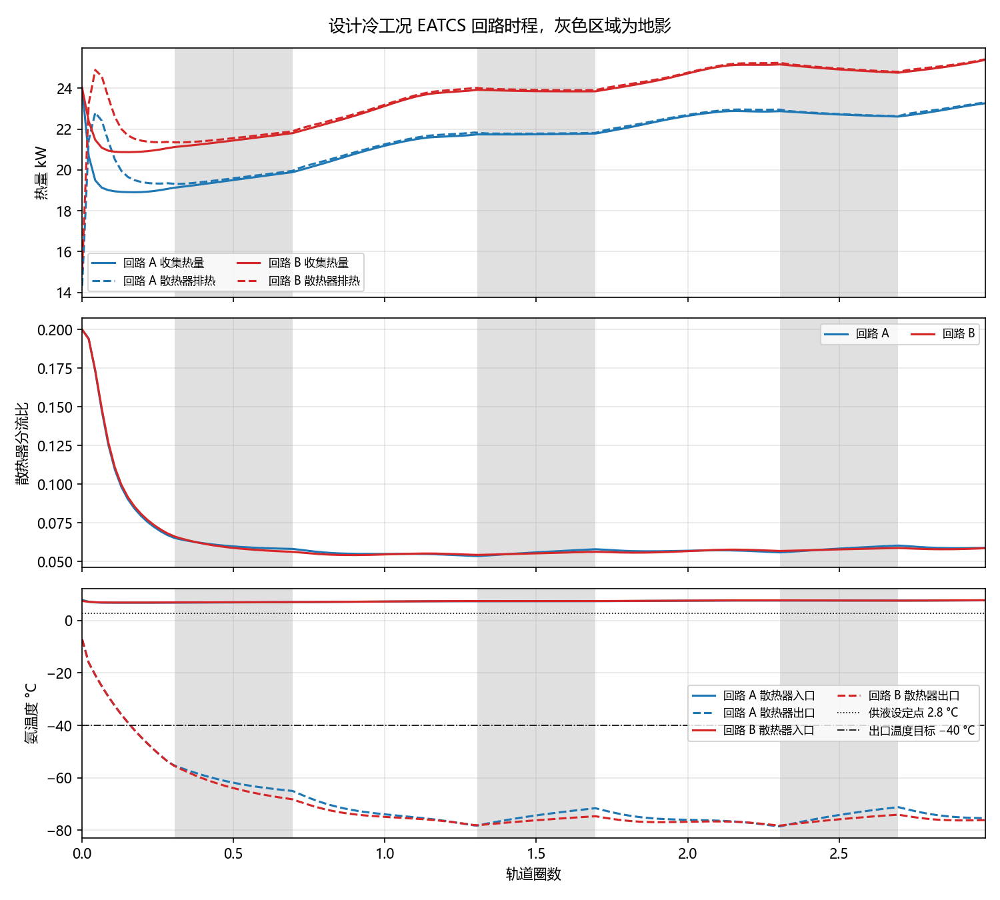

图 5  设计冷工况 EATCS 回路时程，灰色区域为地影

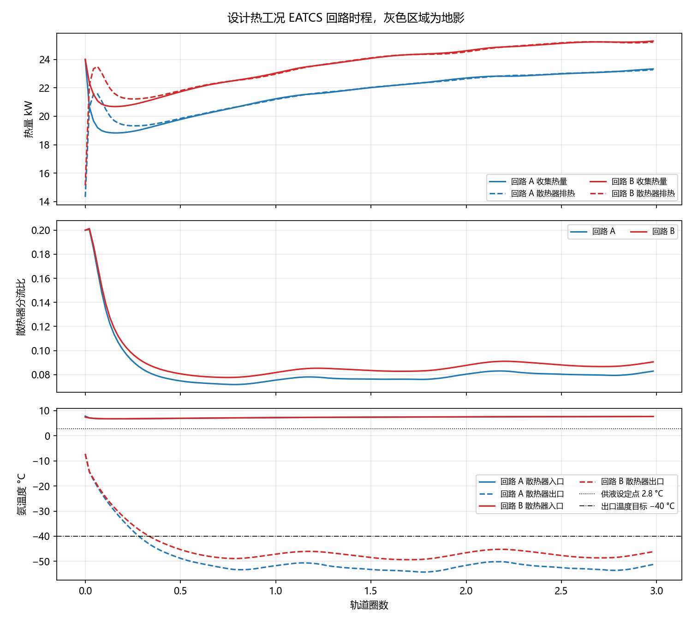

图 6  设计热工况 EATCS 回路时程，该工况全程受晒

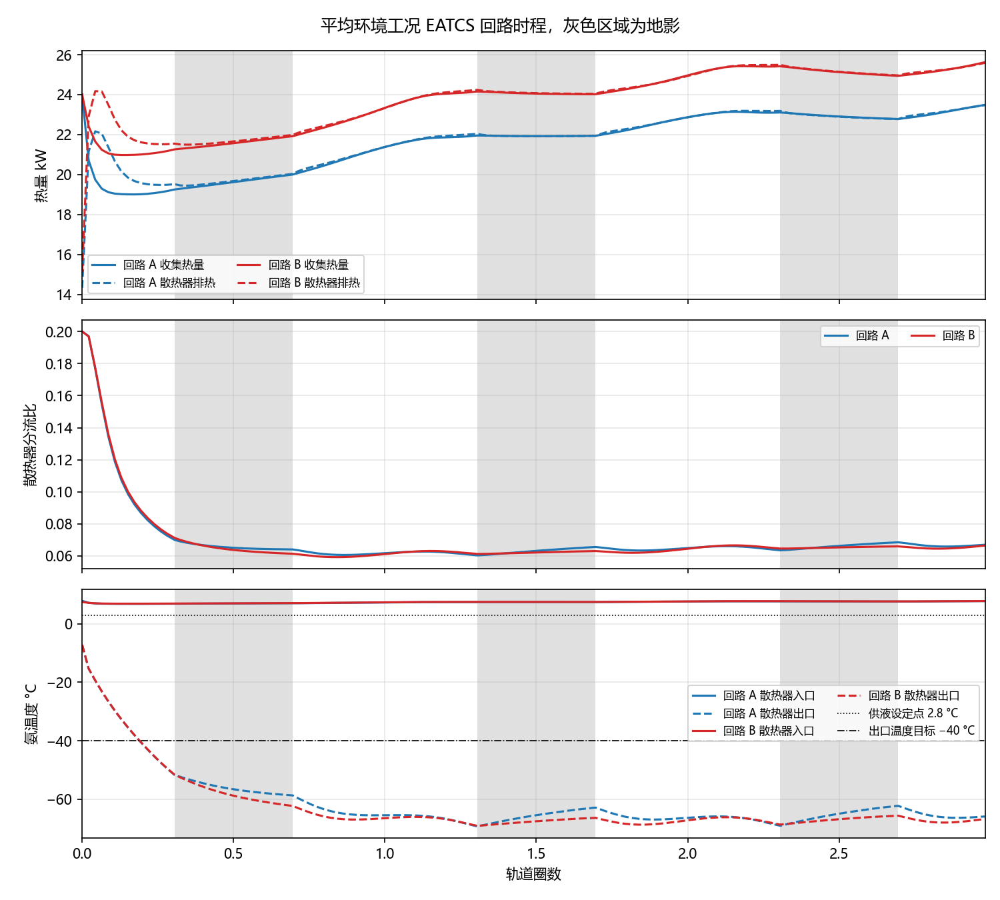

图 7  平均环境工况 EATCS 回路时程，灰色区域为地影
图 5 至图 7 为三个工况的回路时程。散热器分流比在第一圈内由初值 0.20 降到 0.06 至 0.09，此后随收集热量缓慢变化；收集热量在三圈内持续小幅上升，对应机柜的升温储热。

### 5.2 散热器与 PVR

表 13  EATCS 散热器 ORU 第三圈面板温度，单位 °C

| 工况 | ORU | 最低 | 平均 | 最高 |
|---|---|---|---|---|
| 设计冷工况 | P1-1 | −77.4 | −54.6 | −10.7 |
| 设计冷工况 | P1-2 | −77.3 | −54.6 | −10.7 |
| 设计冷工况 | P1-3 | −77.4 | −54.6 | −10.7 |
| 设计冷工况 | S1-1 | −77.8 | −54.9 | −10.6 |
| 设计冷工况 | S1-2 | −77.7 | −54.8 | −10.6 |
| 设计冷工况 | S1-3 | −77.8 | −54.9 | −10.6 |
| 设计热工况 | P1-1 | −48.0 | −31.6 | −3.1 |
| 设计热工况 | P1-2 | −47.9 | −31.5 | −3.1 |
| 设计热工况 | P1-3 | −48.0 | −31.6 | −3.1 |
| 设计热工况 | S1-1 | −52.1 | −36.4 | −5.2 |
| 设计热工况 | S1-2 | −52.9 | −36.0 | −4.5 |
| 设计热工况 | S1-3 | −54.5 | −36.3 | −4.5 |
| 平均环境工况 | P1-1 | −67.9 | −47.4 | −8.4 |
| 平均环境工况 | P1-2 | −67.8 | −47.4 | −8.4 |
| 平均环境工况 | P1-3 | −67.9 | −47.4 | −8.4 |
| 平均环境工况 | S1-1 | −68.4 | −47.3 | −8.2 |
| 平均环境工况 | S1-2 | −68.4 | −47.3 | −8.2 |
| 平均环境工况 | S1-3 | −68.4 | −47.3 | −8.2 |

分流比很小时，受面板换热算法影响，表中最高温度偏高约 4 K 至 8 K，最低温度偏低约 2 K，见第 5.5 节。
每个 ORU 的 8 块面板沿流向串联，入口面板温度最高，出口面板最低。回路 A 的三个 ORU 位于右舷，回路 B 的三个 ORU 位于左舷。同一翼的三个 ORU 在各种姿态下都位于同一平面内，相互之间没有辐射交换与遮挡，对地视角相同，流量均分，温度差别来自对面散热器翼的视角系数随 ORU 位置的变化；两个回路之间的差别来自流量、收集热量以及两翼整体转动造成的相互遮挡。β 为 0 的两个工况中，散热器在地影段转为正面对地，看到的地球红外增加，面板与出口氨温度升高约 5 K 至 7 K；最低温度出现在受晒段末端，此时面板处于 TRRJ 零位侧边对日，这也是需要转角调节防冻的时段。

表 14  PVTCS 回路第三圈统计，热量单位 kW，温度单位 °C

| 工况 | 光伏模块 | 收集热量 | 分流比平均 | PVR 出口范围 | 混合供液范围 |
|---|---|---|---|---|---|
| 设计冷工况 | P4 | 5.8 | 0.04 | −61.8 至 −57.1 | 2.7 |
| 设计冷工况 | P6 | 5.8 | 0.04 | −61.8 至 −57.3 | 2.7 |
| 设计冷工况 | S4 | 5.8 | 0.04 | −61.7 至 −57.2 | 2.7 |
| 设计冷工况 | S6 | 5.8 | 0.04 | −61.8 至 −57.3 | 2.7 |
| 设计热工况 | P4 | 5.9 | 0.05 | −48.1 至 −43.1 | 2.7 至 2.8 |
| 设计热工况 | P6 | 5.9 | 0.05 | −48.1 至 −43.1 | 2.7 至 2.8 |
| 设计热工况 | S4 | 5.8 | 0.05 | −48.4 至 −43.5 | 2.7 至 2.8 |
| 设计热工况 | S6 | 5.8 | 0.05 | −48.4 至 −43.4 | 2.7 至 2.8 |
| 平均环境工况 | P4 | 5.8 | 0.05 | −54.8 至 −46.7 | 2.7 至 2.8 |
| 平均环境工况 | P6 | 5.8 | 0.05 | −54.9 至 −46.9 | 2.7 至 2.8 |
| 平均环境工况 | S4 | 5.8 | 0.05 | −54.7 至 −46.7 | 2.7 至 2.8 |
| 平均环境工况 | S6 | 5.8 | 0.05 | −54.8 至 −46.9 | 2.7 至 2.8 |

PVTCS 分流比平均 0.04 至 0.05，接近 0.02 的下限，平滑抗饱和项在该范围仍起作用，混合供液温度的一圈平均值比设定点低 0.02 K 至 0.07 K，PVR 排热相应略高于收集热量。

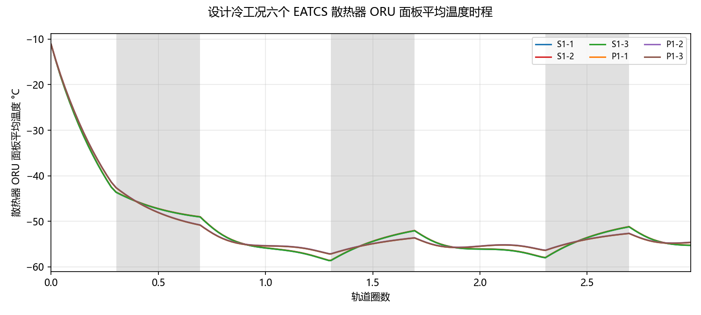

图 8  设计冷工况下六个 EATCS 散热器 ORU 面板平均温度时程，同一翼三个 ORU 的曲线基本重合

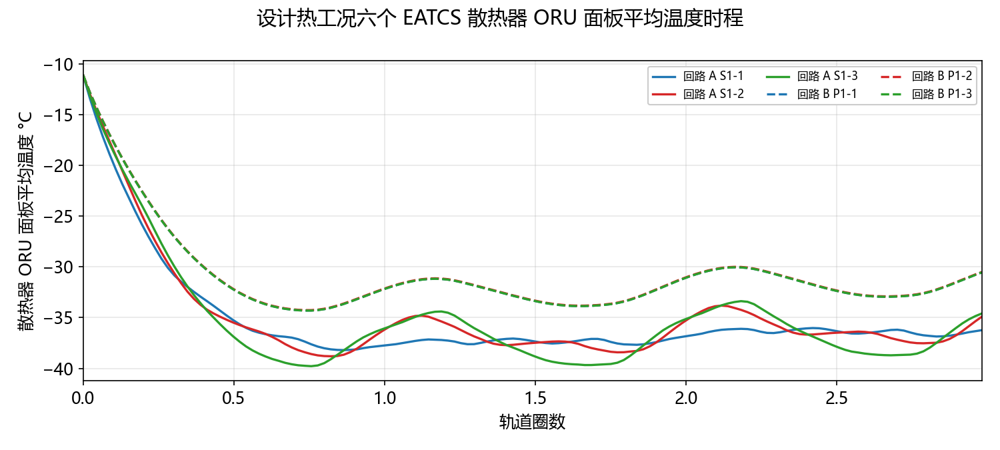

图 9  设计热工况下六个 EATCS 散热器 ORU 面板平均温度时程，同一翼三个 ORU 的曲线基本重合

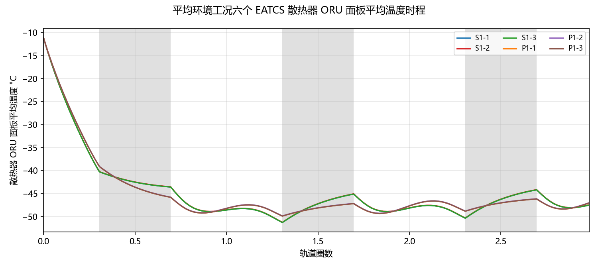

图 10  平均环境工况下六个 EATCS 散热器 ORU 面板平均温度时程，同一翼三个 ORU 的曲线基本重合

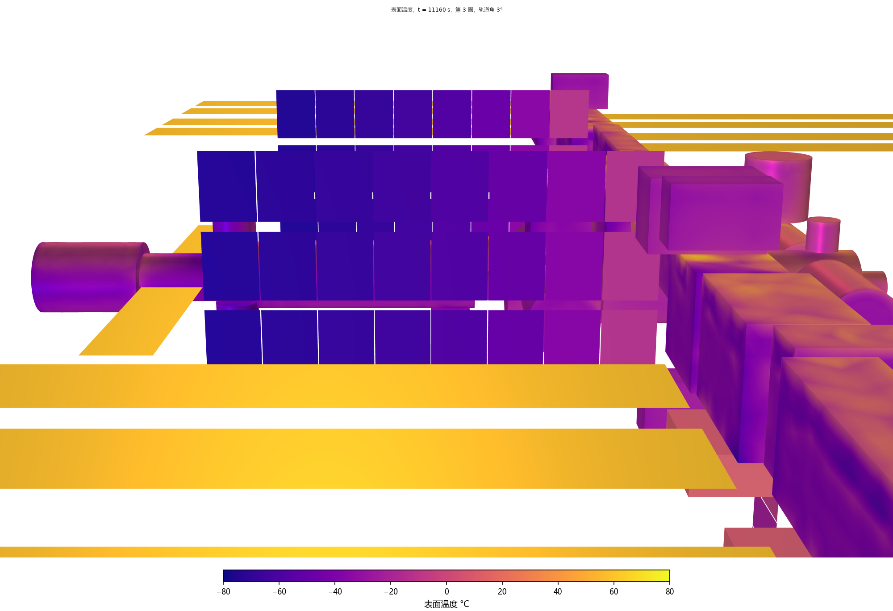

图 11  设计冷工况第三圈正午右舷 EATCS 散热器翼的表面温度，自右舷上方观察，最上一排为后方左舷翼的面板，前景横条为右舷太阳翼

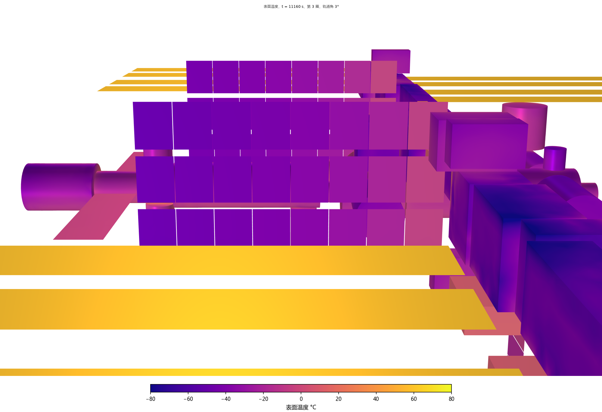

图 12  设计热工况第三圈正午右舷 EATCS 散热器翼的表面温度，自右舷上方观察，最上一排为后方左舷翼的面板，前景横条为右舷太阳翼

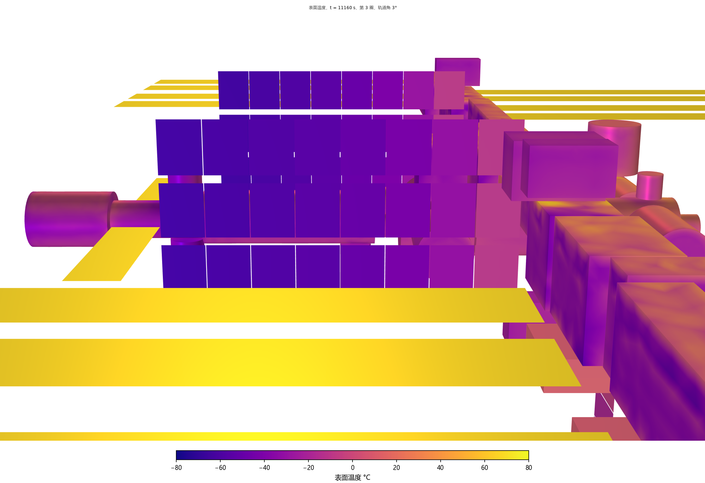

图 13  平均环境工况第三圈正午右舷 EATCS 散热器翼的表面温度，自右舷上方观察，最上一排为后方左舷翼的面板，前景横条为右舷太阳翼

### 5.3 各类部件温度

表 15  各类部件第三圈温度，最低 / 平均 / 最高，单位 °C

| 部件类别 | 设计冷工况 | 设计热工况 | 平均环境工况 |
|---|---|---|---|
| EATCS 散热器面板 | −77.8 / −54.7 / −10.6 | −54.5 / −33.9 / −3.1 | −68.4 / −47.3 / −8.2 |
| PVR 面板 | −60.6 / −38.2 / −6.7 | −47.4 / −28.3 / −3.6 | −53.7 / −31.9 / −4.6 |
| 美国太阳翼 | −81.1 / 4.0 / 57.3 | 53.0 / 54.7 / 57.6 | −74.4 / 10.7 / 66.6 |
| 服务舱太阳翼 | −81.2 / 4.2 / 57.4 | −18.1 / −12.5 / −2.0 | −74.5 / 10.9 / 66.7 |
| 美国段舱体防护屏 | −44.5 / −12.4 / 45.7 | −57.8 / −2.7 / 71.6 | −41.9 / −5.1 / 52.7 |
| 俄罗斯段舱体外表面 | −86.3 / −42.5 / 24.5 | −55.4 / −2.6 / 50.4 | −84.1 / −35.4 / 30.3 |
| 桁架包络 | −82.4 / −20.1 / 74.2 | −90.7 / −27.0 / 113.0 | −79.3 / −16.8 / 78.4 |
| 舱外设备与 IEA | 9.8 / 11.8 / 25.9 | 9.3 / 11.8 / 26.0 | 9.9 / 11.9 / 26.0 |
| 舱外载荷 | −42.8 / −21.1 / −0.3 | −47.6 / −15.3 / 18.4 | −41.0 / −18.8 / 2.5 |
| 舱内机柜 | 10.0 / 22.3 / 27.1 | 10.0 / 22.3 / 27.1 | 10.0 / 22.3 / 27.1 |

美国太阳翼温度随日照变化最剧烈，第三圈在 −81.1 °C 至 66.6 °C 之间；美国段舱体防护屏平均温度在设计冷工况、设计热工况、平均环境工况分别为 −12.4、−2.7、−5.1 °C；俄罗斯段舱体外表面平均温度在设计冷工况、设计热工况、平均环境工况分别为 −42.5、−2.6、−35.4 °C。设计热工况 β 为 75°，全程受晒，环境热流也取上限，舱体的平均温度都高于设计冷工况。β 为 75° 时太阳接近轨道面法向，从左舷一侧照射，朝左舷的表面升温，朝右舷与背阴的表面降温；服务舱太阳翼只能绕 Y 轴转动，太阳与电池面法向的夹角约 75°，因此设计热工况中部分部件比设计冷工况更冷。桁架包络的平均值为体积平均，主要反映初始值，不作工况间比较，表中桁架的最低与最高值为外表面温度。设计热工况桁架包络最高 113.0 °C，出现在 S0 桁架段左舷端面、P1 段后向面与左舷氨罐组件围成的凹角处，该处在 β 为 75° 时正对太阳。舱外设备外表面按多层隔热有效发射率 0.03 与吸收率 0.012 处理，在相互辐射中接近全反射面，射入凹角的阳光经设备表面反射后集中到桁架表面，形成局部高温；实际多层隔热外层为 beta 布，吸收率约 0.36，仍会反射约三分之二的阳光，局部峰值会低一些但仍偏高，113 °C 应看作上限估计。桁架包络的这一局部最高温度偏高，只出现在设备附近的凹角与缝隙处。

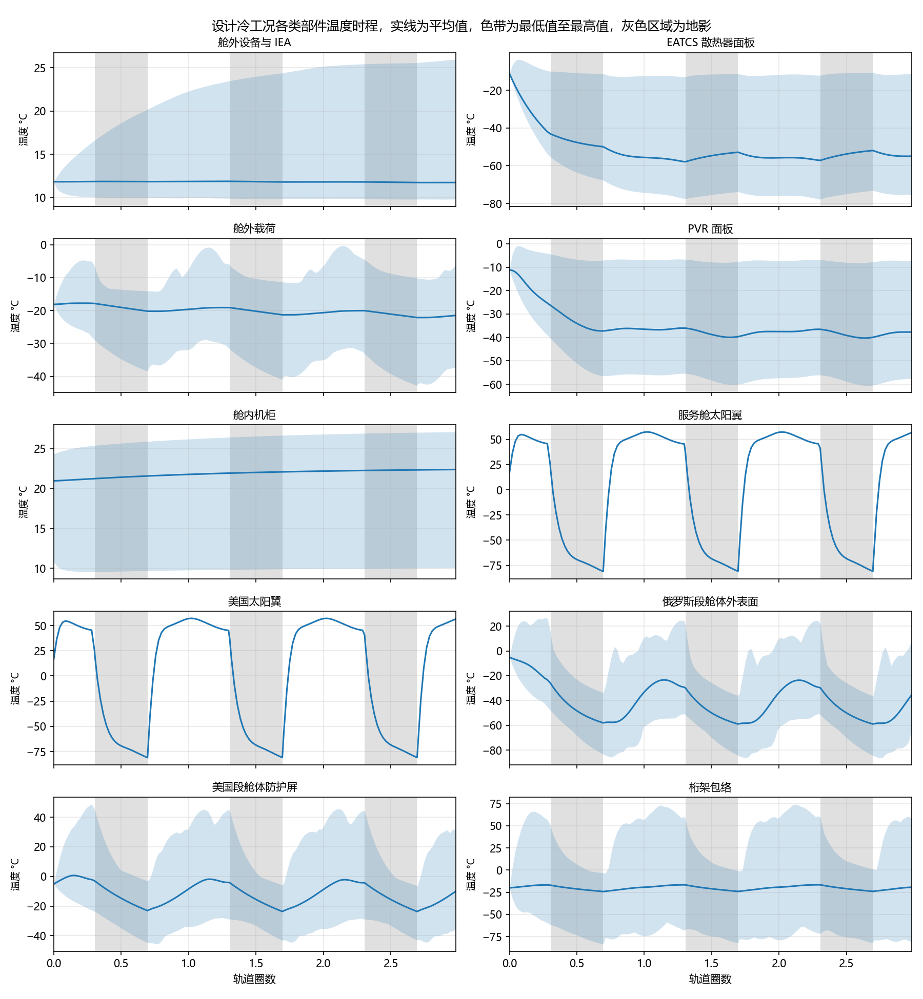

图 14  设计冷工况各类部件温度时程

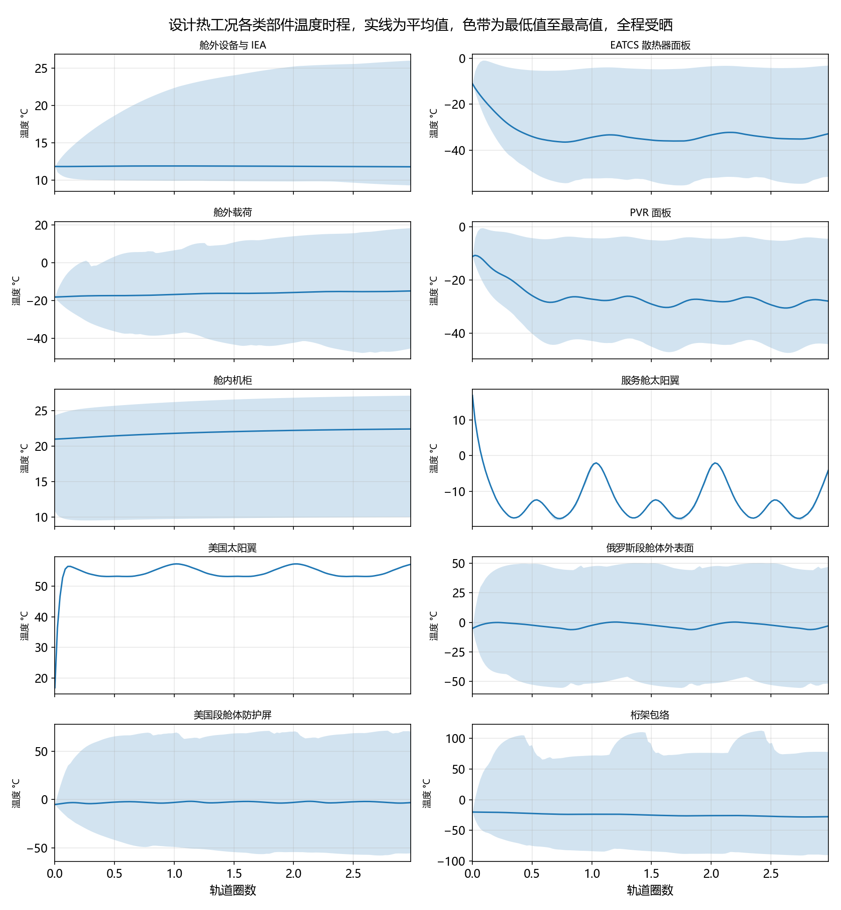

图 15  设计热工况各类部件温度时程

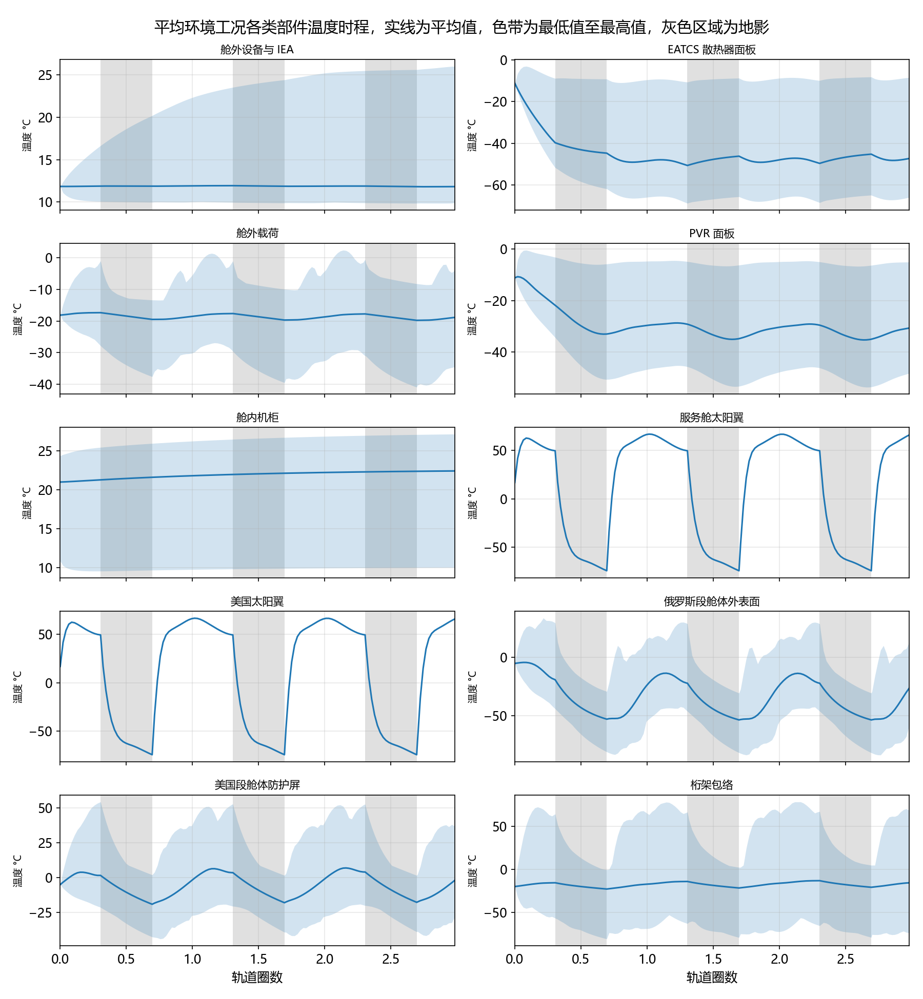

图 16  平均环境工况各类部件温度时程

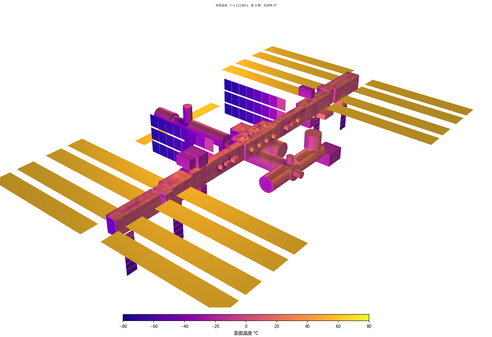

图 17  设计冷工况第三圈正午的表面温度

图 18  设计冷工况第三圈地影中点的表面温度

图 19  设计热工况第三圈正午的表面温度

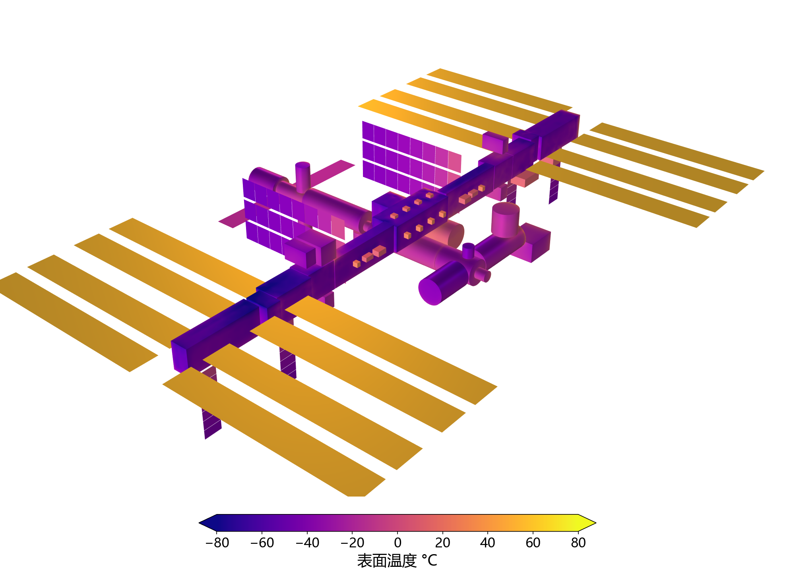

图 20  设计热工况第三圈轨道角约 90°的表面温度

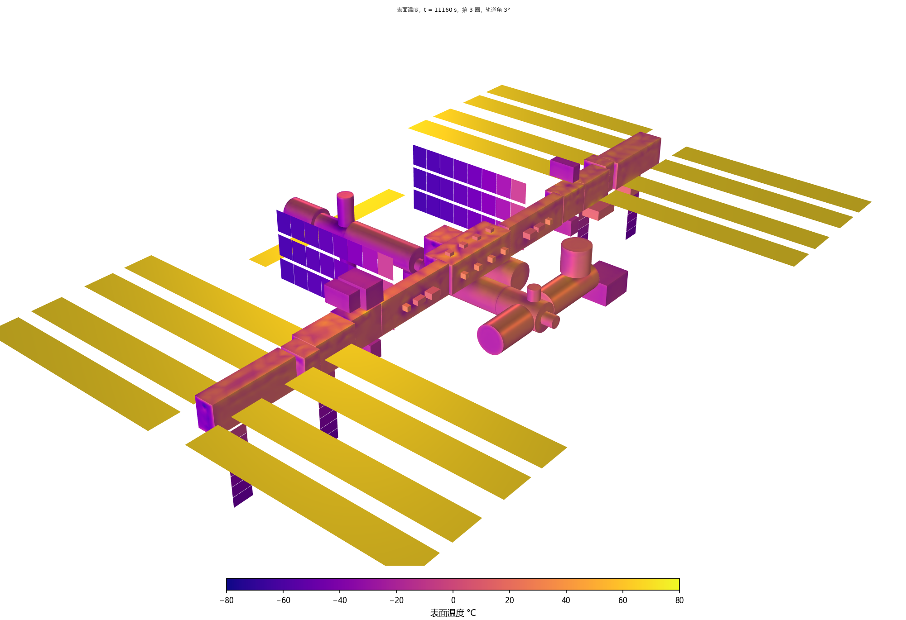

图 21  平均环境工况第三圈正午的表面温度

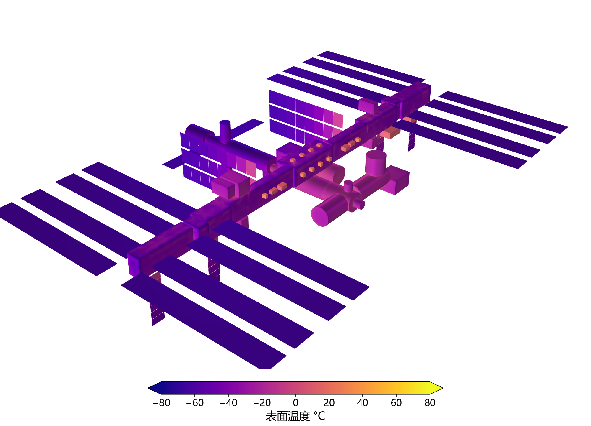

图 22  平均环境工况第三圈地影中点的表面温度

### 5.4 方块热源

表 16  舱内机柜第三圈温度，单位 °C

| 工况 | 舱段 | 机柜数 | 最低 | 平均 | 最高 |
|---|---|---|---|---|---|
| 设计冷工况 | Destiny | 24 | 11.8 | 22.2 | 25.7 |
| 设计冷工况 | Harmony | 8 | 10.0 | 19.8 | 23.2 |
| 设计冷工况 | Tranquility | 16 | 10.9 | 21.0 | 24.4 |
| 设计冷工况 | Columbus | 16 | 12.7 | 23.4 | 27.1 |
| 设计冷工况 | Kibo | 24 | 12.7 | 23.4 | 27.1 |
| 设计热工况 | Destiny | 24 | 11.8 | 22.2 | 25.7 |
| 设计热工况 | Harmony | 8 | 10.0 | 19.8 | 23.2 |
| 设计热工况 | Tranquility | 16 | 10.9 | 21.0 | 24.4 |
| 设计热工况 | Columbus | 16 | 12.7 | 23.4 | 27.1 |
| 设计热工况 | Kibo | 24 | 12.7 | 23.4 | 27.1 |
| 平均环境工况 | Destiny | 24 | 11.8 | 22.2 | 25.7 |
| 平均环境工况 | Harmony | 8 | 10.0 | 19.8 | 23.2 |
| 平均环境工况 | Tranquility | 16 | 10.9 | 21.0 | 24.4 |
| 平均环境工况 | Columbus | 16 | 12.7 | 23.4 | 27.1 |
| 平均环境工况 | Kibo | 24 | 12.7 | 23.4 | 27.1 |

表 17  舱外方块第三圈温度，ATA、PM、NTA 不发热，单位 °C

| 工况 | 部件 | 数量 | 最低 | 平均 | 最高 |
|---|---|---|---|---|---|
| 设计冷工况 | MBSU | 4 | 12.7 | 13.5 | 14.1 |
| 设计冷工况 | DDCU | 6 | 21.7 | 24.3 | 25.9 |
| 设计冷工况 | IEA | 4 | 9.8 | 11.5 | 12.3 |
| 设计冷工况 | ATA | 2 | 10.9 | 11.1 | 11.3 |
| 设计冷工况 | PM | 2 | 10.3 | 10.5 | 10.9 |
| 设计冷工况 | NTA | 2 | 9.9 | 10.3 | 10.8 |
| 设计冷工况 | ELC1 | 1 | −33.9 | −21.8 | −7.7 |
| 设计冷工况 | ELC2 | 1 | −41.8 | −22.8 | −7.0 |
| 设计冷工况 | ELC3 | 1 | −42.8 | −26.3 | −11.7 |
| 设计冷工况 | ELC4 | 1 | −34.7 | −23.2 | −11.2 |
| 设计冷工况 | AMS02 | 1 | −41.5 | −19.4 | −0.3 |
| 设计冷工况 | JEMEF | 1 | −41.0 | −19.9 | −6.8 |
| 设计热工况 | MBSU | 4 | 12.6 | 13.3 | 13.8 |
| 设计热工况 | DDCU | 6 | 21.5 | 24.3 | 26.0 |
| 设计热工况 | IEA | 4 | 9.8 | 11.5 | 12.5 |
| 设计热工况 | ATA | 2 | 10.2 | 11.1 | 11.8 |
| 设计热工况 | PM | 2 | 10.1 | 10.5 | 11.0 |
| 设计热工况 | NTA | 2 | 9.3 | 10.1 | 10.7 |
| 设计热工况 | ELC1 | 1 | −27.0 | −6.7 | 16.0 |
| 设计热工况 | ELC2 | 1 | −47.6 | −29.3 | −15.5 |
| 设计热工况 | ELC3 | 1 | −39.2 | −16.1 | 5.4 |
| 设计热工况 | ELC4 | 1 | −35.3 | −16.1 | 6.0 |
| 设计热工况 | AMS02 | 1 | −41.1 | −17.1 | 13.7 |
| 设计热工况 | JEMEF | 1 | −36.0 | −12.8 | 18.4 |
| 平均环境工况 | MBSU | 4 | 12.7 | 13.5 | 14.1 |
| 平均环境工况 | DDCU | 6 | 21.7 | 24.4 | 26.0 |
| 平均环境工况 | IEA | 4 | 9.9 | 11.5 | 12.4 |
| 平均环境工况 | ATA | 2 | 11.0 | 11.3 | 11.4 |
| 平均环境工况 | PM | 2 | 10.4 | 10.7 | 11.0 |
| 平均环境工况 | NTA | 2 | 10.1 | 10.5 | 10.9 |
| 平均环境工况 | ELC1 | 1 | −29.6 | −17.8 | −2.1 |
| 平均环境工况 | ELC2 | 1 | −40.0 | −21.2 | −1.8 |
| 平均环境工况 | ELC3 | 1 | −41.0 | −24.4 | −6.7 |
| 平均环境工况 | ELC4 | 1 | −30.5 | −19.4 | −6.0 |
| 平均环境工况 | AMS02 | 1 | −39.9 | −18.0 | 2.5 |
| 平均环境工况 | JEMEF | 1 | −38.7 | −17.6 | −2.9 |

氨罐组件、泵模块与氮罐组件不发热，也不接冷板，只经多层隔热有效发射率 0.03 与外界换热，时间常数约 5 天，表中温度基本保持 285 K 的初始值，不是周期稳态结果。
舱内机柜温度由冷板水温、机柜功率与冷板换热系数决定，三个工况的机柜温度相同；接低温水回路的机柜比接中温水回路的机柜平均低 11.1 K，小于两个水回路 13 K 的温差，原因是机柜其余表面与 22 °C 舱内空气换热，接低温水回路的机柜受舱内空气加热更多。接氨冷板的 MBSU 与 DDCU 第三圈平均温度为 13.3 °C 至 24.4 °C，IEA 为 11.5 °C，比 2.8 °C 的氨供液温度高 8.7 K 至 21.6 K，差值来自功率经冷板换热形成的温升；外表面包覆多层隔热，温度主要由冷板决定。无冷板的舱外载荷只能向空间辐射散热，第三圈平均温度在设计冷工况为 −26.3 °C 至 −19.4 °C，在设计热工况为 −29.3 °C 至 −6.7 °C，受环境影响最大。

### 5.5 与规格和在轨数据对比

表 18  计算结果与规格、在轨数据对比

| 工况 | 项目 | 规格或在轨数据 | 计算结果 |
|---|---|---|---|
| 设计冷工况 | 氨供液温度 | 设定 2.8 °C，控制带 ±1.1 °C，文献 A 第 11 页 | 2.8 °C |
| 设计冷工况 | 散热器出口温度 | 目标 −40 °C，文献 A 第 16 页；P1 散热器 2007 至 2010 年在轨读数约 −54 °C 至 +27 °C，文献 D16 图 4；散热器流路两年内温度极值 −40 °C 至 13 °C，文献 D17 | −78.5 °C 至 −71.2 °C |
| 设计冷工况 | 太阳翼出影温度，标定项 | 出影时约 −80 °C，约 3 min 升至 0 °C，文献 O14，毯面面热容按此取定 | −80.9 °C，约 5 min 升至 0 °C，时间分辨率 2 min |
| 设计冷工况 | 太阳翼温度范围 | 文献 O17 推算的飞行极值约 +60 °C 与 −80 °C | −81.1 °C 至 57.3 °C |
| 设计冷工况 | 太阳翼光照段最高温度 | 文献 D18 图 27，寿命初期 β 为 0° 时约 +53 °C | 57.3 °C |
| 设计冷工况 | 散热器分流比 | 单回路设计排热能力 35 kW，分流比达到 1 为能力上限，文献 A 第 5 页 | 最大 0.06 |
| 设计热工况 | 氨供液温度 | 设定 2.8 °C，控制带 ±1.1 °C，文献 A 第 11 页 | 2.8 °C |
| 设计热工况 | 散热器出口温度 | 目标 −40 °C，文献 A 第 16 页；P1 散热器 2007 至 2010 年在轨读数约 −54 °C 至 +27 °C，文献 D16 图 4；散热器流路两年内温度极值 −40 °C 至 13 °C，文献 D17 | −53.6 °C 至 −45.2 °C |
| 设计热工况 | 太阳翼温度范围 | 文献 O17 推算的飞行极值约 +60 °C 与 −80 °C | 53.0 °C 至 57.6 °C |
| 设计热工况 | 散热器分流比 | 单回路设计排热能力 35 kW，分流比达到 1 为能力上限，文献 A 第 5 页 | 最大 0.09 |
| 平均环境工况 | 氨供液温度 | 设定 2.8 °C，控制带 ±1.1 °C，文献 A 第 11 页 | 2.8 °C |
| 平均环境工况 | 散热器出口温度 | 目标 −40 °C，文献 A 第 16 页；P1 散热器 2007 至 2010 年在轨读数约 −54 °C 至 +27 °C，文献 D16 图 4；散热器流路两年内温度极值 −40 °C 至 13 °C，文献 D17 | −69.1 °C 至 −62.3 °C |
| 平均环境工况 | 太阳翼出影温度，标定项 | 出影时约 −80 °C，约 3 min 升至 0 °C，文献 O14，毯面面热容按此取定 | −74.1 °C，约 5 min 升至 0 °C，时间分辨率 2 min |
| 平均环境工况 | 太阳翼温度范围 | 文献 O17 推算的飞行极值约 +60 °C 与 −80 °C | −74.4 °C 至 66.6 °C |
| 平均环境工况 | 太阳翼光照段最高温度 | 文献 D18 图 27，寿命初期 β 为 0° 时约 +53 °C | 66.6 °C |
| 平均环境工况 | 散热器分流比 | 单回路设计排热能力 35 kW，分流比达到 1 为能力上限，文献 A 第 5 页 | 最大 0.07 |

太阳翼出影温度一行是标定项，毯面面热容按该在轨特征取定，这一行只检查标定结果：出影温度与在轨值接近，升到 0 °C 的时间比在轨的约 3 min 长一个 2 min 输出间隔左右。其余各行为独立对比。
β 为 0 的两个工况中太阳翼光照段最高温度比文献 D18 寿命初期计算值高 4.3 K 至 13.6 K，最高值比文献 O17 的飞行极值高 6.6 K，计算的太阳翼温度偏高。设计热工况的最高温度低于平均环境工况，原因是 β 为 75° 时太阳翼背面对地球的视角减小，受到的地球红外与反照较少。

表 19  EATCS 与 PVTCS 温度限值核对

| 工况 | 限值项目 | 限值 | 计算结果 | 余量 |
|---|---|---|---|---|
| 设计冷工况 | 氨冻结 | 冰点 −77 °C，文献 A 第 5 页 | 散热器面板最低 −77.8 °C | −0.8 K，修正后约 1 K |
| 设计冷工况 | PVR 氨冻结 | 冰点 −77 °C，文献 A 第 5 页 | PVR 面板最低 −60.6 °C | 16.4 K |
| 设计冷工况 | 界面换热器防冻 | 供液低于 1.67 °C 时保护动作，文献 A 第 11 页 | 混合供液最低 2.76 °C | 1.09 K |
| 设计冷工况 | 泵控阀温控能力 | 2.2 °C 至 6.1 °C，文献 A 第 11 页 | 混合供液 2.76 °C 至 2.77 °C | 在范围内 |
| 设计热工况 | 氨冻结 | 冰点 −77 °C，文献 A 第 5 页 | 散热器面板最低 −54.5 °C | 22.5 K |
| 设计热工况 | PVR 氨冻结 | 冰点 −77 °C，文献 A 第 5 页 | PVR 面板最低 −47.4 °C | 29.6 K |
| 设计热工况 | 界面换热器防冻 | 供液低于 1.67 °C 时保护动作，文献 A 第 11 页 | 混合供液最低 2.77 °C | 1.10 K |
| 设计热工况 | 泵控阀温控能力 | 2.2 °C 至 6.1 °C，文献 A 第 11 页 | 混合供液 2.77 °C 至 2.79 °C | 在范围内 |
| 平均环境工况 | 氨冻结 | 冰点 −77 °C，文献 A 第 5 页 | 散热器面板最低 −68.4 °C | 8.6 K |
| 平均环境工况 | PVR 氨冻结 | 冰点 −77 °C，文献 A 第 5 页 | PVR 面板最低 −53.7 °C | 23.3 K |
| 平均环境工况 | 界面换热器防冻 | 供液低于 1.67 °C 时保护动作，文献 A 第 11 页 | 混合供液最低 2.76 °C | 1.09 K |
| 平均环境工况 | 泵控阀温控能力 | 2.2 °C 至 6.1 °C，文献 A 第 11 页 | 混合供液 2.76 °C 至 2.78 °C | 在范围内 |

冷板一侧的冷却液温度在模型中取固定值，混合供液温度偏低时界面换热器的保护动作与舱内回路的响应不在模型范围内，上表只核对氨温度本身。
设计冷工况的散热器面板最低 −77.8 °C，接近 −77 °C 的冰点。该工况两个回路收集的热量约为单回路设计排热能力 35 kW 的三分之二，散热器分流比平均只有 0.06，流经散热器的少量氨在面板内冷却到接近面板的辐射平衡温度；模型采用理想的侧边对日与正面对地指向，散热器排热又因理想化处理偏多。文献 A 第 16 页说明，RGAC 的作用之一是使散热器足够暖以防止氨冻结，实际运行中散热器转角会偏离理想规律，文献 D16 图 4 的在轨最低读数约为 −54 °C。模型中液氨物性按液态取值，没有模拟冻结，该结果说明低负荷与冷环境下散热器必须依靠转角调节防冻。分流比很小时每块面板的传热单元数约为 12，远大于 2。模型按氨进出口平均温度计算面板换热，入口面板吸收的热量偏多，出口氨温度低于该面板温度，下游面板得到的热量偏少，本工况出口最低 −78.5 °C，比全部面板的最低温度还低 0.7 K。按传热单元数法逐块计算的集总参数估算表明，EATCS 入口面板温度偏高约 4 K 至 8 K，PVR 入口面板偏高约 2 K 至 5 K，出口端面板偏低约 2 K，出口氨温度偏低约 2 K 至 3 K；修正后设计冷工况面板最低约 −76 °C，比冰点高约 1 K，这一余量小于算法偏差，结果只能说明面板温度接近冰点。该偏差对回路排热量的影响小于 1%，全流量的排热能力子模型中每块面板的传热单元数约为 0.7，两种算法的出口温度相差不到 0.2 K。

### 5.6 散热器排热能力
全站模型中回路收集的热量低于单回路 35 kW 的设计排热能力，流量控制阀让大部分氨绕过散热器，分流比只说明当前负荷所需的散热器流量。为求散热器的排热能力，另建只含 48 块 EATCS 散热器面板的子模型。全站模型中散热器辐射组只与本组面板交换辐射，因此子模型沿用相同的面板几何、材料、涂层、TRRJ 指向规律与轨道环境后，面板所受外热流与全站模型一致。子模型令回路全部流量流经散热器，给定单回路排热量，散热器入口温度等于出口温度加上排热量引起的温升，散热器出口温度即为供液温度。每个排热量由轨道正午起计算 11040 s，统计取最后一个轨道周期；温度研究步沿用第一次计算存储的外热流，第一个排热量由初始温度起算，其余排热量由前一排热量的末态接续计算。计算末时刻与前一轨道周期同一轨道位置的出口温度之差，第一个排热量最大 0.61 K，其余各点不超过 0.03 K，排热能力插值所用的各点都属于后者。

表 20  散热器全流量时的出口氨温度，一圈平均值 / 一圈最高值，单位 °C

| 工况 | 回路 | 35 kW | 60 kW | 85 kW | 110 kW | 135 kW |
|---|---|---|---|---|---|---|
| 设计热工况 | A | −27.3 / −25.4 | −12.0 / −10.2 | 0.7 / 2.4 | 11.5 / 13.1 |  |
| 设计热工况 | B | −24.5 / −22.7 | −9.4 / −7.8 | 3.2 / 4.7 | 14.0 / 15.4 |  |
| 平均环境工况 | A | −36.4 / −33.6 |  | −5.9 / −3.5 |  | 15.6 / 17.6 |
| 平均环境工况 | B | −37.8 / −36.6 |  | −6.4 / −5.4 |  | 15.7 / 16.6 |
| 设计冷工况 | A | −42.2 / −38.9 |  | −9.8 / −6.9 |  | 12.6 / 15.0 |
| 设计冷工况 | B | −43.4 / −41.8 |  | −10.1 / −8.6 |  | 12.8 / 14.1 |

表 21  散热器全流量排热能力

| 工况 | 回路 | 排热 35 kW 时出口温度，一圈平均值 / 一圈最高值，°C | 出口温度一圈最高值达到 2.8 °C 时的排热量，kW | 该排热量下的散热器入口温度，°C | 出口温度一圈平均值达到 2.8 °C 时的排热量，kW |
|---|---|---|---|---|---|
| 设计热工况 | A | −27.3 / −25.4 | 86 | 20.8 | 89 |
| 设计热工况 | B | −24.5 / −22.7 | 81 | 18.4 | 84 |
| 平均环境工况 | A | −36.4 / −33.6 | 98 | 23.3 | 103 |
| 平均环境工况 | B | −37.8 / −36.6 | 101 | 22.4 | 103 |
| 设计冷工况 | A | −42.2 / −38.9 | 104 | 24.7 | 110 |
| 设计冷工况 | B | −43.4 / −41.8 | 107 | 23.5 | 110 |

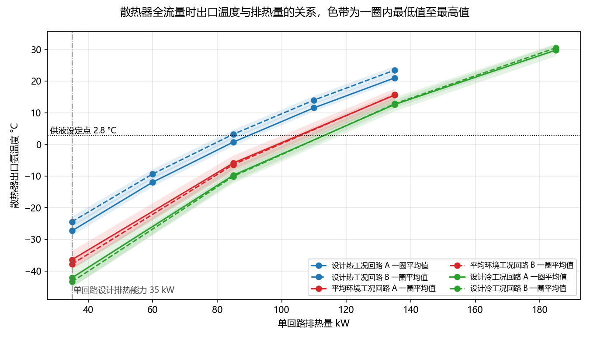

图 23  散热器全流量时出口氨温度与单回路排热量的关系
设计热工况下，单回路排热 35 kW 时散热器全流量出口温度的一圈最高值为 −22.7 °C，比 2.8 °C 设定点低 25.5 K，模型散热器满足单回路 35 kW 的排热要求。出口温度一圈最高值达到 2.8 °C 时，回路 A 与回路 B 分别可排出 86 kW 与 81 kW。公开资料给出三个参考值：文献 A 给出 EATCS 设计排热能力 70 kW，即单回路 35 kW，文献 D5 正文把 70 kW 称为规定的最低性能；文献 D4 与 D5 表 3.2-1 给出 75 kW；文献 D5 表 4.4-2 按解析方法估算装配完成状态的散热器能力为 87.9 kW，即单回路约 44 kW。设计热工况单回路排热 35 kW 时，回路 B 出口温度的一圈平均值比回路 A 高 2.9 K，两回路流量不同只能解释其中约 0.3 K，其余来自两翼整体转动后上下相叠造成的遮挡，见第 3.5 节；实际两翼并排，没有这一差别。

表 22  设计热工况散热器排热能力对理想化处理的敏感性

| 计算条件 | 35 kW 时出口最高温度 A，°C | 35 kW 时出口最高温度 B，°C | 排热能力 A，kW | 排热能力 B，kW |
|---|---|---|---|---|
| 基准：g 为 120 W·m⁻²·K⁻¹，Z-93 吸收率 0.24 | −25.4 | −22.7 | 86 | 81 |
| g 取 40 W·m⁻²·K⁻¹，相当于面板综合翅片效率约 0.8 至 0.9 | −22.7 | −20.1 | 74 | 70 |
| Z-93 吸收率取 30 年末期包络 0.36 | −23.7 | −20.9 | 83 | 78 |

表中排热能力指出口温度一圈最高值达到 2.8 °C 时的单回路排热量。面板与氨之间的换热系数 g 取 40 W·m⁻²·K⁻¹ 时，氨到面板的串联热阻使面板平均温度降低，按面板两面线性化辐射换热系数 6 至 9 W·m⁻²·K⁻¹ 计，效果相当于面板综合翅片效率约 0.8 至 0.9；吸收率取 0.36 考察涂层老化的影响。两个回路平均，换热系数降低使排热能力下降 11 kW，吸收率提高使其下降 3 kW，两项都不足以使排热能力降到单回路约 44 kW 的解析估算；入口温度上限与散热器和站体之间的遮挡也使实际能力更低，见下段。
子模型求得的排热量高于参考值，原因有两方面。第一，排热量增大时散热器入口温度随之升高，散热器温度越高排热越多。舱内热量经界面换热器传给氨，界面换热器氨侧出口温度即散热器入口温度，受中温水回路回水温度限制，回水温度随舱内负荷变化，部分界面换热器串联；若以中温水回路供水温度 17 °C 近似作为散热器入口温度上限，按模型流量计算，回路 A 与回路 B 的收集热量分别约为 68 kW 与 74 kW，更高入口温度对应的排热量需按界面换热器性能核算。第二，模型的理想化处理使散热器排热偏多：散热器与桁架、太阳翼、PVR 之间的遮挡和相互辐射按组间不计处理；面板与氨的换热在面板上均布，相当于流管之间面板的翅片效率取 1，实际面板靠两层 0.254 mm 铝蒙皮导热，远离流管处的面板温度低于氨温度；散热器指向按理想的侧边对日处理。子模型结果应看作排热能力的上限，核算载荷余量时以单回路 35 kW 的设计排热能力为准。

### 5.7 周期性与离散误差

表 23  最后一圈与前一圈平均值之差，温度单位 K

| 工况 | 项目 | 差值 |
|---|---|---|
| 设计冷工况 | EATCS 散热器 | 0.70 |
| 设计冷工况 | PVR | −0.45 |
| 设计冷工况 | 美国太阳翼 | 0.25 |
| 设计冷工况 | 美国段舱体 | −0.13 |
| 设计冷工况 | 俄罗斯段舱体 | −0.06 |
| 设计冷工况 | 桁架 | 0.07 |
| 设计冷工况 | 舱内机柜 | 0.30 |
| 设计冷工况 | 舱外设备与 IEA | −0.07 |
| 设计冷工况 | 舱外载荷 | −0.89 |
| 设计冷工况 | 回路 A 收集热量，kW | 1.01 |
| 设计冷工况 | 回路 B 收集热量，kW | 1.11 |
| 设计热工况 | EATCS 散热器 | 0.97 |
| 设计热工况 | PVR | −0.30 |
| 设计热工况 | 美国太阳翼 | 0.00 |
| 设计热工况 | 美国段舱体 | −0.01 |
| 设计热工况 | 俄罗斯段舱体 | −0.01 |
| 设计热工况 | 桁架 | −1.97 |
| 设计热工况 | 舱内机柜 | 0.30 |
| 设计热工况 | 舱外设备与 IEA | −0.06 |
| 设计热工况 | 舱外载荷 | 0.95 |
| 设计热工况 | 回路 A 收集热量，kW | 1.01 |
| 设计热工况 | 回路 B 收集热量，kW | 1.09 |
| 平均环境工况 | EATCS 散热器 | 0.91 |
| 平均环境工况 | PVR | −0.33 |
| 平均环境工况 | 美国太阳翼 | 0.01 |
| 平均环境工况 | 美国段舱体 | 0.38 |
| 平均环境工况 | 俄罗斯段舱体 | −0.06 |
| 平均环境工况 | 桁架 | 0.88 |
| 平均环境工况 | 舱内机柜 | 0.30 |
| 平均环境工况 | 舱外设备与 IEA | −0.05 |
| 平均环境工况 | 舱外载荷 | −0.11 |
| 平均环境工况 | 回路 A 收集热量，kW | 1.03 |
| 平均环境工况 | 回路 B 收集热量，kW | 1.13 |

按面热容与线性化辐射换热系数估算，太阳翼的时间常数为数分钟，俄罗斯段舱体约 10 min，EATCS 散热器面板在 7 °C 至 −70 °C 之间约 13 min 至 35 min，美国段舱体防护屏约 35 min 至 50 min，这些部件的温度在第三圈已跟随环境达到周期变化，散热器的残余漂移来自回路收集热量仍在随机柜升温增加。机柜与 IEA 的时间常数约 2 h，初始温度取冷板面平衡温度的估计值；舱外载荷方块时间常数约 5 h，初始温度 255 K 为估计值，第三圈仍有漂移；桁架包络等效导热系数只有 1 W·m⁻¹·K⁻¹，内部扩散时间常数为 8 h 至 2 天，初始温度取整轨平均估计值 253 K。第三圈的残余漂移列于上表。
离散误差用散热器排热能力子模型检验，以单回路 35 kW 为基准：设计热工况时间步长由 120 s 减为 60 s 后，出口温度一圈平均值的变化最多 0.01 K，一圈最高值的变化最多 0.01 K；设计热工况散热器网格尺寸由 1.2 m 减为 0.8 m 后，出口温度一圈平均值的变化小于 0.01 K，一圈最高值的变化最多 0.04 K；平均环境工况时间步长由 120 s 减为 60 s 后，出口温度一圈平均值的变化最多 0.01 K，一圈最高值的变化最多 0.01 K。平均环境工况含进出地影与散热器姿态切换，两种步长的结果也一致。这些检验针对散热器子模型，全站模型其余部件的步长与网格影响未经检验。太阳翼的时间常数只有数分钟，120 s 步长只能把出影升温的时刻分辨到一个时间步，即 2 min。全站模型的氨节点换热按进出口平均温度计算，分流比很小时的偏差见第 5.5 节，上述步长与网格检验不包括这一项。

## 6 结论与建议
1．在本模型 44.8 kW 舱内机柜热负荷与 6.1 kW EATCS 舱外冷板负荷下，三个工况的散热器分流比最大 0.09，EATCS 散热器仍有较大余量。散热器排热能力子模型给出设计热工况下单回路排热能力的上限，回路 A 为 86 kW，回路 B 为 81 kW；全站模型中单回路收集热量的第三圈平均值最大为 25.2 kW，比单回路 35 kW 的设计排热能力低 9.8 kW。舱内机柜增加功率时，应按单回路 35 kW 的设计排热能力核算余量。
2．文献 A 第 16 页说明，RGAC 在受晒段令散热器侧边对日，在地影段令散热器正面对地，同时使散热器足够冷以排热、足够暖以防止氨冻结，出口温度目标为 −40 °C。本模型没有模拟这一约束，组间辐射不计与面板换热均布又使散热器偏冷，计算的出口温度最低 −78.5 °C，其中约 2 K 至 3 K 来自面板换热算法的偏差；文献 D16 图 4 中 P1 散热器 2007 至 2010 年的在轨读数约为 −54 °C 至 +27 °C，计算最低值低于该范围。后续可在散热器指向规律中加入 RGAC 对出口温度的约束，用在轨出口温度数据校核散热器与桁架、太阳翼之间遮挡的处理和面板翅片效率，并为每个散热器翼单设辐射组，消除两翼整体转动造成的相互遮挡。
3．舱外载荷不接冷板，温度取决于外表面光学性质与自身功率；IEA 与冷板设备的温度主要由冷板决定，多层隔热有效发射率影响进入 PVTCS 的热量。工程应用时应以载荷的实测光学性质与热控设计替换本报告的典型值。
4．本模型已具备按工况批量计算的脚本流程，可直接求解舱外载荷在不同安装位置与不同功率下的温度，以及载荷接入冷板后的 EATCS 余量，也可把载荷方块替换为在轨计算设备的详细模型。
5．主要不确定性来自组间辐射不计、桁架按实体包络处理、散热器面板换热均布、机柜与舱外载荷尚未完全达到周期稳态以及部分参数采用模型取定值。机柜储热的影响见第 5.1 节，离散误差见第 5.7 节，第 5.6 节给出了面板换热系数与涂层吸收率两项敏感性，其余参数对部件温度与回路收集热量的影响需由后续敏感性工况确定。设计热工况桁架包络 113 °C 的局部最高温度来自舱外设备按有效光学性质处理后的反射集中，不代表真实桁架温度。

## 附录 文件与复现

表 24  主要文件

| 文件 | 内容 |
|---|---|
| model/iss_spec.py | 全部模型参数与来源 |
| model/iss_layout.py | 几何布局、辐射分组、回路方程 |
| model/iss_build.py | 在 COMSOL 中建立几何、网格、物理场与研究 |
| model/iss_run.py | 载入模型、设置时间步并求解 |
| model/iss_solve.py | 结果探针、部件统计与回路热量来源分解 |
| model/post_all.py | 探针、时程图、云图与报告的批处理 |
| model/iss_capacity.py | 散热器排热能力子模型 |
| model/iss_render.py 与 iss_plots.py | 几何图、云图、时程图与排热能力图 |
| out 下各工况目录中的 series.csv、items.csv 与 loop_breakdown.csv | 时程、部件统计与回路热量来源 |
| out/capacity | 排热能力子模型的出口温度时程与统计 |
| docs/ISS_SPEC.md 与各资料文档 | 参数来源与核验记录 |

复现步骤以平均环境工况 nom0 为例：在装有 MPh 的 Python 虚拟环境中依次运行 iss_build.py --case nom0 --no-solve 与 iss_run.py nom0 --orbits 3 --dt 120，再运行 post_all.py nom0，完成探针取值并生成时程图与温度云图，post_all.py 同时列出三个工况时生成本报告。几何与网格图由 iss_render.py 以 --what geom 生成，色标由 iss_plots.py --legend 加注。散热器排热能力子模型依次运行 iss_capacity.py hot75 --q 35,60,85,110,135、iss_capacity.py nom0 --q 35,85,135 与 iss_capacity.py cold0 --q 35,85,135,185，排热能力图由 iss_plots.py --capacity 生成；离散误差检验运行 iss_capacity.py hot75 --q 35 --dt 60 --suffix _dt60、iss_capacity.py hot75 --q 35 --hmax 0.8 --suffix _h08 与 iss_capacity.py nom0 --q 35 --dt 60 --suffix _dt60；敏感性计算运行 iss_capacity.py hot75 --q 35,60,85 --g 40 --suffix _g40 与 iss_capacity.py hot75 --q 35,60,85 --alpha 0.36 --suffix _a36。
生产模型在最后几项参数修改之前建立，求解前由 iss_run.py 的参数覆盖功能写入当前取值。为确认求解所用的设置，iss_readback.py 从求解后的模型文件读回全部全局参数、材料热物性、各辐射面光学性质与冷板开关状态，并与 model/iss_spec.py 逐项比较：设计冷工况模型 iss_cold0_34584.mph 不一致项 0 个；设计热工况模型 iss_hot75_2404.mph 不一致项 0 个；平均环境工况模型 iss_nom0_29756.mph 不一致项 0 个。求解所用设置与报告所列取值一致。
